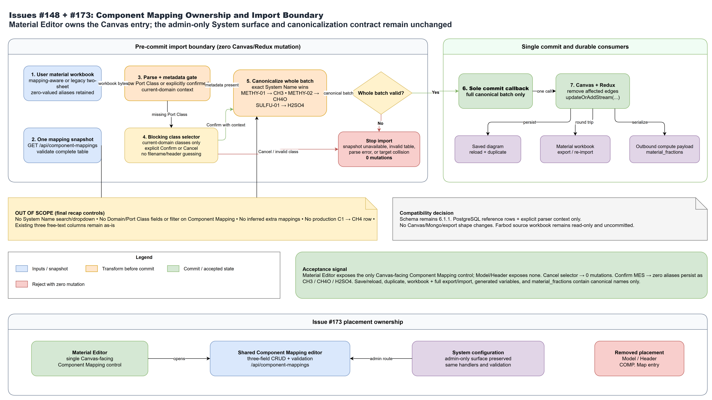

## Overview

Component Mapping is the global reference-data boundary between user material workbook headers and canonical component names. An authenticated Canvas user maintains mappings through **User Tables -> Material Properties -> Component Mapping**. Material import fetches and validates one complete mapping snapshot, parses the workbook, and canonicalizes fraction keys before any edge or Redux mutation. When a legacy two-sheet workbook has no Port Class metadata, Material Editor blocks the import until the user explicitly confirms one concrete class owned by the current domain.

The boundary maps `User Name -> System Name`; it does not change fraction values, units, basis, workbook files, system catalog rows, or solver serialization rules.

## Import Boundary Diagram



The editable source is [component-mapping-import-boundary.drawio](./diagrams/component-mapping-import-boundary.drawio).

## Source Files

- `src/src/shared/componentMapping.ts`: shared record type, snapshot validation, deterministic key canonicalization, and collision diagnostics.
- `src/src/frontend/src/components/component-mapping/ComponentMappingEditor.tsx`: reusable Canvas CRUD modal and Material Editor action for all three fields.
- `src/src/frontend/src/services/componentMappingService.ts`: one-snapshot authenticated read used by each import attempt.
- `src/src/frontend/src/services/componentMappedMaterialImport.ts`: executable load -> parse -> canonicalize -> commit orchestration boundary.
- `src/src/frontend/src/components/header-bar/index.tsx`: no longer exposes a Component Mapping entry; Model remains focused on diagram lifecycle actions.
- `src/src/frontend/src/components/material-editor/index.tsx`: owns the single Canvas-facing **Component Mapping** entry, opens the shared CRUD modal, fetches the snapshot, and canonicalizes parsed streams before React Flow or Redux updates.
- `src/src/frontend/src/components/material-editor/legacyMaterialPortClassSelection.ts`: filters the legacy-workbook selector to concrete current-domain Material Classes and supports visible-class preselection without auto-confirming it.
- `src/src/backend/routes/componentMappingRoutes.ts`: authenticated Canvas CRUD routes.
- `src/src/backend/routes/componentMappingHandlers.ts`: shared validation and persistence handlers.
- `src/src/backend/routes/adminReferenceRoutes.ts`: preserves the existing System configuration endpoint by reusing the same handlers behind admin authorization.
- `src/src/backend/prisma/postgres/schema.prisma`: maps the PostgreSQL `Component Mapping` table.
- `src/src/backend/prisma/postgres/migrations/20260811170000_add_component_mapping/migration.sql`: deployable fresh/existing database migration.
- `src/src/backend/prisma/postgres/migrations/20260817223000_seed_farbod_component_aliases/migration.sql`: idempotent Farbod reference rows with explicit conflict diagnostics.
- `src/src/frontend/src/features/domain/domainSlice.ts`: receives only successfully canonicalized imported streams.
- `src/src/frontend/src/components/header-bar/utils/save-util.tsx`: saves the canonical Redux material state in diagram `snapshotData`.
- `src/src/backend/utils/translation.ts`: consumes canonical selected-stream fraction keys without a second mapping layer.

## Ownership And API Contract

PostgreSQL owns the mapping catalog. The Canvas route is available to any authenticated user because the editing surface is part of Material Editor, while the existing System route remains admin-only.

| Operation | Canvas endpoint                      | System endpoint                                      | Request or response                               |
| --------- | ------------------------------------ | ---------------------------------------------------- | ------------------------------------------------- |
| List      | `GET /api/component-mappings`        | `GET /api/admin/reference/component-mappings`        | Sorted array of mapping records.                  |
| Create    | `POST /api/component-mappings`       | `POST /api/admin/reference/component-mappings`       | All three string fields; returns the created row. |
| Update    | `PATCH /api/component-mappings/:id`  | `PATCH /api/admin/reference/component-mappings/:id`  | All three string fields; returns the updated row. |
| Delete    | `DELETE /api/component-mappings/:id` | `DELETE /api/admin/reference/component-mappings/:id` | No body; returns `204`.                           |

```ts
type ComponentMappingRecord = {
  id?: string;
  component: string;
  system_name: string;
  user_name: string;
};
```

All string fields are trimmed and required. List order is deterministic: `component`, then `system_name`, then `user_name`, ascending.

## Validation And Deterministic Mapping

The shared contract validates the complete snapshot so frontend import and backend writes use the same rules:

- `user_name` is unique case-insensitively.
- Different casing for one canonical `system_name` is rejected.
- A `user_name` cannot also be another row's `system_name` when it would resolve to a different target.
- A known User Name maps to the registered System Name, case-insensitively.
- An existing System Name is preserved and normalized to its registered casing.
- Unknown keys are preserved exactly.
- Zero-valued component columns remain present and are renamed exactly like non-zero values.
- Two keys in one input stream that collapse to the same canonical target reject the whole batch with both source keys, the stream identity, and the target in the diagnostic.

`component` is required neutral metadata. It is stored and edited but is not a workbook key or solver key. For the three Farbod rows, no separate description was supplied, so `component` intentionally equals `system_name` rather than inventing chemistry labels.

## Data Flow

1. A signed-in user maintains rows in **Material Editor -> Component Mapping** or the preserved admin-only System view.
2. The backend validates the proposed complete snapshot before a create or update and relies on a case-insensitive PostgreSQL unique index as the final duplicate-alias guard.
3. One Material Editor import attempt calls `GET /api/component-mappings` once.
4. The frontend validates the complete response before reading it as a mapping snapshot.
5. `parsePortClassDatabaseMappingsWorkbook(...)` parses the local workbook into user material streams.
6. If the workbook has neither a mapping sheet nor row-level Port Class metadata, parsing raises `LegacyMaterialPortClassRequiredError`; no state has changed.
7. Material Editor opens a blocking selector containing only concrete classes whose domain matches the current domain. The visible active class may be preselected for convenience, but **Confirm Class and Import** is required. **Cancel Import**, no valid class, or a cross-domain context commits nothing. Filename, stream names, and component headers are never inference inputs.
8. Confirmation starts a new import attempt with the chosen class as explicit parser context and one newly validated mapping snapshot. Every parse receives an isolated `ArrayBuffer` copy, and the file input is reset after selection, so Cancel/reselect and Confirm cannot reuse bytes mutated by the first XLSX read.
9. `canonicalizeMaterialStreams(...)` builds new `stream_fractions` objects for the complete parsed batch.
10. Only after every row passes, Material Editor invokes the sole commit callback, updates affected edges, and dispatches `updateOrAddStream(...)` into Redux.
11. Save persists the canonical Redux material data in diagram `snapshotData`; duplicate and export/import copy the already canonical snapshot.
12. Edge selection and translation read those canonical component keys when building generated variables and solver `material_fractions`.

Canonicalization belongs before Redux, not in the solver translator. This keeps Canvas inspection, save/reload, generated-variable wiring, and solver input on the same names and prevents different consumers from seeing different representations.

## Side Effects And Failure Behavior

- CRUD writes only the PostgreSQL mapping catalog.
- User workbook import remains a local browser operation; the workbook is not uploaded or modified.
- A successful import can change Redux material state and remove edges whose source IDs are replaced by imported rows, matching the existing import behavior.
- Mapping API unavailability aborts import. The application does not guess, use a partial response, or silently fall back to stale mappings.
- An invalid or ambiguous snapshot aborts import before edges or Redux change.
- Missing legacy Port Class metadata opens the blocking selector. Cancel, unavailable choices, or invalid/cross-domain context leaves edges and Redux unchanged.
- A collision aborts the entire parsed batch; no earlier row is committed.
- Mapping deletion changes future imports only. Existing saved diagrams retain their already canonicalized snapshot data.

## Database Migration And Compatibility

The table migration creates `Component Mapping` for a fresh database and uses `IF NOT EXISTS` column/index operations for an existing database that received the draft table through `prisma db push`. It refuses to invent values for blank legacy rows and refuses case-insensitive duplicate aliases; operators must repair those rows before migration continues.

The follow-up reference migration installs exactly the three mappings Farbod supplied:

| Component | System Name | User Name  |
| --------- | ----------- | ---------- |
| `CH3`     | `CH3`       | `METHY-01` |
| `CH4O`    | `CH4O`      | `METHY-02` |
| `H2SO4`   | `H2SO4`     | `SULFU-01` |

The reference migration is safe to rerun. If an alias already has the exact required `Component` and `System Name`, the existing row and its `_id` are preserved. If the alias or deterministic reference id is already used for different semantics, migration fails with `Component Mapping reference conflict`; it never overwrites the row or hides the conflict behind `ON CONFLICT DO NOTHING`.

This change does **not** bump the saved Canvas/library schema version; `CURRENT_SCHEMA_VERSION` remains `6.1.1`:

- the new table is PostgreSQL reference data, not Mongo diagram structure;
- `Stream.stream_fractions` was already a dynamic key/value object;
- save, reload, edge selection, and solver payload shapes are unchanged; and
- non-GSLN and system-catalog streams remain on their current paths.

Do not infer a whole-library workbook or runtime schema migration from this reference-data table or the explicit import context. Revisit the Migration Center gates only if a future change alters persisted Canvas topology or the workbook/runtime contract.

The current Stable 7 runtime workbook is `src/excel-sheets/Aug-16-2026.xlsx` (SHA-256 `D053926548563C50889A3D3C79D453CEA032B52B67F12AB0D2E56C4ACCFCD653`). An exact-cell audit finds no `C1` value in that workbook; canonical `CH4` is present at `#Comp_MES_HP!F1`. The companion `HYPRONET_GUI_Excel_Import_Examples.xlsx` also contains no exact `C1` value. This feature neither edits those workbooks nor seeds mappings from them.

`C1 -> CH4` is retained only as the meeting-specified synthetic, disposable acceptance fixture. It proves that an arbitrary user alias is replaced by a canonical System Name through the full import boundary. It is not current Stable 7 reference data, a recommended customer mapping, or a production seed. Automated tests construct the row in memory or inside isolated test databases; manual acceptance must create it in an isolated database and remove it after the run.

The Farbod source audit records `Amix_ATR_mixer_usr_stream_data.xlsx` at SHA-256 `D96C9C51FCB0B72492CAC8A113C0B17CED31302B6AF5AAB01E2E6578FDC3C497`. Its two data sheets have no Port Class metadata, and the three alias columns are zero-valued in the supplied rows. The original workbook is read-only evidence: it is never edited or committed. Browser acceptance uses the sanitized structural fixture `src/cypress/fixtures/issue148-farbod-legacy-material.xlsx` (SHA-256 `EB5D4C58F241B1A3C20AE3A8F1095B0625E054F55F73FCB9CCB37DAB62D65553`): only the two sheet names, `A1:I5` / `A1:P5` bounds, E/O/P alias positions, and four zero-valued alias rows are retained.

Component Mapping remains a global three-column table; the final scope explicitly leaves the existing free-text editor as-is. System Name search/dropdown, Domain filtering, Port Class filtering, and Domain/Port Class schema fields are out of scope.

## Testing And Verification

Automated coverage should include:

- shared mapping validation and case-insensitive canonicalization;
- immutable unknown/canonical-key behavior;
- atomic target-collision rejection;
- actual workbook parse followed by the synthetic, disposable `C1 -> CH4` acceptance mapping (never a production seed);
- authenticated Canvas CRUD and preserved System endpoint behavior;
- fresh/existing migration SQL and the case-insensitive index;
- repeat-safe insertion of the three supplied reference rows plus identical-row preservation and conflicting-row failure;
- blocking current-domain legacy class selection with explicit Confirm/Cancel and zero mutation before confirmation;
- zero-valued `METHY-01`, `METHY-02`, and `SULFU-01` headers surviving as `CH3`, `CH4O`, and `H2SO4`;
- Material Editor ownership tests that prove the single Canvas entry opens the shared editor, the Header entry is absent, and mapping completes before Redux dispatch; and
- save/reload, full diagram export/import, duplicate, workbook export/import, generated-variable, and outbound `material_fractions` regressions;
- unchanged non-GSLN translation/computation controls.

The migration source smoke test runs in the normal Jest set. To execute the SQL against isolated fresh and existing PostgreSQL databases in a disposable container, run from `src`:

```powershell
$env:RUN_COMPONENT_MAPPING_MIGRATION_INTEGRATION='1'
npx.cmd jest tests/integration/componentMappingMigration.integration.test.ts --runInBand --coverage=false
```

Manual acceptance uses an isolated database and disposable diagram. The `C1 -> CH4` row remains a synthetic control and must not be copied into production reference data. The Farbod path is:

1. Apply the migrations to an isolated PostgreSQL database and verify the three supplied aliases are present exactly once.
2. Import the sanitized two-sheet workbook without Port Class metadata. Verify the selector offers only current-domain classes, then cancel and confirm that nothing was imported.
3. Repeat, choose the intended class, and click **Confirm Class and Import**.
4. Inspect Redux and save/reload the diagram; only `CH3`, `CH4O`, and `H2SO4` remain for the three aliases, including zero values.
5. Verify full diagram export/import, duplicate, and material workbook export/import keep those canonical keys and contain no aliases.
6. Wire a positive-valued sanitized control and inspect generated variables and solver `material_fractions` for canonical names only.
7. Run one real non-GSLN computation through enqueue, `task_id`, callback, Mongo terminal result, API retrieval, and UI result; results must be finite.

## Known Cautions

- Never add name-specific UI or solver workarounds. Extend the shared mapping contract instead.
- Do not add invented mappings beyond the three explicitly supplied reference rows. Other mappings remain owned through the CRUD surface.
- Do not infer selector/filter or Domain/Port Class behavior from the mapping table. Those ideas were proposals, not the accepted #148 UI contract.
- The legacy import-context selector is not a Component Mapping table filter and adds no Domain/Port Class fields to that table.
- Treat a failed mapping fetch as an import blocker, not as permission to apply the workbook without mapping.
- Keep the admin-only System view and Material Editor Canvas view on the same handlers so their validation cannot drift.
- Changing a mapping does not retroactively migrate old saved diagrams.
- Baseline test or TypeScript project-reference debt is tracked separately and must not be hidden in this feature.

## Related Pages

- [Material Domain Editor Workflow](./material-domain-editor-workflow.md)
- [Save Diagram and Node Cache](./save-diagram-and-node-cache.md)
- [Translation and Reverse Translation](./translation-and-reverse-translation.md)
- [Backend Data Routes and Persistence](./backend-data-routes-and-persistence.md)
