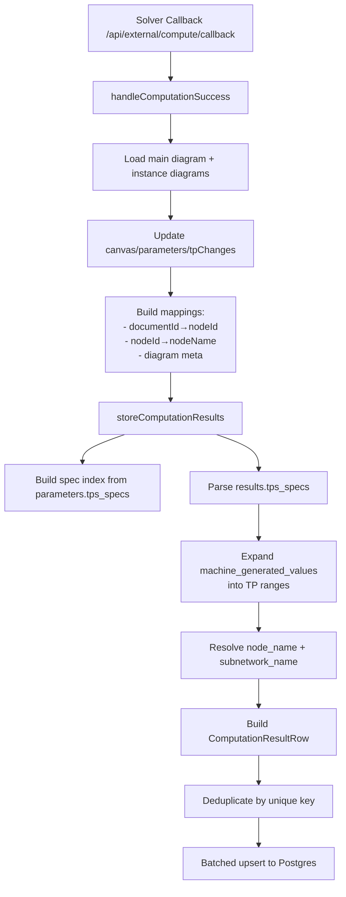

# Computation Result Persistence

## Overview

This document explains how solver callback results are persisted into PostgreSQL `ComputationResults`. It covers the end‑to‑end flow, field mapping, TP range handling, and the exact upsert logic used to store results.

Key files:
- `src/src/backend/services/computationTaskHandler.ts`
- `src/src/backend/utils/storeComputationResultUtils.ts`
- `src/src/backend/prisma/postgres/schema.prisma` (`ComputationResults`)

---

## 1. Entry Point and Call Flow

**Entry function:**
- `handleComputationSuccess` in `computationTaskHandler.ts`

**Trigger:**
- Solver callback endpoint `/api/external/compute/callback` with status `success`

**High‑level sequence:**
1. Load diagram and subnetwork instances from MongoDB.
2. Update canvas/parameters/tpChanges with solver output (MongoDB).
3. Build mappings: documentId↔nodeId, nodeId→nodeName, diagram meta.
4. Call `storeComputationResults` to upsert rows into PostgreSQL.

---


---

## 1.1 Input Origin Guard (`is_human_input`)

During step **D** (update canvas/parameters/tpChanges), solver results are only applied to values that are **not** human-owned.

- If `is_human_input === true`, the value is preserved.
- If `is_human_input !== true`, solver output can overwrite and will set `is_computed = true` for UI highlighting.

See: `docs/CodeExplanation/human-input-flag.md`

## 2. Process Flow Diagram



---

## 3. Inputs Used for Persistence

### 3.1 Solver Output

Source: `results.tps_specs`

Example:

```json
{
  "network": "fulltest",
  "node": "<documentId>",
  "port": "OUT",
  "port_var": "MF",
  "machine_generated_values": {
    "1-1": 10,
    "2-3": 156
  }
}
```

Fields used directly:
- `network` → `network_name`
- `node` → `node_id` (documentId from Mongo `nodes` collection)
- `port` → `port_name`
- `port_var` (or `port_var_name`) → `port_var_name`
- `machine_generated_values` → `(from_tp, to_tp, value)` pairs

### 3.2 Parameter Specs (Metadata)

Source: `diagram.parameters.tps_specs` (MongoDB)

Used to enrich results with:
- `spec`
- `lower_bound`
- `upper_bound`
- `unit`
- `type`
_Note:_ current persistence does not store a `run_type` field; solver + algorithm names are stored instead.

### 3.3 Node Name Resolution

Source: diagram canvas JSON (MongoDB).

Resolution order for node display name:
1. `node.data.node_name`
2. `node.data.name`
3. `node.data.label`
4. `node.data.model.node_name`
5. `node.data.model.name`

The resolved name is stored in `node_name` and kept in sync with what the user sees on the canvas.

### 3.4 Subnetwork Name Resolution

`subnetwork_name` is derived as follows:
1. If the node is matched in parameters `tps_specs`, use the spec‑level subnetwork label (if present).
2. Otherwise, infer from the instance diagram (Mongo `diagram` with `type = 2`) that owns the node, using that diagram’s `name`.

---

## 4. PostgreSQL Schema (Current)

```prisma
model ComputationResults {
  diagram_id      String
  run_name        String
  solver_name     String
  algorithm_name  String
  network_name    String
  subnetwork_name String
  node_id         String
  node_name       String
  port_name       String
  port_var_name   String
  from_tp         String
  to_tp           String
  value           Float
  upper_bound     Float?
  lower_bound     Float?
  spec            String?
  unit            String?
  type            String?

  @@unique([diagram_id, run_name, node_id, port_name, port_var_name, from_tp, to_tp])
}
```

---

## 5. TP Range Parsing and `from_tp`/`to_tp`

`machine_generated_values` supports two formats:

### 5.1 Object Format (preferred)

```json
{
  "1-4": 10,
  "5-8": 20
}
```

- Each key is parsed as a TP range.
- `from_tp`/`to_tp` are parsed from the range key.

### 5.2 Array Format

```json
[10, 20, 30]
```

- Index is mapped to TP: index 0 → TP 1, index 1 → TP 2, etc.
- `from_tp` = `to_tp` = the array index + 1.

---

## 6. Detailed Storage Logic (Step‑By‑Step)

The persistence logic is implemented in `storeComputationResultUtils.ts` and can be summarized as:

### Step 1 — Build Spec Index (metadata lookup)

For each `parameters.tps_specs` entry:
- Build a key: `network|node_name|port|port_var|from_tp|to_tp`.
- Store meta: `spec`, `lower_bound`, `upper_bound`, `unit`, and `type`.
- Also store a fallback key with empty `network` to be resilient if solver output omits network.

### Step 2 — Parse Solver Results

For each item in `results.tps_specs`:
- Extract `network`, `node`, `port`, `port_var`.
- Parse `machine_generated_values` to a list of `{ fromTp, toTp, value }`.

### Step 3 — Resolve Names and Subnetwork

For each `(fromTp, toTp, value)` pair:
- `node_id` = solver `spec.node` (documentId).
- `node_name` = lookup by `documentId -> nodeId -> canvas name`.
- `subnetwork_name` = try parameter mapping; fallback to instance diagram’s `name` if node belongs to a subnetwork diagram.

### Step 4 — Build the Record

Create a `ComputationResultRow`:

- `diagram_id` = computation task diagramId
- `run_name` = computation task runName
- `solver_name` = computation task solver name
- `algorithm_name` = computation task algorithm name
- `network_name` = spec.network
- `subnetwork_name` = inferred (see above)
- `node_id` = documentId
- `node_name` = resolved from canvas
- `port_name` = spec.port
- `port_var_name` = spec.port_var
- `from_tp`/`to_tp` = TP range bounds (stringified)
- `value` = solver output value
- `spec/lower_bound/upper_bound/unit/type` = from parameter spec lookup

### Step 5 — Dedupe Within the Batch

A map key is used to avoid duplicate rows before writing:

```
${diagram_id}|${run_name}|${node_id}|${port_name}|${port_var_name}|${from_tp}|${to_tp}
```

If duplicates occur in the same payload, the last one wins.

### Step 6 — Batched Upsert

- Records are written in chunks (size 200).
- Each chunk uses `$transaction` with per‑row `upsert`.

**Upsert `where` clause:**

```ts
{
  diagram_id_run_name_node_id_port_name_port_var_name_from_tp_to_tp: {
    diagram_id,
    run_name,
    node_id,
    port_name,
    port_var_name,
    from_tp,
    to_tp,
  }
}
```

**On create:**
- Insert the full row

**On update:**
- Update `value`, `spec`, `bounds`, `unit`, `type`, `solver_name`, `algorithm_name`, `network_name`, `subnetwork_name`, `node_name`

This ensures the latest computation output is always reflected without duplicating rows.

---

## 7. Notes and Constraints

- The current schema uses `solver_name/algorithm_name` and `from_tp/to_tp`.
- `node_id` is **Mongo `nodes.id` (documentId)**, not the ReactFlow node id.
- `node_name` always comes from canvas display data (editable on the frontend).

---

## 8. Future‑Proofing (If Schema Changes)

If the schema changes again (e.g., return to `run_type` + `tp_id`):

1. Update Prisma schema + migration
2. Adjust `ComputationResultRow` and `upsert where` key
3. Modify TP parsing to persist `from_tp/to_tp` explicitly
