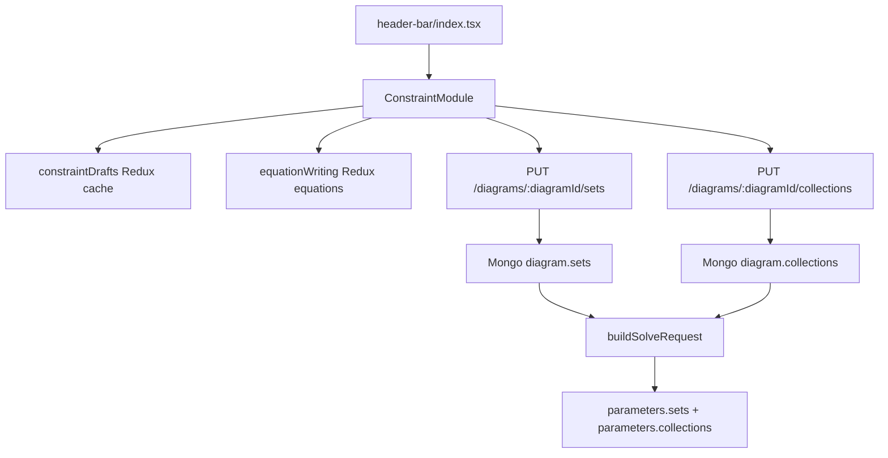

# Constraint Module Code Explanation

## Overview

The `+Constr` module lets users organize saved equations into Objective Function and Constraint sets, then organize Constraint sets into collections. The main frontend entry point is `src/src/frontend/src/components/header-bar/header-buttons/constraint-module.tsx`.

The current UI model assigns sets to each equation rather than editing a set and filling it with equations from inside the set card. The module keeps draft sets and collections in Redux so closing and reopening the modal does not lose unsaved work. Saved data is persisted on the MongoDB diagram record under `diagram.sets` and `diagram.collections`.

## Source Files

- `src/src/frontend/src/components/header-bar/header-buttons/constraint-module.tsx`: modal UI, hydration, set and collection editing, equation membership toggles, deletion guards, and save calls.
- `src/src/frontend/src/components/header-bar/header-buttons/constraint-module.css`: layout, scrolling, fixed-height panels, item-card sizing, and assignment-row styling.
- `src/src/frontend/src/features/constraint/constraintSlice.ts`: Redux cache for draft sets, collections, and SoluAlgoLib assignment guards.
- `src/src/frontend/src/features/equationWriting/equationWritingSlice.ts`: source of loaded equation drafts displayed in the assignment panel.
- `src/src/frontend/src/components/header-bar/index.tsx`: renders `ConstraintModule` while the Model section is active.
- `src/src/backend/routes/dataRoutes.ts`: persists `diagram.sets` and `diagram.collections`, sanitizes nested equations, and rejects invalid deletes.
- `src/src/backend/services/solverEngineApiService.ts`: normalizes sets and collections for the solver request with id references.
- `src/src/backend/prisma/mongodb/schema.prisma`: declares `Diagram.sets Json?`, `Diagram.collections Json?`, and `Diagram.solualgolib Json?`.

## Purpose and Responsibility

This module owns the frontend layout and draft state for equation grouping. It decides which equations belong to which sets, which Constraint sets belong to which collections, and when a set or collection can be deleted.

It does not own equation editing itself. Equations are loaded from the Equation Writing module state or from `diagram.equations`. It also does not own SoluAlgoLib row editing; it only reads SoluAlgoLib assignments so users cannot delete sets or collections that are already referenced there.

## Inputs and Outputs

| Input | Source | Used For |
| --- | --- | --- |
| `diagramId` | React Router params | Loads, saves, and deletes persisted sets and collections. |
| `canvasName` | Redux `state.canvas.canvasName` | Used in save success messages. |
| `state.equationWriting.equations` | Redux | Provides equations that can be assigned to compatible sets. |
| `state.constraintDrafts` | Redux | Rehydrates unsaved local set and collection drafts after closing the modal. |
| `GET /api/data/diagrams/:diagramId` | Backend route | Loads saved equations, sets, collections, and SoluAlgoLib assignments. |
| `diagram.solualgolib` | MongoDB diagram field | Prevents deleting selected sets or collections. |

| Output | Destination | Notes |
| --- | --- | --- |
| Draft `sets` | Component state and Redux `constraintDrafts` | Contains set id, name, type, and equation id slots. |
| Draft `collections` | Component state and Redux `constraintDrafts` | Contains collection id, name, and set id slots. |
| `PUT /api/data/diagrams/:diagramId/sets` | Backend route | Persists the full set list. |
| `PUT /api/data/diagrams/:diagramId/collections` | Backend route | Persists the full collection list. |
| `diagram.sets` | MongoDB | Stores sets with expanded equation objects for UI reload. |
| `diagram.collections` | MongoDB | Stores collections with expanded Constraint set objects. |
| `parameters.sets` | Solver request | Stores set ids, names, types, and equation id arrays. |
| `parameters.collections` | Solver request | Stores collection ids, names, and set id arrays. |

## Core State and Data Structures

- `ConstraintSetDraftItem`: `{ id, name, setType, equationSlots }`.
- `ConstraintEquationSlot`: `{ id, equationId }`; stores ids so duplicate equation names are safe.
- `ConstraintCollectionDraftItem`: `{ id, name, setSlots }`.
- `ConstraintCollectionSetSlot`: `{ id, setId }`; stores ids so duplicate set names are safe.
- `PersistedSoluAlgoAssignment`: `{ algorithmName, phaseName, collectionId, setId }`; currently uses collection ids for SoluAlgoLib deletion guards and keeps `setId` for legacy compatibility.
- `selectedSetId` and `selectedCollectionId`: decide whether the right panel shows equation assignments or collection set membership.
- `isHydratingConstraints` and `isSavingSets`: disable actions during load and save.

Mongo persists expanded objects:

```ts
{
  id: string;
  name: string;
  type: 'Objective Function' | 'Constraint';
  equations: StoredEquationDefinition[];
}
```

Collections persist only Constraint sets:

```ts
{
  id: string;
  name: string;
  sets: StoredConstraintSetDefinition[];
}
```

## Main Functions and Components

- `ConstraintModule`: renders the optional trigger button and the full modal.
- `normalizePersistedEquations(...)`: loads saved equations into the equation-writing Redux slice when needed.
- `normalizePersistedSets(...)`: converts saved Mongo sets into draft set items with equation id slots.
- `normalizePersistedCollections(...)`: converts saved Mongo collections into draft collection items with set id slots.
- `normalizePersistedSoluAlgoAssignments(...)`: extracts current SoluAlgoLib collection ids for deletion guards, while keeping the legacy `setId` field empty.
- `renderEquationSetAssignments(...)`: renders compatible set checkboxes for each equation.
- `handleEquationSetMembershipChange(...)`: adds or removes equation id slots on the selected set.
- `handleSetTypeChange(...)`: switches a set between `Objective Function` and `Constraint`, removing assigned equations that no longer match the selected type.
- `handleAddSet()` and `handleAddCollection()`: create draft rows with generated unique ids.
- `handleDeleteSet(...)`: prevents deletion when a set is assigned to equations or belongs to a collection.
- `handleDeleteCollection(...)`: prevents deletion when a collection is referenced by SoluAlgoLib.
- `serializeSetForPersistence(...)`: expands equation ids back into full saved equation objects before persistence.
- `serializeCollectionForPersistence(...)`: expands selected Constraint set ids into full set objects before persistence.
- `handleSaveSets()`: saves sets and collections with parallel `PUT` calls.

## Rendered UI and Interaction Map

| UI Area | Behavior |
| --- | --- |
| Model-section `+Constr` button | Opens the modal when the header's Model section is active. |
| Collections column | Adds, renames, selects, and deletes collections. |
| Sets column | Adds, renames, type-selects, selects, and deletes sets. The set type dropdown sits on the same row as the set name, with Delete on the far right. |
| Set type dropdown | Allows `Objective Function` or `Constraint`; it limits compatible equation assignment and is disabled while the set has assigned equations. |
| Right panel, collection selected | Adds/removes set slots for that collection. Only Constraint sets can be selected. |
| Right panel, no collection selected | Lists equations and shows compatible set checkboxes for each equation. |
| Equation assignment list | Uses scrollable fixed-height panels so many equations or sets do not grow the modal indefinitely. |
| Save button | Persists both sets and collections for the current diagram. |

## Component Contract

`ConstraintModule` accepts:

| Prop | Required | Behavior |
| --- | --- | --- |
| `disabled?: boolean` | No | Disables the optional visible trigger. |
| `buttonLabel?: string` | No | Defaults to `+Constr`. |
| `showButton?: boolean` | No | Controls whether the module renders its own button. |
| `openSignal?: number` | No | Opens the modal when the signal value changes. |

The component expects `equationWriting` and `constraintDrafts` reducers to be registered in `store.ts`.

## Data Flow

1. `header-bar/index.tsx` renders `ConstraintModule` in the Model header section.
2. Opening the modal first checks `state.constraintDrafts` for drafts loaded for the current `diagramId`.
3. If there is no matching cache, the module fetches the diagram and loads equations, sets, collections, and SoluAlgoLib assignments.
4. Saved equations hydrate the equation-writing slice so the assignment panel can show them.
5. Saved sets and collections hydrate local component state and the constraint Redux cache.
6. Users assign sets by checking compatible set names on each equation card.
7. Users assign Constraint sets to collections from the collection detail panel.
8. Save sends the current full set list and collection list to the backend.
9. The backend sanitizes and replaces `diagram.sets` and `diagram.collections`.
10. During computation, saved sets and collections are normalized into `parameters.sets` and `parameters.collections`. Sets reference equation ids, and collections reference set ids; full equation definitions remain in top-level `parameters.equations`.



## Backend/Data-Flow Contract

The backend routes accept:

```ts
{ sets: unknown[] }
{ collections: unknown[] }
```

Important route behavior:

- `diagramId` must be valid and owned by the authenticated user.
- The request body field must be an array.
- Saved sets are sanitized to `Objective Function` or `Constraint`.
- Saved collections discard non-Constraint sets during sanitization.
- Solver payload sets and collections use id-only references. Full equations are not nested inside sets or collections.
- Set deletes are rejected when the set has assigned equations or belongs to collections.
- Collection deletes are rejected when the collection is referenced by SoluAlgoLib.
- The save routes replace the full JSON arrays.

## Side Effects

- Opening the modal can fetch the full diagram.
- Hydration can update both `equationWriting` and `constraintDrafts` Redux state.
- Editing sets or collections updates local state and then mirrors it into Redux cache.
- Save writes two Mongo fields through two API calls.
- Delete calls can mutate Mongo immediately when the diagram is saved.

## Error Handling and Edge Cases

- Saving without `diagramId` shows `Please save the diagram before saving sets.`
- Loading failures show an error alert and leave drafts empty.
- A set assigned to any equation cannot be deleted from the UI.
- A set inside any collection cannot be deleted.
- A collection referenced by SoluAlgoLib cannot be deleted; the module reloads latest SoluAlgoLib assignments before checking.
- Collections can only include Constraint sets.
- Compatible equation assignment is controlled by `equation.equationType === setItem.setType`.
- Names can duplicate; ids are the reliable reference keys.

## Extension Points

- If Mongo persistence should store only equation ids instead of expanded equation objects, update `serializeSetForPersistence(...)`, backend sanitization, Optimization/DataRec selected-input loading, and solver normalization together.
- If collections should support Objective Function sets, update collection filtering in frontend and backend sanitization.
- If more set types are added, update `ConstraintSetType`, type rendering, assignment compatibility, backend sanitizer, and solver expectations.
- If deletion rules change, keep UI-side checks and backend route checks aligned.

## Testing and Verification

Terminal: **PowerShell**

Working directory:

```text
HYPRONET-GUI/src/
```

Useful checks:

```powershell
npm.cmd exec tsc -- -p tsconfig.build.json --noEmit
npm.cmd exec eslint src/frontend/src/components/header-bar/header-buttons/constraint-module.tsx
```

Manual verification matrix:

| Scenario | Expected Result |
| --- | --- |
| Add sets and close/reopen modal before saving | Draft sets remain through Redux cache. |
| Assign Objective Function equation to Objective Function set | Checkbox stays selected and save persists the assignment. |
| Assign Constraint equation to Constraint set | Checkbox stays selected and save persists the assignment. |
| Change a set type with no equations assigned | Dropdown updates the set type and the right-panel compatible checkboxes change. |
| Try to change a set type with equations assigned | Dropdown is disabled until assignments are removed. |
| Select collection and add set slots | Only Constraint sets appear. |
| Try to delete a set assigned to an equation | Delete is disabled or rejected with an alert. |
| Try to delete a collection referenced by SoluAlgoLib | Delete is rejected with row names. |
| Save and restart project | Saved sets and collections reload from Mongo. |
| Create duplicate names | Id-based assignment still resolves the correct item. |

## Known Cautions

- Mongo stores expanded nested objects for reload. Solver `parameters.sets`, `parameters.collections`, SoluAlgoLib, and selected solve-input references use ids.
- Set and collection display names are not unique. Never use names as persistent linkage.
- The constraint Redux cache is a draft cache, not a database. Save is still required to persist to Mongo.
- Collections deliberately include Constraint sets only.
- Deletion guards exist in both frontend and backend; update both sides when changing behavior.

## Related Pages

- [Equation Writing Module Code Explanation](./equation-writing-module.md)
- [Solution Algorithm Library Module Code Explanation](./solution-algo-library-module.md)
- [Run Config and Computation Start Code Explanation](./run-config-and-computation-start.md)
- [Compute, Solver Callback, and Results Code Explanation](./compute-solver-callback-and-results.md)
