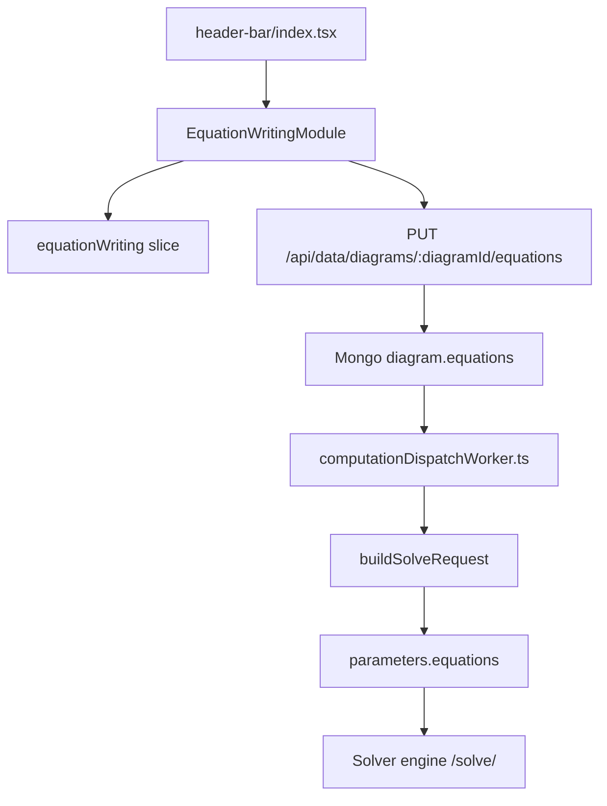

# Equation Writing Module Code Explanation

## Overview

The Equation Writing module lets users create named objective or constraint equations from diagram variables, imported variable rows, operators, and optional time-period suffixes. The main entry point is `src/src/frontend/src/components/header-bar/header-buttons/equation-writing-module.tsx`, rendered from the canvas header.

Draft equations live in the frontend Redux `equationWriting` slice. Saved equations are stored on the MongoDB diagram record as `diagram.equations`, then normalized into solver-facing `parameters.equations` when the computation dispatch worker builds the solve request.

## Source Files

- `src/src/frontend/src/components/header-bar/header-buttons/equation-writing-module.tsx`: modal UI, variable/operator selection, CSV import, equation tokenization, diagram hydration, save/delete API calls, and subnetwork variable discovery.
- `src/src/frontend/src/components/header-bar/header-buttons/equation-writing-module.css`: modal layout, editor, sidebar, toolbar, and term-list styling.
- `src/src/frontend/src/features/equationWriting/equationWritingSlice.ts`: Redux state, equation draft reducers, active equation selection, imported variable deduplication, and loaded diagram tracking.
- `src/src/frontend/src/components/header-bar/index.tsx`: renders `EquationWritingModule` in the main header toolbar.
- `src/src/frontend/src/store.ts`: registers the `equationWriting` reducer.
- `src/src/backend/routes/dataRoutes.ts`: sanitizes and persists `diagram.equations`, deletes saved equations, and enforces diagram ownership.
- `src/src/backend/workers/computationDispatchWorker.ts`: loads the saved diagram and passes `diagram.equations` into the solver request builder.
- `src/src/backend/services/solverEngineApiService.ts`: normalizes saved equation records into `parameters.equations` before posting to the solver engine.
- `src/src/backend/prisma/mongodb/schema.prisma`: declares the MongoDB `Diagram.equations Json?` field.

## Purpose and Responsibility

The frontend module owns the user experience for writing equations: opening the modal, creating drafts, selecting an active equation, assembling tokens, parsing free-text edits, importing variable choices from CSV, and saving or deleting equations for the current diagram.

The Redux slice owns temporary editor state only. It does not validate mathematical correctness or call the solver.

The backend data route owns persistence checks and storage sanitization. The computation worker and solver API service own the runtime handoff from stored diagram equations to the outbound solver payload. They do not let the Equation Writing UI edit `parameters.equations` directly.

## Inputs and Outputs

| Input | Source | Used For |
| --- | --- | --- |
| `diagramId` | React Router params | Loads, saves, and deletes equations for the current diagram. |
| `canvasName` | Redux `state.canvas.canvasName` | Defaults `belongTo` and appears in success alerts. |
| `flowNodes` | React Flow store | Builds variable options from current diagram nodes. |
| `state.domain.data.models` | Redux domain slice | Finds imported subnetwork model names. |
| `state.domain.data.eqTypesConfig` | Redux domain slice | Populates the `EQ Type` selector. |
| `state.equationWriting` | Redux slice | Supplies equation drafts, active equation id, imported variables, and loaded diagram id. |
| Model versions | `useNodeCache()` and embedded node data | Provides visible port and variable choices for nodes. |
| Subnetwork instance diagrams | `/api/data/diagrams/:diagramId/subnetwork-instance` and `/api/data/diagrams/:instanceDiagramId` | Adds subnetwork variables and `belongTo` choices. |
| CSV file | Hidden file input parsed with `xlsx` | Imports extra variable rows with `Node`, `Port`, and `Variable` columns. |
| Saved diagram equations | `/api/data/diagrams/:diagramId` | Hydrates Redux drafts when the modal opens. |

| Output | Destination | Notes |
| --- | --- | --- |
| `EquationDefinition[]` | Redux `state.equationWriting.equations` | Local draft state for the modal. |
| `PUT /api/data/diagrams/:diagramId/equations` | Backend data route | Persists all visible equation drafts for the diagram. |
| `DELETE /api/data/diagrams/:diagramId/equations/:equationId` | Backend data route | Removes one persisted equation by id. |
| `diagram.equations` | MongoDB diagram document | Stored JSON source of truth for saved equations. |
| `parameters.equations` | Solver request body | Runtime normalized copy sent during compute dispatch. |
| Alerts | Redux alert slice | Shows load, save, delete, import, and validation feedback. |

## Core State and Data Structures

- `EquationDefinition`: frontend draft record with `id`, `name`, `belongTo`, `equationType`, `eqType`, `expression`, and `tokens`.
- `EquationToken`: either a `variable` token with `network`, `node`, `port`, `variable`, `tp`, and `path`, or an `operator` token with `value`.
- `ImportedVariableDraft`: imported CSV row with `node`, `port`, and `variable`; the slice deduplicates rows case-insensitively by those three fields.
- `loadedDiagramId`: Redux guard that prevents equations loaded for one diagram from appearing while another diagram is active.
- `activeEquationId`: Redux pointer for the selected sidebar equation; deleting the active equation selects a neighbor or clears selection.
- `showPanel`: local state that opens the modal and gates hydration/subnetwork loading effects.
- `selectedNetwork`, `selectedNode`, `selectedPort`, `selectedVariable`, `selectedTimePeriod`: local selector state used to build the next variable token.
- `isUserSelfDefine`: swaps node, port, and variable dropdowns for text inputs.
- `isHydratingEquations`, `isSavingEquations`, `pendingDeleteEquationId`: local loading and disabled-state guards.
- `subnetworkDiagramData`: local cache of loaded subnetwork instance diagram nodes.

Persisted equations use this backend shape:

```ts
{
  id: string;
  name: string;
  expression: {
    belong_to: string;
    equation_type: string;
    eq_type: string;
    expression: string;
    tokens: StoredEquationToken[];
  };
}
```

The solver request receives a flattened normalized shape inside `parameters.equations`:

```ts
{
  name: string;
  belong_to: string;
  equation_type: string;
  eq_type: string;
  expression: string;
  tokens: Record<string, unknown>[];
}
```

## Main Functions and Components

- `EquationWritingModule`: renders the header button and modal, reads Redux/router/React Flow state, and coordinates all editor actions.
- `normalizePersistedEquations(...)`: converts saved records or legacy flat fields into frontend `EquationDefinition` drafts.
- `serializeEquationForPersistence(...)`: converts a frontend draft into the backend `expression` wrapper shape.
- `tokenizeExpressionSegments(...)` and `parseExpressionToTokens(...)`: split free-text expressions into operator and variable tokens while preserving bracketed time-period suffixes.
- `buildVariableTokenFromPath(...)`: parses a variable path such as `Network.Node.Port.Variable[t+1]` into a structured variable token.
- `buildNodeOptionsFromCanvasNodes(...)`: extracts node, port, and variable choices from canvas nodes and model versions.
- `handleAddEquation()`: creates the next `eq_###` draft and makes it active.
- `handleAddVariable()`: appends a selected or self-defined variable token and positions the cursor inside `[]` for self-defined time periods.
- `handleExpressionChange(...)`: reparses manually typed text and keeps `expression` and `tokens` synchronized.
- `handleSaveEquations()`: saves all visible drafts with `PUT /api/data/diagrams/:diagramId/equations`.
- `handleDeleteEquation(...)`: deletes from the backend first when a diagram id exists, then removes the local draft.
- `handleImportedVariableFile(...)`: validates and imports CSV variable rows.
- `sanitizeEquationDefinitionForStorage(...)`: backend sanitizer that trims fields, normalizes tokens, rebuilds expression text when needed, and defaults `equation_type` to `Objective Function`.
- `buildSolveRequest(...)`: injects normalized equations into `parameters.equations`.

## Rendered UI and Interaction Map

| UI State or Action | Source State or Props | Expected Result | Verification |
| --- | --- | --- | --- |
| Header `Equation Writing` button | `disabled` prop, default `buttonLabel` | Opens the modal unless disabled. | Click the header button. |
| Modal opens for saved diagram | `diagramId`, `loadedDiagramId`, `/api/data/diagrams/:diagramId` | Shows `Loading saved equations...`, then saved equations or empty state. | Open a saved diagram with and without stored equations. |
| `New Equation` | `visibleEquations`, hydration flags | Adds `eq_###`, names it `Equation N`, and selects it. | Click `New Equation`; sidebar and editor appear. |
| Sidebar name input | Active equation draft | Updates `name` in Redux immediately. | Rename a draft and save. |
| Sidebar delete button | `diagramId`, `pendingDeleteEquationId` | Calls delete route for saved diagrams, disables the deleting row, and selects the next draft. | Delete active and non-active equations. |
| Network/node/port/variable controls | React Flow nodes, node cache, imported rows, self-define toggle | Selects a variable source; self-define mode changes dropdowns to text inputs. | Toggle `User Self Define` and compare controls. |
| Time-period selector | `timePeriodOptions` | Adds no suffix, `[t]`, `[t+1]`, `[t-1]`, or `[]` to variable paths. | Add variables for each option. |
| Operator buttons | `operatorButtons` | Appends operator tokens to the expression and terms list. | Click each operator and inspect expression text. |
| Textarea edit | `handleExpressionChange` | Re-tokenizes free text and refreshes the terms panel. | Type `A.B.C.D[t] <= A.B.C.E[t+1]`. |
| Terms panel delete | Active equation `tokens` | Removes one token and rebuilds expression text from remaining tokens. | Delete a middle term. |
| Import button | Hidden `.csv` input | Imports unique variable choices with required headers. | Import valid and invalid CSV files. |
| Clear button | `isSavingEquations` | Clears active equation expression and tokens. | Clear during normal state and while saving. |
| Save Equation button | `diagramId`, `visibleEquations`, `isSavingEquations` | Persists all visible equations or alerts if the diagram has not been saved. | Save before and after creating a diagram. |

## Component Contract

`EquationWritingModule` accepts:

| Prop | Required | Behavior |
| --- | --- | --- |
| `disabled?: boolean` | No | Disables the header button and prevents opening the modal. Defaults to `false`. |
| `buttonLabel?: string` | No | Overrides the header button text. Defaults to `Equation Writing`. |

Important parent and child contracts:

- `header-bar/index.tsx` renders `<EquationWritingModule />` without passing computation disable rules, so the module currently remains available from the header whenever the header renders it.
- The component expects `RootState` to include `equationWriting`, `canvas`, and `domain`.
- `useNodeCache()` must provide `getCachedModelVersion`, `isLoading`, and `loadModelVersion`; missing model versions trigger background loads while the modal is open.
- React Bootstrap `Modal`, `Button`, `Form.Select`, `Form.Control`, and `Form.Check` provide the visible controls.
- The hidden import input accepts `.csv,text/csv` and is triggered through `importInputRef`.

Important hooks and cleanup:

- The subnetwork-loading effect depends on `diagramId`, `showPanel`, and `subnetworkDiagramReferences`. It uses a `didCancel` flag to avoid setting state after unmount or close.
- The equation-hydration effect depends on `currentBelongToDefault`, `diagramId`, `dispatch`, `isDiagramDraftReady`, and `showPanel`. It also uses `didCancel` and clears the loading flag when safe.
- Selector reset effects clear invalid `selectedNetwork`, `selectedNode`, `selectedPort`, and `selectedVariable` values when available options change, unless self-define mode owns the text.
- The missing-model-version effect loads node model versions only when the modal is open and the node is not already cached or loading.

## Data Flow

1. `header-bar/index.tsx` renders `EquationWritingModule` in the main toolbar.
2. The user opens the modal. If `diagramId` is present and the Redux drafts are not loaded for that diagram, the component fetches `/api/data/diagrams/:diagramId`.
3. `normalizePersistedEquations(...)` converts `diagram.equations` into Redux `EquationDefinition[]`, defaulting `belongTo` to the canvas name and `equationType` to `Objective Function` when needed.
4. The user creates or edits drafts. Button-driven edits append structured tokens; textarea edits parse text back into tokens.
5. The user saves. `serializeEquationForPersistence(...)` wraps each draft under `expression` and sends `PUT /api/data/diagrams/:diagramId/equations`.
6. `dataRoutes.ts` validates the diagram id, checks ownership, sanitizes the payload, rejects duplicate ids, and writes `diagram.equations` to MongoDB.
7. During a compute dispatch, `computationDispatchWorker.ts` loads the diagram and calls `buildSolveRequest(configuration, diagram.parameters, diagram.equations)`.
8. `solverEngineApiService.ts` normalizes the saved equations into `parameters.equations`.
9. `createComputationTask(...)` posts the solve request to `BASE_SOLVER_ENGINE_URL/solve/`.



## Backend/Data-Flow Contract

The persistence route accepts:

```ts
{
  equations: unknown[]
}
```

Each equation may contain fields in the current wrapped shape or older flat fields. The sanitizer reads `expression.belong_to`, `expression.equation_type`, `expression.eq_type`, `expression.expression`, and `expression.tokens` first, then falls back to flat `belong_to`, `equation_type`, `eq_type`, `expression`, and `tokens`.

Storage rules in `dataRoutes.ts`:

- `diagramId` must be a Mongo ObjectId.
- The authenticated user must own the diagram.
- `equations` must be an array.
- Duplicate sanitized `id` values are rejected.
- Operators are stored only as `{ type: 'operator', value }`; the backend trims but does not reject unknown operator values in existing operator tokens.
- Variable tokens are rebuilt from `path` when available. Otherwise `network.node.port.variable` plus `tp` becomes the fallback path.
- If token arrays are absent, the backend tokenizes `expression` text using the same operator list as the frontend.
- The route writes the whole sanitized array to `diagram.equations`; it is not a patch-by-id save.

Solver request rules in `solverEngineApiService.ts`:

- `parameters` is spread first, then `equations: normalizedEquations` is assigned, so the saved diagram equations override any existing `parameters.equations` value.
- The outbound field is exactly `parameters.equations`.
- Each outbound equation contains `name`, `belong_to`, `equation_type`, `eq_type`, `expression`, and `tokens`.
- Token normalization trims string fields and preserves only token records with `type` equal to `operator` or `variable`.

## Side Effects

- Opening the modal may call `/api/data/diagrams/:diagramId` to hydrate saved equations.
- Opening the modal with subnetwork wrappers may call `/api/data/diagrams/:diagramId/subnetwork-instance` and `/api/data/diagrams/:instanceDiagramId` to discover subnetwork variables.
- Missing model versions trigger `loadModelVersion(nodeId, sourceDiagramId)` through the node cache service.
- Saving writes the complete `diagram.equations` array in MongoDB.
- Deleting writes a filtered `diagram.equations` array in MongoDB and then removes the local draft.
- Importing CSV rows updates only Redux `importedVariables`; imported variable choices are not persisted unless they are used in saved equation tokens.
- Compute dispatch sends saved equations to the external solver inside `parameters.equations`.
- When `SAVE_JSON_FILES=true`, `solverEngineApiService.ts` may write the generated solve request JSON for debugging; that file is generated output, not documentation source of truth.

## Error Handling and Edge Cases

- If the modal opens without `diagramId`, hydration initializes empty drafts for a null diagram key.
- If save is attempted without `diagramId`, the UI shows `Please save the diagram before saving equations.` and does not call the backend.
- If loading saved equations fails, Redux is hydrated with an empty array and an error alert is shown.
- If delete fails, the local draft is left intact and the pending delete state is cleared.
- If `selectedNetwork`, `selectedNode`, `selectedPort`, or `selectedVariable` no longer exists in derived options, the component clears the invalid selection unless self-define mode is active.
- `handleAddVariable()` returns without changes unless an active equation and all variable path parts are present.
- CSV import rejects non-`.csv` files, empty files, headers other than exactly `Node`, `Port`, `Variable` after normalization, partial rows, and files with no valid rows.
- The tokenizer preserves bracket contents, so `t+1` and `t-1` are not split at `+` or `-`.
- The tokenizer treats `<=` and `>=` as two-character operators.
- A minus sign is treated as an operator in boundary cases; contributors should test negative values carefully if they add numeric literal support.
- The delete route does not report a special error when an equation id is absent from the saved array; it saves the unchanged filtered array.

## Extension Points

- Add a new operator by updating `operatorButtons` in `equation-writing-module.tsx`, `EQUATION_OPERATOR_OPTIONS` in `dataRoutes.ts`, and any solver-side expectations for `parameters.equations.tokens`.
- Add a new time-period preset by updating `timePeriodOptions`, the path suffix handling helpers, and manual checks for parsing/persistence.
- Add a new equation metadata field by updating `EquationDefinition`, `serializeEquationForPersistence(...)`, `normalizePersistedEquations(...)`, `sanitizeEquationDefinitionForStorage(...)`, `normalizeSolveRequestEquations(...)`, and the solver contract.
- Change variable discovery by editing `buildNodeOptionsFromCanvasNodes(...)`, `getVisiblePortVarsForNode(...)`, and the subnetwork-loading flow together.
- Persist imported CSV variable choices only if a new diagram field and backend route behavior are added; the current imported list is draft-only.
- Add automated coverage around tokenization, route sanitization, and solver normalization before changing expression parsing.

## Testing and Verification

Terminal: **PowerShell**

Working directory:

```text
HYPRONET-GUI/src/
```

Automated checks:

```powershell
npm.cmd run build
npm.cmd run test -- --runInBand --coverage=false
```

There is no equation-writing-specific test file in the current repository. Use the full build and test suite as broad regression checks, and add targeted tests when changing tokenization, persistence sanitization, or solver request normalization.

Manual frontend verification matrix:

| Scenario | Action | Expected Result | Regression Risk |
| --- | --- | --- | --- |
| Unsaved diagram | Open module, create equation, click Save Equation | Error alert says to save the diagram first. | Prevents writes without a diagram id. |
| Saved empty diagram | Open module and click `New Equation` | `eq_001` appears and editor controls render. | Draft initialization and active selection. |
| Canvas variable | Select network, node, port, variable, and `t+1`; click Add Variable | Textarea and terms panel show `Network.Node.Port.Variable[t+1]`. | Node cache and suffix formatting. |
| Self-defined variable | Enable `User Self Define`, type node/port/variable, select `Self-Define`, click Add Variable | Variable path ends with `[]` and cursor moves inside brackets. | Custom variable entry and cursor behavior. |
| Text parsing | Type an expression with `<=`, `>=`, `[t+1]`, and `[t-1]` | Terms panel keeps comparison operators and time-period suffixes intact. | Parser compatibility. |
| CSV import | Import a CSV with `Node,Port,Variable` headers and duplicate rows | Unique imported variables become selectable; invalid files show errors. | Import validation and deduplication. |
| Save and reload | Save equations, close modal, reload diagram, reopen modal | Saved names, metadata, expression, and tokens rehydrate. | Frontend/backend storage contract. |
| Delete saved equation | Delete an equation after saving | Backend delete succeeds and local active selection moves to a remaining equation. | Destructive persistence behavior. |
| Compute handoff | Save equation and start a computation | Solver request includes normalized `parameters.equations`. | Solver payload shape. |

For backend payload confirmation, prefer source-level tests around `dataRoutes.ts` and `solverEngineApiService.ts`. Generated files such as `src/src/backend/services/solve_request.json` may confirm a local run when `SAVE_JSON_FILES=true`, but they should not be committed or treated as the source of truth.

## Known Cautions

- Saving equations replaces the entire `diagram.equations` array, so callers must send all equations that should remain.
- The frontend and backend each maintain tokenizer/operator logic; update both sides together.
- `parameters.equations` is generated during compute dispatch. Do not document or edit it as the equation-writing source of truth.
- The module is currently rendered without the header computation disable rule, unlike some other header actions.
- Imported CSV variable choices are draft-only until they are included in an equation token and saved.
- Subnetwork variable discovery may create or load subnetwork instances while the modal is open.
- The solver request builder overwrites any existing `parameters.equations` with normalized `diagram.equations`.
- There is currently no dedicated automated test coverage for the equation-writing UI or equation route sanitizer.

## Related Pages

- `docs/CodeExplanation/header-bar.md`
- `docs/CodeExplanation/run-config-and-computation-start.md`
- `docs/CodeExplanation/compute-solver-callback-and-results.md`
- `docs/CodeExplanation/subnetwork-blueprint-and-instance-flow.md`
- `docs/CodeExplanation/save-diagram-and-node-cache.md`
