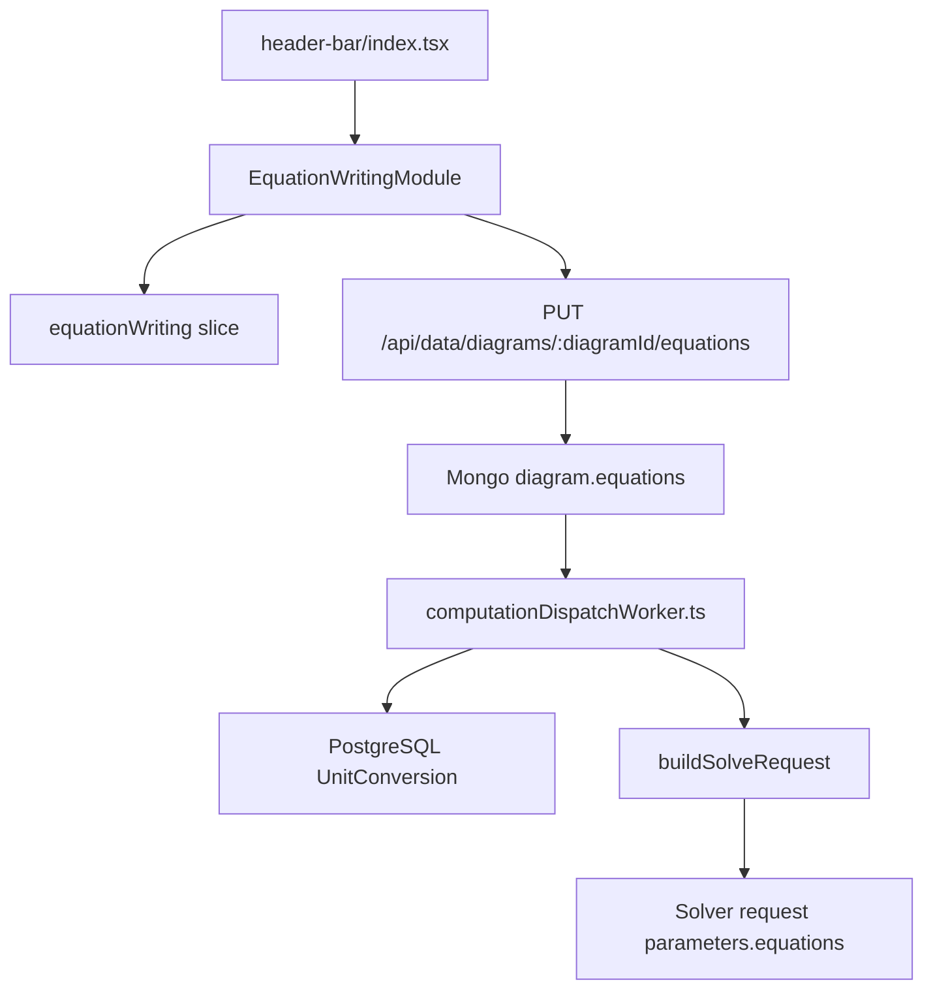

# Equation Writing Module Code Explanation

## Overview

The Equation Writing module lets users create objective-function and constraint equations from diagram variables, manually typed variable paths, imported CSV rows, operators, and time-period suffixes. The main frontend entry point is `src/src/frontend/src/components/header-bar/header-buttons/equation-writing-module.tsx`.

Draft equations live in Redux while the modal is open. Saved equations are written to MongoDB under `diagram.equations`. During computation, the backend reads those saved equations, normalizes their tokens, converts variable bounds to base units, and includes them in the solver request when they are relevant to the active run.

Equations can also reuse variable terms from other equations that belong to a compatible `+Constr` set. Constraint equations share terms with Constraint equations, and Objective Function equations share terms with Objective Function equations after Objective Function sets are restored in `+Constr`.

The module now distinguishes authored token kinds for the solver. Existing diagram variables are normalized as `model_variable`, user self-defined variables are normalized as `declared_variable`, numeric constants are normalized as `literal`, and older unresolved variable-shaped records can still pass through as `variable` for compatibility. Declared variables are also collected once into `parameters.declared_variables` so the solver can create them before evaluating expressions.

## Source Files

- `src/src/frontend/src/components/header-bar/header-buttons/equation-writing-module.tsx`: modal UI, equation list, token editing, Add Variable popover, Dimension/Unit conversion behavior, CSV import, save/delete calls, and subnetwork variable discovery.
- `src/src/frontend/src/components/header-bar/header-buttons/equation-writing-module.css`: layout and sizing for the modal, equation sidebar, editor, Add Variable popover, operator pad, and terms panel.
- `src/src/frontend/src/features/equationWriting/equationWritingSlice.ts`: Redux draft state for equations, active equation id, imported variable rows, and loaded diagram id.
- `src/src/frontend/src/features/constraint/constraintSlice.ts`: Redux draft cache for `+Constr` sets used by the shared-term selector.
- `src/src/frontend/src/components/header-bar/header-buttons/constraint-module.tsx`: assigns equations to compatible Objective Function or Constraint sets.
- `src/src/frontend/src/components/header-bar/index.tsx`: renders the Equation Writing button in the header.
- `src/src/frontend/src/store.ts`: registers the `equationWriting` reducer.
- `src/src/backend/routes/dataRoutes.ts`: sanitizes and persists `diagram.equations`, deletes saved equations, and loads domain-level equation metadata.
- `src/src/backend/workers/computationDispatchWorker.ts`: loads PostgreSQL unit conversion rows and passes diagram equations into the solver request builder.
- `src/src/backend/services/solverEngineApiService.ts`: converts equation tokens into solver payload shape and converts non-base bound values into base units.
- `src/src/backend/prisma/mongodb/schema.prisma`: declares the `Diagram.equations Json?` persistence field.

## Purpose and Responsibility

The frontend module owns equation authoring: creating drafts, assigning equation type metadata, adding variable and operator tokens, parsing typed expression text, importing variable rows, and saving or deleting equations for the current diagram.

The module does not validate whether an equation is mathematically solvable. It also does not decide which equations are active for optimization or data reconciliation; set and collection selection is handled by related modules and by the compute-start flow.

The backend route owns persistence validation and sanitization. The solver API service owns runtime conversion from stored equation JSON into the outbound solver payload.

## Inputs and Outputs

| Input | Source | Used For |
| --- | --- | --- |
| `diagramId` | React Router params | Loads, saves, and deletes equations for the current diagram. |
| `canvasName` | Redux `state.canvas.canvasName` | Defaults the `belongTo` value. |
| `flowNodes` | React Flow store | Builds available node, port, and variable options. |
| `state.domain.data.models` | Redux domain slice | Provides model version metadata for visible node variables. |
| `state.domain.data.eqTypesConfig` | Redux domain slice | Populates the `EQ Type` selector. |
| `state.domain.data.units` | Redux domain slice, sourced from PostgreSQL `UnitConversion` | Populates Dimension and Unit controls in Add Variable. |
| `state.equationWriting` | Redux slice | Supplies equation drafts, active equation id, imported variables, and loaded diagram guard. |
| `state.constraintDrafts` | Redux slice | Supplies cached `+Constr` set membership for shared-term lookup. |
| Saved diagram sets | `GET /api/data/diagrams/:diagramId` | Fallback source for shared-term lookup when the `+Constr` cache is not hydrated. |
| CSV import file | Hidden file input parsed by `xlsx` | Adds user-provided variable rows with `Node`, `Port`, and `Variable` columns. |
| Saved diagram equations | `GET /api/data/diagrams/:diagramId` | Hydrates Redux drafts when the modal opens. |

| Output | Destination | Notes |
| --- | --- | --- |
| `EquationDefinition[]` | Redux `state.equationWriting.equations` | Local draft state for the modal. |
| `PUT /api/data/diagrams/:diagramId/equations` | Backend data route | Persists all visible equation drafts for the diagram. |
| `DELETE /api/data/diagrams/:diagramId/equations/:equationId` | Backend data route | Removes one persisted equation by id. |
| `diagram.equations` | MongoDB diagram document | Stores user-facing equation data, including the user-selected unit. |
| `parameters.equations` | Solver request body | Contains normalized saved equations, with token kinds resolved and variable bounds converted to base units. |
| `parameters.declared_variables` | Solver request body | Contains one declaration token per user self-defined variable referenced by saved equations or selected nested structures. |
| `parameters.solve_inputs` | Solver request body | Contains selected run inputs. Objective Function selections use equation ids; additional constraints use collection ids. |

## Core State and Data Structures

- `EquationDefinition`: frontend draft record with `id`, `name`, `belongTo`, `equationType`, `eqType`, `expression`, and `tokens`.
- `EquationToken`: discriminated token. Operator tokens store `value`; variable-like tokens store the existing user-facing fields `type`, `name`, `path`, `network`, `node`, `port`, `variable`, `tp`, `lb`, `ub`, and `units`, plus a token kind that can become `variable`, `literal`, `model_variable`, or `declared_variable`.
- `AddVariableDraft`: local popover state for `name`, `lb`, `ub`, `dimension`, `units`, and Pyomo variable `type`.
- `ImportedVariableDraft`: CSV-imported row with `node`, `port`, and `variable`; deduplicated case-insensitively.
- `activeEquationId`: current sidebar equation.
- `loadedDiagramId`: prevents drafts loaded from one diagram from leaking into another.
- `isUserSelfDefine`: switches node, port, and variable controls into text inputs.
- `showAddVariablePopover`: controls whether the metadata popover for Add Variable is open.
- `selectedSharedEquationId` and `selectedSharedTermIndex`: track the same-set equation and variable token selected for reuse.
- `selectedAttributeVariable`: tracks the structured variable token whose attributes are shown from the expression editor popover.

Persisted equations use this backend wrapper:

```ts
{
  id: string;
  name: string;
  expression: {
    belong_to: string;
    equation_type: string;
    eq_type: string | null;
    expression: string;
    tokens: StoredEquationToken[];
  };
}
```

Solver-normalized equation tokens keep the same user-facing fields where possible:

```ts
{
  token_type: 'variable' | 'literal' | 'model_variable' | 'declared_variable';
  type: string | null;
  name: string;
  network: string | null;
  node: string | null;
  port: string | null;
  variable: string | null;
  tp: string | null;
  path: string;
  lb: number | null;
  ub: number | null;
  units: string | null;
}
```

Numeric literals use `token_type: 'literal'`. Mongo persistence keeps the original token structure and only updates the token kind; the solve-request builder may compact numeric literals into the solver-facing literal form. Declared-variable expression references do not repeat Pyomo `type`; that metadata belongs to the corresponding top-level `parameters.declared_variables` entry.

## Main Functions and Components

- `EquationWritingModule`: renders the button and modal, coordinates state, and owns user interactions.
- `normalizePersistedEquations(...)`: converts Mongo records into frontend drafts, supporting both current wrapped records and older flatter shapes.
- `serializeEquationForPersistence(...)`: wraps a frontend equation under `expression` for MongoDB persistence.
- `tokenizeExpressionSegments(...)` and `parseExpressionToTokens(...)`: split text expressions into variable/operator tokens while preserving bracketed time-period suffixes.
- `buildVariableTokenFromPath(...)`: parses a typed path into a variable token when possible.
- `buildNodeOptionsFromCanvasNodes(...)`: resolves visible node, port, and variable options from the canvas and model-version cache.
- `buildAddVariableDraftFromSelection()`: seeds Add Variable metadata from the currently selected variable option.
- `handleAddVariableDimensionChange(...)`: changes the Dimension dropdown, selects the first compatible unit, and clears `lb`/`ub` to avoid stale values.
- `handleAddVariableUnitChange(...)`: converts the current `lb`/`ub` display values between units within the same dimension.
- `handleConfirmAddVariable()`: validates variable selection and appends the structured variable token.
- `handleEquationTypeChange(...)`: switches between Objective Function and Constraint, clears the active expression, and prevents stale comparison syntax from crossing equation types.
- `handleOperatorButtonClick(...)`, `handleExpressionKeyDown(...)`, and `handleExpressionPaste(...)`: block comparison operators for Objective Function equations while allowing them for Constraint equations.
- `handleExpressionChange(...)`: reparses manually typed expression text and synchronizes tokens.
- `handleSaveEquations()`: saves the full visible equation list.
- `handleDeleteEquation(...)`: deletes one saved equation and updates local state.
- `handleImportedVariableFile(...)`: validates CSV headers and imports user variable choices.
- `normalizePersistedConstraintSets(...)`: reads saved `+Constr` set membership so shared-term options can be built even when the `+Constr` modal has not been opened.
- `handleSharedEquationChange(...)`: selects another equation from a compatible same-type set as the source of reusable terms.
- `handleSharedTermChange(...)`: clones the selected variable token, preserving node, port, variable, bounds, unit, and path metadata, then appends it to the active equation.
- `handleExpressionTermClick(...)`: opens the attribute popover for `model_variable` and `declared_variable` tokens only.
- `normalizeSolveRequestEquations(...)`: converts stored equations to solver shape and converts non-base bounds into base-unit values.

## Rendered UI and Interaction Map

| UI Area | Behavior |
| --- | --- |
| Header button | Opens the Equation Writing modal. |
| Left equation sidebar | Lists equations, allows rename, displays read-only type badge `ObjecF` or `Const`, and deletes equations. |
| Equation type selector | Stores `Objective Function` or `Constraint`; the sidebar badge is display-only and fixed-size. |
| `Belong to` selector | Stores equation ownership context for the expression wrapper. |
| `EQ Type` selector | Populated from PostgreSQL-backed EQ type config. |
| Shared Eq selector | Lists same-type equations that share at least one compatible `+Constr` set with the active equation. |
| Shared Term selector | Lists variable tokens from the selected shared equation and appends the selected token to the active expression. |
| Variable selectors | Build a variable path from network, node, port, variable, and TP values. |
| `User Self Define` | Allows `Node/Port/Var`, `Node/Var`, or `Port/Var`, as long as `Var` is not empty. |
| Add Variable popover | Captures name, lower bound, upper bound, Dimension, Unit, and type before inserting a token. |
| Dimension dropdown | Lists dimensions from `UnitConversion`; changing it clears bounds and resets unit. |
| Unit dropdown | Lists the base unit and target units for the selected dimension; changing it converts displayed bounds. |
| Operator pad | Appends operator tokens. Comparison operators `=`, `==`, `<`, `<=`, `>`, and `>=` are disabled for Objective Function equations. |
| Text editor | Allows free text edits; changes are parsed back into tokens. Keyboard and pasted comparison syntax is blocked for Objective Function equations. |
| Structured term popover | Clicking a `model_variable` or `declared_variable` term shows its saved attributes. Link styling is only visible when the cursor is over the term. |
| Terms panel | Displays current tokens and allows term deletion. |
| Import | Imports CSV rows as draft-only variable choices. |
| Save Equation | Persists all equation drafts for the current diagram. |

## Component Contract

`EquationWritingModule` accepts:

| Prop | Required | Behavior |
| --- | --- | --- |
| `disabled?: boolean` | No | Disables the header button and prevents opening the modal. |
| `buttonLabel?: string` | No | Overrides the header button text. |

The component expects the Redux store to provide `domain`, `canvas`, and `equationWriting` slices. It also expects `useNodeCache()` to provide cached model versions or the ability to load missing versions while the modal is open.

## Data Flow

1. The header renders `EquationWritingModule`.
2. Opening the modal fetches `GET /api/data/diagrams/:diagramId` when the current diagram's equations are not already hydrated.
3. Saved equations are normalized into Redux drafts.
4. The user edits the active equation through selectors, typed text, operator buttons, CSV imports, and the Add Variable popover.
5. The shared-term selectors derive same-type, same-set equations from `constraintDrafts` or saved `diagram.sets`; selecting a term appends a cloned variable token to the active equation.
6. Add Variable stores user-facing metadata exactly as selected, including non-base units.
7. Save sends all visible drafts to `PUT /api/data/diagrams/:diagramId/equations`.
8. `dataRoutes.ts` validates ownership, sanitizes tokens, rejects duplicate equation ids, and writes `diagram.equations`.
9. During computation, `computationDispatchWorker.ts` loads PostgreSQL `UnitConversion` rows and calls `buildSolveRequest(...)` with `diagram.equations`.
10. `solverEngineApiService.ts` converts each variable token's `lb` and `ub` from the selected unit into the dimension base unit when a conversion row exists.
11. The solver request contains base-unit equation bounds, while MongoDB still preserves the user-selected unit for future editing.


```mermaid
flowchart TD
  Header["header-bar/index.tsx"] --> Modal["EquationWritingModule"]
  Modal --> Redux["equationWriting slice"]
  Modal --> SaveRoute["PUT /api/data/diagrams/:diagramId/equations"]
  SaveRoute --> Mongo["Mongo diagram.equations"]
  Mongo --> Worker["computationDispatchWorker.ts"]
  Worker --> Units["PostgreSQL UnitConversion"]
  Worker --> Builder["buildSolveRequest"]
  Builder --> Solver["Solver request parameters.equations"]
```

## Backend/Data-Flow Contract

The save route accepts `{ equations: unknown[] }`. Each equation may use the current wrapped `expression` shape or legacy flat fields. The sanitizer writes the current wrapper shape.

Important storage rules:

- `diagramId` must be a valid MongoDB ObjectId.
- The authenticated user must own the diagram.
- `equations` must be an array.
- Duplicate sanitized equation ids are rejected.
- Operator tokens are stored as operator tokens only.
- Variable tokens require a usable `path`; tokens without one are dropped.
- The route replaces the full `diagram.equations` array rather than patching a single equation.

Important solver rules:

- `buildSolveRequest(...)` removes older independent solve-input parameter keys before adding normalized fields.
- `parameters.equations` is generated from `diagram.equations` when saved equations exist.
- `parameters.declared_variables` is generated from declared-variable tokens and keeps the same token shape as the equation variable records.
- `parameters.solve_inputs` is generated from the computation configuration selection snapshot.
- Selected set and collection snapshots use ids for references, so duplicate display names do not confuse the solver.
- Non-base variable bounds are converted with `(value - offset) / multiplier`; the outbound unit is the dimension base unit.
- Structured diagram variables emit `token_type: 'model_variable'` with network, node id, port, and variable fields. User self-defined variables emit `token_type: 'declared_variable'`. Numeric constants emit `token_type: 'literal'`.

## Side Effects

- Opening the modal may fetch the current diagram.
- Opening the modal may load subnetwork instance diagrams and missing model versions.
- Saving writes the full equation array into MongoDB.
- Deleting writes a filtered equation array into MongoDB.
- CSV import changes only Redux draft options unless imported variables are used in saved tokens.
- Solver dispatch may write `src/src/backend/services/solve_request.json` when `SAVE_JSON_FILES=true`; that file is debug output, not source of truth.

## Error Handling and Edge Cases

- Saving without a saved diagram shows `Please save the diagram before saving equations.`
- Loading failures hydrate an empty equation draft list and show an alert.
- Deleting failures leave the local draft in place.
- In structured mode, Add Variable requires network, node, port, and variable.
- In self-defined mode, Add Variable requires only the variable field. Node and port are optional.
- If self-defined mode has node/port values but no variable, Add Variable shows an error.
- Shared-term selectors are disabled only when the active equation has no compatible same-type set peers or the selected peer has no variable tokens.
- Objective Function equations cannot contain comparison operators. Changing between Objective Function and Constraint clears the expression to avoid carrying invalid syntax across types.
- Shared terms copy the original token metadata; later edits to the source equation do not automatically update copied terms in other equations.
- Changing Dimension clears `lb` and `ub`; changing Unit converts the current bounds if both units are known.
- CSV import rejects non-CSV files, empty files, wrong headers, partial rows, and files with no valid rows.
- The tokenizer preserves bracket contents such as `[t+1]`, so `+` inside brackets is not treated as an operator.
- Standalone numeric expressions are preserved as literal tokens even when the user did not insert them through Add Variable.

## Extension Points

- Add an operator by updating the frontend operator list, backend operator sanitizer, and solver expectations together.
- Add equation metadata by updating `EquationDefinition`, persistence serialization, backend sanitization, and solver normalization.
- Change unit behavior by updating frontend `UnitConversion` helpers and backend `normalizeSolveRequestToken(...)` together.
- Change self-defined variable rules in both `handleConfirmAddVariable()` and solver token normalization.
- Persist CSV imports only after adding an explicit Mongo field and route support.
- Add automated coverage around token parsing, unit conversion, and solver normalization before changing expression syntax.

## Testing and Verification

Terminal: **PowerShell**

Working directory:

```text
HYPRONET-GUI/src/
```

Useful checks:

```powershell
npm.cmd exec tsc -- -p tsconfig.build.json --noEmit
npm.cmd exec eslint src/frontend/src/components/header-bar/header-buttons/equation-writing-module.tsx
```

Manual verification matrix:

| Scenario | Expected Result |
| --- | --- |
| Create, rename, and save an equation | Mongo `diagram.equations` stores the new wrapped equation. |
| Add structured variable | Token contains network, node, port, variable, tp, path, bounds, units, and type. |
| Add self-defined `Var` only | Token is accepted and no Node/Port validation error appears. |
| Add self-defined Node/Port without Var | Error alert appears and token is not added. |
| Constraint equation shares a set with another Constraint equation | `Shared Eq` lists the peer equation and `Shared Term` appends the selected variable token. |
| Objective Function equation is active | Shared-term controls are disabled. |
| Change Dimension | Unit resets to a compatible unit and `lb`/`ub` become empty. |
| Change Unit within same Dimension | Existing `lb`/`ub` values convert on screen. |
| Run computation with non-base unit bounds | `solve_request.json`, when enabled, shows base-unit bounds and base unit. |
| Delete saved equation | Backend deletes it and active selection moves to a remaining equation or empty state. |
| Import invalid CSV | User sees an error and no rows are added. |

## Known Cautions

- Do not treat `src/src/backend/services/solve_request.json` as source code. It is generated only when debugging is enabled.
- Mongo stores user-selected units for editor clarity; solver payload uses base units for variable bounds.
- Display names are not unique. Use ids when connecting equations to sets, sets to collections, or rows to SoluAlgoLib.
- Shared-term lookup depends on saved or cached `+Constr` set membership. Unsaved set changes are available only while the Redux draft cache is still loaded for the current diagram.
- `parameters.solve_inputs` and `parameters.equations` serve different purposes. The former captures selected run inputs; the latter carries normalized saved equations.
- The Add Variable popover conversion is frontend-only until computation dispatch performs the final base-unit conversion.

## Related Pages

- [Constraint Module Code Explanation](./constraint-module.md)
- [Solution Algorithm Library Module Code Explanation](./solution-algo-library-module.md)
- [Run Config and Computation Start Code Explanation](./run-config-and-computation-start.md)
- [Compute, Solver Callback, and Results Code Explanation](./compute-solver-callback-and-results.md)
- [Translation and Reverse Translation Code Explanation](./translation-and-reverse-translation.md)
