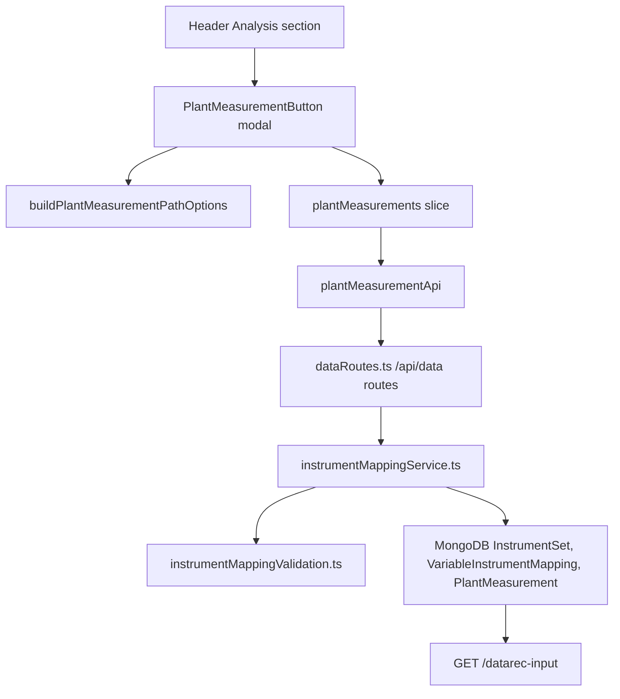

## Overview

The Plant Measurements workflow lets a user define an instrument set for the current diagram, map plant instruments to model variables, import or enter measured plant values, and save those rows for later DataRec use. The main frontend entry point is `src/src/frontend/src/components/header-bar/header-buttons/plant-measurements/plant-measurement-button.tsx`, rendered from the header `Analysis` section.

This workflow spans the header UI, Redux draft state, frontend validation utilities, backend `/api/data` routes, MongoDB persistence models, and a backend-only DataRec input endpoint. It is not part of the solver payload path until another caller reads the saved DataRec input.

## Source Files

- `src/src/frontend/src/components/header-bar/index.tsx`: renders `PlantMeasurementButton` in the `Analysis` header section and passes the computation read-only rule.
- `src/src/frontend/src/components/header-bar/header-buttons/plant-measurements/plant-measurement-button.tsx`: modal UI, instrument-set loading, mapping and measurement grids, row edits, file import, validation, save, delete, date picker, and time picker.
- `src/src/frontend/src/components/header-bar/header-buttons/plant-measurements/plantMeasurementModelPathUtils.ts`: derives selectable network, subnetwork, node, port, variable, and unit options from current canvas nodes, subnetwork diagrams, model versions, and unit conversions.
- `src/src/frontend/src/components/header-bar/header-buttons/plant-measurements/plantMeasurementTableValidation.ts`: frontend mapping and measurement validation, stale model-path warnings, duplicate checks, include parsing, numeric parsing, timestamp parsing, and unit matching.
- `src/src/frontend/src/components/header-bar/header-buttons/plant-measurements/plantMeasurementImportUtils.ts`: parses imported spreadsheet rows and requires `Include?`, `Instrument Name`, `Value`, `Units`, `Date`, and `Time` columns.
- `src/src/frontend/src/components/header-bar/header-buttons/plant-measurements/plantMeasurementRowSyncUtils.ts`: keeps measurement rows aligned when a mapped instrument is renamed.
- `src/src/frontend/src/features/plantMeasurements/plantMeasurementApi.ts`: frontend API wrapper for instrument sets, mappings, measurement preview, and measurement save routes.
- `src/src/frontend/src/features/plantMeasurements/plantMeasurementSlice.ts`: Redux draft state for the active instrument set, mapping rows, and imported measurement rows.
- `src/src/frontend/src/features/plantMeasurements/plantMeasurementTypes.ts`: shared frontend DTO and draft row types.
- `src/src/frontend/src/store.ts`: registers the `plantMeasurements` reducer and excludes plant-measurement draft actions from the global saved-state dirty marker.
- `src/src/backend/routes/dataRoutes.ts`: authenticated `/api/data` endpoints for instrument sets, mapping replacement, measurement preview, measurement replacement, and DataRec input.
- `src/src/backend/services/instrumentMappingService.ts`: backend access checks, validation orchestration, whole-set replace operations, saved measurement revalidation, DTO conversion, and DataRec input assembly.
- `src/src/backend/utils/instrumentMappingValidation.ts`: backend validation and normalization shared by mapping, measurement, and DataRec input generation.
- `src/src/backend/prisma/mongodb/schema.prisma`: MongoDB `InstrumentSet`, `VariableInstrumentMapping`, and `PlantMeasurement` models.

## Purpose and Responsibility

The frontend owns the user-facing plant measurement workspace. It opens from the header, lists or creates instrument sets for the current diagram, stages editable mapping and measurement rows in Redux, validates rows before save, and calls the backend API.

The backend owns authorization, persistence, canonical validation, whole-set replacement, and DataRec input generation. It does not trust frontend validation. It checks diagram or instrument-set ownership for every route and stores normalized rows in MongoDB.

This page owns the Plant Measurements and Instrument Mapping workflow. It does not own general diagram save behavior, compute dispatch, or solver request translation; those are covered by related CodeExplanation pages.

## Inputs and Outputs

| Input | Source | Used For |
| --- | --- | --- |
| `diagramId` | React Router params and backend route params | Lists or creates instrument sets for the current diagram. |
| `readOnly` | `PlantMeasurementButton` prop from `useComputingDisableRule("Analysis.PlantMeasurements")` | Blocks edits, imports, creates, deletes, and saves while the workflow is read-only. |
| `flowNodes` | React Flow store | Builds current-network node, port, variable, and unit choices. |
| `subnetworkDiagramData` | Local modal state loaded from current subnetwork data | Adds subnetwork path options for mapping rows. |
| `domainUnits` | Redux domain data | Supplies unit conversion options and safe value conversion when units change. |
| `activeInstrumentSet` | Redux `state.plantMeasurements.activeInstrumentSet` | Selects which mapping and measurement rows are loaded or saved. |
| `mappingDraftRows` | Redux `state.plantMeasurements.mappingDraftRows` | Draft variable-to-instrument mappings displayed in the Instrument Mapping tab. |
| `importedMeasurementRows` | Redux `state.plantMeasurements.importedMeasurementRows` | Draft plant measurement rows displayed in the Plant Measurements tab. |
| Spreadsheet rows | `.csv`, `.xlsx`, or `.xls` import parsed with `xlsx` | Adds measured plant values for preview and editing. |
| Authenticated user | `authenticateToken` in `dataRoutes.ts` | Scopes every backend route to the current user. |

| Output | Destination | Notes |
| --- | --- | --- |
| `InstrumentSetDto[]` | Frontend instrument-set select | Loaded from `GET /api/data/diagrams/:diagramId/instrument-sets`. |
| `VariableInstrumentMappingDraft[]` | Redux and MongoDB `variable_instrument_mappings` | Saved through whole-set replacement for one instrument set. |
| `PlantMeasurementDraft[]` | Redux and MongoDB `plant_measurements` | Saved through whole-set replacement for one instrument set. |
| Row `errors` and `warnings` | Grid status cells and backend DTOs | Used to block saves or warn about stale paths and accuracy choices. |
| `DataRecInputRow[]` | `GET /api/data/instrument-sets/:instrumentSetId/datarec-input` response | Backend-only output built from included, valid saved measurements with matching mappings. |
| Alerts | Redux alert slice | Shows load, create, delete, import, validation, and save failures or success messages. |

## Core State and Data Structures

- `InstrumentSetDto`: `{ id, diagramId, network, instrSet }`; one instrument set is unique by `diagramId`, normalized `network`, and normalized `instrSet`.
- `VariableInstrumentMappingDraft`: maps a model variable path to an instrument name and units, with optional bounds and accuracy fields.
- `PlantMeasurementDraft`: represents a plant value row with `include`, `instrumentName`, `value`, `units`, `date`, `time`, optional `mappingId`, and optional row-level `errors` or `warnings`.
- `activeInstrumentSet`: Redux selection for the currently loaded instrument set. Setting it clears mapping and measurement drafts.
- `mappingDraftRows`: Redux draft rows for the Instrument Mapping tab.
- `importedMeasurementRows`: Redux draft rows for the Plant Measurements tab.
- `pathOptions`: memoized model path options built from current canvas nodes, subnetwork diagram data, and unit conversions.
- `activeTab`: local modal state that switches between `mappings` and `measurements`.
- `instrumentSets`, `isLoading`, `isSaving`, `isSetDataReady`: local state controlling selection, fetch status, save status, and disabled states.
- `InstrumentSet`, `VariableInstrumentMapping`, and `PlantMeasurement`: MongoDB Prisma models persisted under `instrument_sets`, `variable_instrument_mappings`, and `plant_measurements`.
- `DataRecInputRow`: backend output containing `instrumentName`, `plantValue`, `units`, `date`, `time`, `accuracy`, `bounds`, and `modelPath`.

## Main Functions and Components

- `PlantMeasurementButton`: renders the header button, modal, set selector, create/delete controls, mapping grid, measurement grid, import input, and save button.
- `loadInstrumentSets()`: loads sets for the current diagram and clears the list when there is no `diagramId`.
- `loadSetData(instrumentSetId)`: loads mappings and measurements in parallel, then stages them in Redux.
- `handleCreateInstrumentSet()`: validates the selected network, creates or gets the instrument set, reloads the set list, selects the set, and loads its rows.
- `handleDeleteInstrumentSet()`: confirms deletion, deletes the selected set, reloads the set list, and selects the next available set.
- `handleMappingFieldCommit(...)`: applies cell edits, clears stale row status, refreshes dependent selections, resolves units, converts numeric values when units change, and syncs measurement rows when an instrument is renamed.
- `handleMeasurementFieldCommit(...)`: applies measurement edits, clears stale row status, and updates units or mapping id from the matching mapping.
- `handleImportFile(...)`: validates file type, parses rows with `xlsx`, sends import preview to the backend, and stages valid plus invalid preview rows for review.
- `handleSave()`: validates mapping and measurement rows on the frontend, stages invalid rows when needed, then saves mappings followed by measurements.
- `buildPlantMeasurementPathOptions(...)`: derives mapping choices from current nodes and subnetwork diagram entries.
- `validateVariableInstrumentDraftRows(...)` and `validatePlantMeasurementDraftRows(...)`: frontend pre-save validation.
- `replaceVariableInstrumentMappings(...)` and `replacePlantMeasurements(...)`: backend whole-set replacement operations.
- `revalidateSavedMeasurements(...)`: backend repair pass that detaches or disables saved measurements when mappings are changed or removed.
- `getDataRecInput(...)`: backend response builder that returns only included, error-free saved measurements that still have matching mappings.

## Rendered UI and Interaction Map

| UI State or Action | Source State or Props | Expected Result | Verification |
| --- | --- | --- | --- |
| Header `Plant Measurements` button | `readOnly` prop | Opens the modal when editable; is disabled when read-only. | Click the button during normal state and while computation processing makes the rule read-only. |
| Modal opens without saved diagram | Missing `diagramId` | Shows an error alert telling the user to save the diagram first. | Open from an unsaved diagram. |
| Modal opens with saved diagram | `diagramId` route param | Loads instrument sets for the diagram and shows the set selector. | Open from a saved diagram with no sets and with existing sets. |
| `New Set` | `pathOptions.networks`, create form state | Opens a create modal with a network select and `InstrSet` name. | Create `VARINSTRMAP` for the current network. |
| Delete set | `activeInstrumentSet` | Confirms and deletes the set plus its mappings and measurements. | Delete a set and confirm it disappears from the selector. |
| Instrument Mapping tab | `mappingDraftRows` | Shows an AgGrid mapping table with selectable path fields, instrument name, units, bounds, accuracy, and status. | Add, edit, remove, and save mapping rows. |
| Plant Measurements tab | `importedMeasurementRows` and validated mapping rows | Shows add/remove/import controls and a measurement table. | Add a row after at least one valid mapping exists. |
| Import measurements | Hidden file input, `parsePlantMeasurementImportRows`, backend preview route | Imports `.csv`, `.xlsx`, or `.xls` rows for review, including invalid rows with errors. | Import valid and invalid files. |
| Save | Frontend validation, `activeInstrumentSet`, backend save routes | Saves mappings then measurements and reloads saved DTOs into Redux. | Save valid rows, then reload the modal. |
| Invalid rows | Validation output | Stages row `errors` and blocks save. | Try duplicate instruments, invalid timestamps, mismatched units, or missing required fields. |

## Component Contract

`PlantMeasurementButton` accepts:

| Prop | Required | Behavior |
| --- | --- | --- |
| `readOnly?: boolean` | No | Disables the header button and all mutating modal actions when true. Defaults to `false`. |

Important parent and child contracts:

- `header-bar/index.tsx` renders `<PlantMeasurementButton readOnly={rulePlantMeasurements} />` only in the `Analysis` section.
- `useComputingDisableRule("Analysis.PlantMeasurements")` returns true while `canvas.isComputationProcessing` is true because `ComputingDisableMap` marks the workflow as `ReadOnly`.
- The component expects `RootState` to include `canvas`, `domain`, and `plantMeasurements`.
- `plantMeasurementApi` assumes `axios` is configured to reach `/api/data`.
- The AgGrid tables use full-row draft arrays from Redux; cell commits replace the entire draft array.
- `plantMeasurementSlice.setActiveInstrumentSet(...)` intentionally clears both draft row arrays to avoid showing rows from a previous set.
- `store.ts` excludes `clearPlantMeasurementState`, `setActiveInstrumentSet`, `stageImportedMeasurementRows`, and `updateMappingDraftRows` from the global saved-state dirty marker. Plant measurement edits are saved by this workflow's own Save button, not by diagram save.

Important hooks and cleanup:

- `pathOptions` is memoized from current network name, flow nodes, subnetwork data, and domain unit conversions.
- An effect fills `networkName` when exactly one network option exists.
- Click handling stops AgGrid editing before outside interactions so picker popovers and cells commit cleanly.
- Refs hold the mapping grid, measurement grid, and hidden import input.

## Data Flow

1. The user opens the header `Analysis` section and clicks `Plant Measurements`.
2. `PlantMeasurementButton` checks `diagramId`; if it is missing, the workflow stops with an alert.
3. The modal calls `GET /api/data/diagrams/:diagramId/instrument-sets` and displays existing instrument sets.
4. The user creates or selects a set. The frontend calls `POST /api/data/diagrams/:diagramId/instrument-sets` or selects an existing id, then loads mappings and measurements.
5. `loadSetData(...)` calls `GET /api/data/instrument-sets/:instrumentSetId/mappings` and `GET /api/data/instrument-sets/:instrumentSetId/measurements`.
6. Redux stores the active set, mapping drafts, and measurement drafts.
7. The user edits mapping rows. `plantMeasurementModelPathUtils.ts` keeps node, port, variable, and unit choices aligned to the current model paths.
8. The user edits or imports measurement rows. Import parses spreadsheet rows, sends them to `/measurements/import-preview`, and stages valid and invalid rows for review.
9. On Save, frontend validation runs first. If any invalid row exists, row errors are staged and no backend save happens.
10. Valid mapping rows are sent to `PUT /api/data/instrument-sets/:instrumentSetId/mappings`.
11. The backend validates and replaces all mapping rows for the set, then revalidates saved measurements against the new mappings.
12. Valid measurement rows are sent to `PUT /api/data/instrument-sets/:instrumentSetId/measurements`.
13. The backend validates and replaces all measurement rows for the set, then returns saved DTOs to Redux.
14. A backend caller can later call `GET /api/data/instrument-sets/:instrumentSetId/datarec-input` to get included, valid measurements with mapping bounds, accuracy, and model paths.



## Backend/Data-Flow Contract

All Plant Measurements routes use `authenticateToken` and the current `req.user.id`.

| Route | Request | Response | Backend Owner |
| --- | --- | --- | --- |
| `GET /api/data/diagrams/:diagramId/instrument-sets` | `diagramId` route param | `{ instrumentSets }` | `listInstrumentSets(...)` |
| `POST /api/data/diagrams/:diagramId/instrument-sets` | `{ network, instrSet? }` | `201 { instrumentSet }` | `createOrGetInstrumentSet(...)` |
| `DELETE /api/data/instrument-sets/:instrumentSetId` | `instrumentSetId` route param | `{ instrumentSet }` | `deleteInstrumentSet(...)` |
| `GET /api/data/instrument-sets/:instrumentSetId/mappings` | `instrumentSetId` route param | `{ mappings }` | `listVariableInstrumentMappings(...)` |
| `PUT /api/data/instrument-sets/:instrumentSetId/mappings` | `{ mappings: MappingRowInput[] }` | `{ mappings }` | `replaceVariableInstrumentMappings(...)` |
| `POST /api/data/instrument-sets/:instrumentSetId/measurements/import-preview` | `{ rows: Record<string, unknown>[] }` | `{ validRows, invalidRows }` | `previewPlantMeasurements(...)` |
| `GET /api/data/instrument-sets/:instrumentSetId/measurements` | `instrumentSetId` route param | `{ measurements }` | `listPlantMeasurements(...)` |
| `PUT /api/data/instrument-sets/:instrumentSetId/measurements` | `{ measurements: MeasurementRowInput[] }` | `{ measurements }` | `replacePlantMeasurements(...)` |
| `GET /api/data/instrument-sets/:instrumentSetId/datarec-input` | `instrumentSetId` route param | `{ instrumentSet, measurements }` | `getDataRecInput(...)` |

Persistence rules:

- `assertDiagramAccess(...)` rejects missing diagrams with 404 and diagrams owned by another user with 403.
- `assertInstrumentSetAccess(...)` rejects missing instrument sets with 404 and sets owned by another user with 403.
- `createOrGetInstrumentSet(...)` validates the network name and rejects networks that do not match the current diagram network.
- `InstrumentSet` is unique by `diagramId`, `networkKey`, and `instrSetKey`.
- `VariableInstrumentMapping` is unique by `instrumentSetId` and `instrumentKey`.
- Mapping replacement deletes all mappings for the set, creates the submitted valid rows, and then revalidates existing measurements.
- Measurement replacement deletes all measurements for the set and creates the submitted valid rows.
- Measurement preview validates spreadsheet rows against current saved mappings but does not write MongoDB.
- `getDataRecInput(...)` includes only measurements where `include === true`, `mappingId` exists, `rowErrors` is empty, and the mapping still exists.

Validation rules:

- `network`, `nodeName`, `port`, `variable`, `instrument`, and `units` are required for mappings.
- `instrSet` defaults to `VARINSTRMAP`; missing subnetwork values default to `none`.
- Optional bounds and accuracy fields must be numeric when supplied.
- Lower bound cannot exceed upper bound.
- Absolute accuracy cannot be negative.
- Percent accuracy must be between 0 and 100.
- Missing accuracy fields and providing both absolute and percent accuracy are warnings, not hard errors.
- `instrument` must be unique inside the selected Network + InstrSet.
- Measurement `Instrument Name`, `Value`, `Units`, `Date`, and `Time` are required.
- Measurement timestamps must parse from `YYYY-MM-DD` plus `HH:mm` or `HH:mm:ss` and round-trip to a real local date/time.
- Measurement `Instrument Name` must match exactly one mapping in the selected set.
- Measurement units must match the mapped instrument units.

## Side Effects

- Creating a set upserts an `InstrumentSet` row for the current diagram and user.
- Deleting a set deletes its `PlantMeasurement` rows, its `VariableInstrumentMapping` rows, and the `InstrumentSet` row in one MongoDB transaction.
- Saving mappings performs a whole-set replacement, not a patch update.
- Saving mappings can mutate saved measurements by clearing `mappingId`, setting `include: false`, or adding row errors when mappings are removed or units no longer match.
- Saving measurements performs a whole-set replacement, not a patch update.
- Measurement import preview is read-only on the backend, but it stages preview rows in Redux for user review.
- Draft Redux changes do not mark the diagram as dirty in the global saved-state middleware.

## Error Handling and Edge Cases

- Opening the modal without `diagramId` shows `Save the diagram first to configure plant measurements.`
- Creating a set is blocked when read-only, when `diagramId` is missing, when no create network is selected, or when the selected network is not in `pathOptions.networks`.
- Deleting a set asks for browser confirmation before sending the delete request.
- Add Measurement and Import are disabled when read-only, loading, no active set is selected, set data is not ready, or no valid mapping rows exist.
- Save is disabled while saving.
- Remove Selected remains available when a set is ready; it does not require valid mapping rows.
- Import rejects files that are not `.csv`, `.xlsx`, or `.xls`.
- Import rejects missing required plant measurement columns.
- Frontend validation blocks save and stages invalid rows with row errors.
- Backend validation can still reject save requests and returns route errors through `handleInstrumentMappingRouteError(...)`.
- Renaming a mapping's instrument name updates draft measurement rows that referenced the previous instrument name.
- If a selected model variable path no longer exists in the current network, the frontend adds a warning but can still stage the row.
- The DataRec endpoint skips saved measurement rows that are excluded, have row errors, lost their mapping, or point to a mapping id that no longer exists.

## Extension Points

- Add a new mapping field by updating `VariableInstrumentMappingDraft`, frontend grid columns, `validateVariableInstrumentDraftRows(...)`, backend `MappingRowInput`, `validateMappingRows(...)`, `mappingRowToCreateData(...)`, Prisma schema if it must persist, and DataRec output if it affects downstream consumers.
- Add a new measurement field by updating `PlantMeasurementDraft`, import parsing, frontend validation, backend `MeasurementRowInput`, Prisma `PlantMeasurement`, and `measurementRowToCreateData(...)`.
- Change accepted import columns by updating `REQUIRED_PLANT_MEASUREMENT_HEADERS`, `parsePlantMeasurementImportRows(...)`, backend `spreadsheetRowToMeasurementInput(...)`, and manual import checks.
- Change unit behavior by updating `plantMeasurementModelPathUtils.ts`, frontend validation, backend validation, and any DataRec consumer expectations together.
- Add a frontend caller for `datarec-input` by adding a method to `plantMeasurementApi`, then documenting how the caller handles included rows, bounds, accuracy, and model paths.
- Add automated tests before changing whole-set replacement, mapping revalidation, timestamp parsing, or DataRec filtering.

## Testing and Verification

Terminal: **PowerShell**

Working directory:

```text
HYPRONET-GUI/src/
```

Automated checks:

```powershell
npm.cmd run build
npm.cmd run lint
```

There is no dedicated Plant Measurements test file in the current repository. Use the full frontend/backend checks as broad regression coverage, and add targeted tests around `instrumentMappingValidation.ts`, `instrumentMappingService.ts`, and `PlantMeasurementButton` before changing validation or persistence behavior.

Manual frontend verification matrix:

| Scenario | Action | Expected Result | Regression Risk |
| --- | --- | --- | --- |
| Unsaved diagram | Click `Plant Measurements` | Error alert asks the user to save the diagram first. | Prevents orphaned instrument sets. |
| Saved diagram without sets | Open modal, click `New Set`, create `VARINSTRMAP` | Set appears in the selector and empty grids are ready. | Instrument-set creation and selection. |
| Mapping row defaults | Add a mapping row | Network, subnetwork, node, port, variable, and units are resolved from current model path options. | Current canvas path discovery. |
| Mapping validation | Save duplicate instruments or invalid bounds | Save is blocked and row errors appear. | Frontend validation and row status. |
| Measurement manual entry | Add a measurement after creating a valid mapping | Instrument and unit fields align to the mapping. | Mapping-to-measurement coupling. |
| Import measurements | Import `.csv`, `.xlsx`, and `.xls` files with required headers | Rows are previewed; invalid rows show errors before save. | Spreadsheet parsing and backend preview. |
| Save and reload | Save mappings and measurements, close and reopen modal | Saved rows reload from MongoDB. | Persistence and DTO conversion. |
| Mapping rename | Rename a mapped instrument with existing measurement drafts | Matching draft measurements update their `instrumentName` and `mappingId`. | Draft synchronization. |
| Mapping removal | Save mappings after removing an instrument used by saved measurements | Backend revalidation detaches or disables affected saved measurements. | Whole-set replace side effects. |
| Read-only during compute | Start a computation and open the Analysis section | Plant Measurements control is read-only/disabled according to `Analysis.PlantMeasurements`. | Compute-state guard. |
| DataRec output | Call `GET /api/data/instrument-sets/:instrumentSetId/datarec-input` for a set with included valid rows | Response includes only valid included measurements with bounds, accuracy, and model paths. | Downstream DataRec contract. |

Backend API spot checks should use an authenticated session and a saved diagram owned by that user. Verify that unauthorized instrument-set ids return authorization errors before relying on row data.

## Known Cautions

- Mapping and measurement saves are whole-set replacements. Never send only the changed row unless every other row should be deleted.
- Frontend validation is only a usability guard; backend validation is the source of truth for persisted rows.
- Changing mappings can mutate existing measurements through `revalidateSavedMeasurements(...)`.
- Plant measurement draft actions are excluded from the global diagram dirty marker, so users must use the Plant Measurements Save button.
- `datarec-input` is currently a backend route; no frontend API wrapper or UI caller exists in `plantMeasurementApi.ts`.
- Stale model paths create warnings, not hard frontend errors.
- Import preview can stage invalid rows in Redux for review; those rows are not persisted until a successful save.
- Generated artifacts and archived docs are not source truth for this workflow.

## Related Pages

- [Header Bar Code Explanation](./header-bar.md)
- [Backend Data Routes and Persistence Code Explanation](./backend-data-routes-and-persistence.md)
- [Run Config and Computation Start](./run-config-and-computation-start.md)
- [Translation and Reverse Translation Code Explanation](./translation-and-reverse-translation.md)
