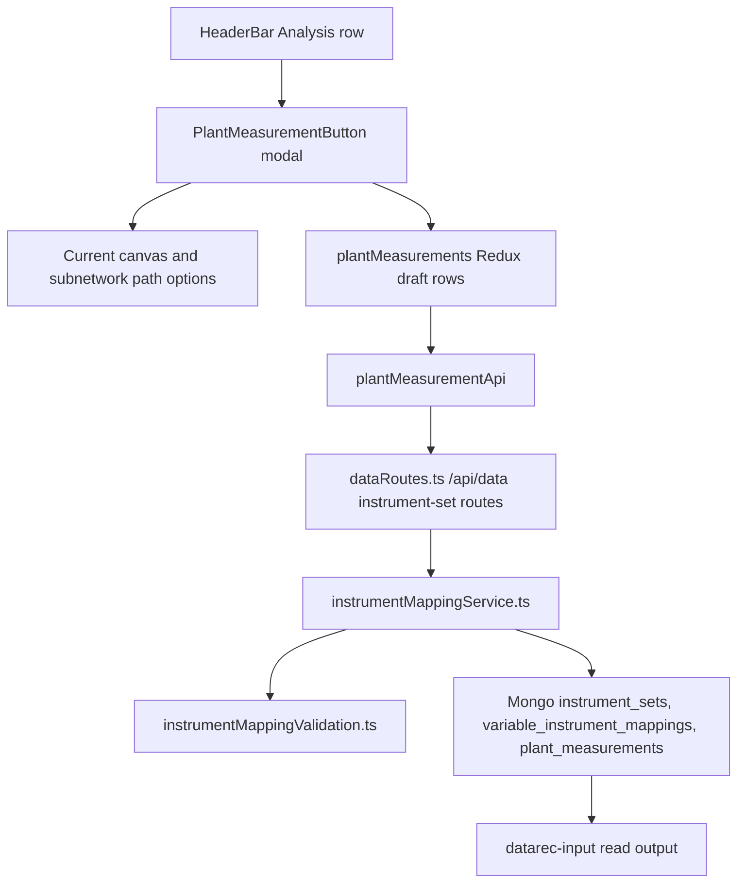

# Plant Measurements and Instrument Mapping Code Explanation

## Overview

Plant Measurements is the Analysis header workflow for connecting measured plant data to model variables. The frontend lets a user create a measurement set, map model paths to instrument names, enter or import measurement rows, validate them, and save the resulting mappings and measurements.

The feature crosses frontend UI, Redux state, authenticated data routes, service-level validation, and MongoDB persistence. Its backend also exposes a `datarec-input` read endpoint that filters saved rows into the shape needed by DataRec consumers.

## Source Files

Current behavior was checked in these source files:

- `src/src/frontend/src/components/header-bar/index.tsx`: renders `PlantMeasurementButton` in the Analysis secondary row and passes the computation read-only guard.
- `src/src/frontend/src/configs/computingDisableConfig.ts`: maps `Analysis.PlantMeasurements` to `ReadOnly` while computation is processing.
- `src/src/frontend/src/components/header-bar/header-buttons/plant-measurements/plant-measurement-button.tsx`: owns the modal UI, grid columns, local loading state, row editing, import preview, and save orchestration.
- `src/src/frontend/src/components/header-bar/header-buttons/plant-measurements/plant-measurement-button.css`: styles the modal, tabs, grids, custom date/time controls, and error cells.
- `src/src/frontend/src/components/header-bar/header-buttons/plant-measurements/plantMeasurementModelPathUtils.ts`: builds selectable model paths and unit options from current canvas nodes, subnetwork diagrams, model versions, and unit conversions.
- `src/src/frontend/src/components/header-bar/header-buttons/plant-measurements/plantMeasurementTableValidation.ts`: validates mapping and measurement draft rows before save.
- `src/src/frontend/src/components/header-bar/header-buttons/plant-measurements/plantMeasurementImportUtils.ts`: parses spreadsheet import rows and required headers.
- `src/src/frontend/src/components/header-bar/header-buttons/plant-measurements/plantMeasurementRowSyncUtils.ts`: keeps measurement rows aligned when an instrument mapping is renamed.
- `src/src/frontend/src/components/header-bar/header-buttons/plant-measurements/plantMeasurementFieldErrorUtils.ts`: maps validation messages to highlighted grid cells.
- `src/src/frontend/src/features/plantMeasurements/plantMeasurementApi.ts`: wraps the `/api/data/...instrument-sets...` endpoints used by the frontend.
- `src/src/frontend/src/features/plantMeasurements/plantMeasurementSlice.ts`: stores the active set, mapping draft rows, and imported measurement rows in Redux.
- `src/src/frontend/src/features/plantMeasurements/plantMeasurementTypes.ts`: defines the frontend DTO and draft row shapes.
- `src/src/frontend/src/store.ts`: mounts the `plantMeasurements` reducer.
- `src/src/backend/routes/dataRoutes.ts`: exposes authenticated instrument-set, mapping, measurement, import-preview, and `datarec-input` routes.
- `src/src/backend/services/instrumentMappingService.ts`: owns access checks, service DTOs, replace-style writes, saved-row revalidation, and DataRec input assembly.
- `src/src/backend/utils/instrumentMappingValidation.ts`: normalizes keys, validates mapping and measurement rows, and builds DataRec rows.
- `src/src/backend/prisma/mongodb/schema.prisma`: defines `InstrumentSet`, `VariableInstrumentMapping`, and `PlantMeasurement` persistence models.

## Purpose and Responsibility

This workflow owns the user-maintained relationship between a saved diagram and plant measurement data:

- An `InstrumentSet` selects a diagram network and set name, defaulting to `VARINSTRMAP` when no set name is supplied.
- `VariableInstrumentMapping` rows map current model paths to instrument names, units, bounds, accuracy fields, and mapping weights.
- `PlantMeasurement` rows store plant values, units, timestamps, sample numbers, measurement weights, include flags, row errors, warnings, and raw imported rows.
- `getDataRecInput(...)` reads valid saved rows and emits DataRec-ready rows with weights, accuracy, bounds, and `modelPath`.

This workflow does not own model-version editing, TP editing, Economic costs, computation task creation, or solver request generation. It reads model paths from the current canvas and related subnetwork instance diagrams, but it persists only plant-measurement records and their instrument mappings.

## Inputs and Outputs

| Input | Source | Used For |
| --- | --- | --- |
| `diagramId` | React Router params in `PlantMeasurementButton` | Loads, creates, and scopes measurement sets. |
| `readOnly` | `HeaderBar` via `useComputingDisableRule("Analysis.PlantMeasurements")` | Disables editing controls while computation rules require read-only behavior. |
| `flowNodes` | React Flow store | Builds selectable node, port, and variable paths for the current diagram. |
| `canvasName` | Redux `state.canvas.canvasName` | Supplies the current network name used in model path options. |
| `domain.data.models` and `domain.data.units` | Redux domain slice | Provides model metadata and unit conversion options. |
| Subnetwork wrapper nodes | React Flow node data | Identify subnetwork instance or blueprint diagrams that must be read for path options. |
| Spreadsheet rows | `.csv`, `.xlsx`, or `.xls` first sheet | Import candidate plant measurements for backend preview validation. |
| Mapping draft rows | Redux `plantMeasurements.mappingDraftRows` | Saved as `VariableInstrumentMapping` rows after validation. |
| Measurement draft rows | Redux `plantMeasurements.importedMeasurementRows` | Saved as `PlantMeasurement` rows after validation. |

| Output | Destination | Notes |
| --- | --- | --- |
| `activeInstrumentSet` | Redux `plantMeasurements.activeInstrumentSet` | Selecting a set resets the staged mapping and measurement rows. |
| Staged mapping rows | Redux `mappingDraftRows` | Local UI state until saved through `PUT /instrument-sets/:instrumentSetId/mappings`. |
| Staged measurement rows | Redux `importedMeasurementRows` | Local UI state until saved through `PUT /instrument-sets/:instrumentSetId/measurements`. |
| Instrument sets | Mongo `instrument_sets` | Unique per `diagramId`, `networkKey`, and `instrSetKey`. |
| Variable-instrument mappings | Mongo `variable_instrument_mappings` | Whole-set replaced for the selected instrument set. |
| Plant measurements | Mongo `plant_measurements` | Whole-set replaced for the selected instrument set. |
| DataRec rows | `GET /api/data/instrument-sets/:instrumentSetId/datarec-input` | Reads included, mapped, error-free saved measurements only. |

## Core State and Data Structures

### Frontend State

- `show`: local modal visibility for the main Plant Measurements modal.
- `showCreateSet`: local modal visibility for creating a new measurement set.
- `activeTab`: local tab state, either `mappings` or `measurements`.
- `instrumentSets`: local list loaded from `plantMeasurementApi.listInstrumentSets(diagramId)`.
- `networkName`, `createNetworkName`, and `createInstrSetName`: local set-selection and set-creation fields.
- `subnetworkDiagramData`: local collection of loaded subnetwork instance diagrams used by `buildPlantMeasurementPathOptions(...)`.
- `isLoading`, `isSaving`, and `isSetDataReady`: local guards for async reads, saves, and whether selected-set data is ready for editing.
- `plantMeasurements.activeInstrumentSet`: Redux owner of the selected set.
- `plantMeasurements.mappingDraftRows`: Redux owner of mapping grid rows.
- `plantMeasurements.importedMeasurementRows`: Redux owner of plant measurement grid rows.

### MongoDB Models

- `InstrumentSet`: stores `diagramId`, `userId`, `network`, `networkKey`, `instrSet`, and `instrSetKey`. It has a unique constraint on `[diagramId, networkKey, instrSetKey]`.
- `VariableInstrumentMapping`: stores the selected model path, `instrument`, `instrumentKey`, units, bounds, accuracy fields, `weight`, and `modelPath`. It has a unique constraint on `[instrumentSetId, instrumentKey]`.
- `PlantMeasurement`: stores `mappingId`, `sampleNumber`, `weight`, `include`, `instrumentName`, `instrumentKey`, `value`, `units`, `date`, `time`, `measuredAt`, `rowErrors`, `rowWarnings`, `rawRow`, and `source`.

### Backend Validation Shapes

- `ValidMappingRow`: normalized mapping row with lowercase business keys, numeric bounds/accuracy/weight, and a `modelPath` object.
- `ValidMeasurementRow`: normalized plant row with parsed include flag, positive sample number, non-negative weight, numeric value, valid timestamp, and the matched mapping instrument key.
- `DataRecInputRow`: output row containing `instrumentName`, `plantValue`, `units`, date/time/sample fields, `mappingWeight`, `measurementWeight`, `accuracy`, `bounds`, and `modelPath`.

## Main Functions and Components

### Frontend

- `PlantMeasurementButton(...)`: renders the Analysis button, main modal, create-set modal, mapping grid, measurement grid, import file input, and save footer.
- `loadInstrumentSets()`: requires `diagramId`, calls `plantMeasurementApi.listInstrumentSets(...)`, and populates the local set list.
- `loadSetData(instrumentSetId)`: clears staged Redux rows, loads mappings and measurements in parallel, then marks the set data as ready.
- `handleOpen()`: opens the modal, refreshes available sets, and reloads the active set if it still exists.
- `handleCreateInstrumentSet()`: verifies the chosen network belongs to the current `pathOptions.networks`, creates or gets the set, refreshes the set list, and loads its rows.
- `handleDeleteInstrumentSet()`: confirms with the user, deletes the selected set, refreshes the set list, and selects the next available set if one remains.
- `handleMappingFieldCommit(...)`: commits one grid cell, resets dependent path fields, resolves units, converts bounds and absolute accuracy on unit changes, and syncs measurement rows when instrument or unit changes affect them.
- `handleMeasurementFieldCommit(...)`: commits one measurement grid cell, converts values on unit changes, and updates units/mapping id when `instrumentName` changes.
- `handleImportFile(...)`: reads the first workbook sheet, parses required import columns, calls backend import preview, then stages both valid and invalid preview rows for user review.
- `handleSave()`: validates mapping and measurement drafts, writes visible error/warning rows back into Redux when invalid, otherwise saves mappings first and measurements second.
- `buildPlantMeasurementPathOptions(...)`: extracts selectable network/subnetwork/node/port/variable paths from current nodes and subnetwork diagram data.
- `convertPlantMeasurementValueByUnitChange(...)`: converts values only when the current and target units share a conversion dimension, including `fraction` and `%`.

### Backend

- `listInstrumentSets(...)`: checks diagram access, then lists sets for the authenticated user and diagram.
- `createOrGetInstrumentSet(...)`: validates the set input, verifies the network belongs to the selected diagram, then upserts by diagram/network/set key.
- `deleteInstrumentSet(...)`: deletes measurements, mappings, and the set in a Mongo transaction.
- `replaceVariableInstrumentMappings(...)`: validates mapping rows, verifies their network and set match the selected set, whole-set replaces mapping rows, then revalidates saved measurements against the fresh mappings.
- `previewPlantMeasurements(...)`: maps spreadsheet-shaped rows into measurement inputs and returns valid and invalid preview rows without writing MongoDB.
- `listPlantMeasurements(...)`: lists saved measurement rows for the selected set by timestamp and instrument name.
- `replacePlantMeasurements(...)`: validates measurement rows against saved mappings, whole-set replaces measurements, and links each saved row to its matching mapping.
- `getDataRecInput(...)`: reads saved mappings and measurements, keeps only included rows that have a mapping id, no row errors, and a matching mapping, then builds DataRec rows.
- `validateMappingRows(...)`: enforces required path/instrument/unit fields, unique instrument names, numeric bounds and accuracy, non-negative weights, and warning-only accuracy combinations.
- `validateMeasurementRows(...)`: enforces exact single mapping match by instrument name, matching units, numeric value, valid timestamp, positive sample number, and non-negative weight.
- `buildDataRecInput(...)`: combines included measurements with their mappings into the downstream DataRec row shape.

## Rendered UI / Interaction Map

| UI State or Action | Source State or Props | Expected Result | Verification |
| --- | --- | --- | --- |
| Analysis section visible | `HeaderBar.activeSection === "Analysis"` | Expenses, Objective Function, and Revenues render as disabled placeholders; Plant Measurements renders as the active feature button. | Open a canvas, click Analysis, and inspect the secondary row. |
| Computation processing | `readOnly === true` from `Analysis.PlantMeasurements` rule | Plant Measurements button and edit actions are disabled/read-only. | Toggle computation state and inspect button/edit guards. |
| Open Plant Measurements | `diagramId` route param, active set state | Main XL modal opens and attempts to load instrument sets. Missing `diagramId` shows a save-diagram error. | Click Plant Measurements before and after saving a diagram. |
| Create measurement set | `pathOptions.networks`, create-set modal fields | Backend upserts the set, modal closes, the set becomes active, and set rows load. | Click New Measurement Set, choose a network, create the set. |
| Select measurement set | `instrumentSets`, selected id | Redux active set changes, existing mapping and measurement rows are loaded. | Use the Measurement Set dropdown. |
| Delete measurement set | `activeInstrumentSet` | Confirmation appears; on confirm, backend deletes the set, mappings, and measurements. | Delete a test set and confirm rows disappear. |
| Mapping tab Add Mapping | `isSetDataReady`, `activeInstrumentSet`, path options | Adds a default mapping row seeded from selected network/path options. | Click Add Mapping after selecting a set. |
| Mapping row edit | Grid cell renderer and `handleMappingFieldCommit(...)` | Dependent fields reset as parent path fields change; units and converted numeric fields update when possible. | Edit network/subnetwork/node/port/variable/units cells. |
| Measurement tab Add Measurement | Valid mapping rows exist | Adds a default measurement row using current date/time and first available instrument. | Add at least one valid mapping, then click Add Measurement. |
| Import measurements | `.csv`, `.xlsx`, or `.xls` input | First sheet is parsed, backend preview validates rows, and valid plus invalid rows appear in the measurement grid. | Import a file with required headers. |
| Save rows | Draft mappings and measurements pass validation | Frontend saves mappings, then measurements; Redux is replaced by saved backend DTOs. | Click Save and inspect success alert plus persisted reload. |
| Save invalid rows | Frontend validation fails | Invalid rows stay visible with error/warning status and no PUT request is sent. | Leave required fields blank and click Save. |

## Component Contract

`PlantMeasurementButton` receives one prop:

| Prop | Type | Owner | Contract |
| --- | --- | --- | --- |
| `readOnly` | `boolean` | `HeaderBar` | Prevents opening edit actions and disables cell controls when computation rules require read-only behavior. |

Important state and dependency contracts:

- The component reads `diagramId` from route params. Creating or loading measurement sets requires a saved diagram id.
- The component reads React Flow `nodes` directly through `useStore(...)` so path options reflect the live canvas, not only saved data.
- The component reads cached model versions through `useNodeCache()`. When the modal is open, it loads missing model versions for visible nodes.
- Subnetwork wrapper nodes can trigger `POST /api/data/diagrams/:diagramId/subnetwork-instance` followed by `GET /api/data/diagrams/:instanceDiagramId` so subnetwork model paths appear in the mapping grid.
- `setActiveInstrumentSet(...)` intentionally clears both staged row arrays. `loadSetData(...)` repopulates them after the backend responds.
- `measurementActionsDisabled` requires a selected set, loaded set data, non-read-only state, non-loading state, and at least one valid mapping.
- Date and time cells use custom controls with document-level `mousedown` cleanup. Modal mouse-down handling stops grid editing unless the click stays inside an inline-edited grid cell.

## Data Flow

1. `HeaderBar` renders `PlantMeasurementButton` under the Analysis secondary row and passes `readOnly={rulePlantMeasurements}`.
2. Opening the modal calls `plantMeasurementApi.listInstrumentSets(diagramId)` and populates the `Measurement Set` dropdown.
3. Creating a set sends `POST /api/data/diagrams/:diagramId/instrument-sets` with `network` and optional `instrSet`.
4. `dataRoutes.ts` authenticates the user and calls `createOrGetInstrumentSet(...)`.
5. `instrumentMappingService.ts` verifies diagram ownership, validates the network/set, and upserts Mongo `InstrumentSet`.
6. Selecting a set loads `GET /instrument-sets/:instrumentSetId/mappings` and `GET /instrument-sets/:instrumentSetId/measurements` in parallel.
7. The frontend stages those rows in `plantMeasurements.mappingDraftRows` and `plantMeasurements.importedMeasurementRows`.
8. Mapping edits use current canvas and subnetwork path options to keep network, subnetwork, node, port, variable, and unit selections coherent.
9. Measurement edits and imports are staged locally first. Import preview calls `POST /instrument-sets/:instrumentSetId/measurements/import-preview` and does not persist rows.
10. Saving validates mapping rows and measurement rows on the frontend. Invalid rows are written back into the grid with row status.
11. If validation passes, the frontend calls `PUT /instrument-sets/:instrumentSetId/mappings` first. The backend whole-set replaces mappings and revalidates existing measurements.
12. The frontend then calls `PUT /instrument-sets/:instrumentSetId/measurements`. The backend whole-set replaces measurements and links each row to the matching mapping id.
13. DataRec consumers can call `GET /instrument-sets/:instrumentSetId/datarec-input`; the backend filters included, mapped, error-free measurements and returns `buildDataRecInput(...)` output.


```mermaid
flowchart TD
  Header["HeaderBar Analysis row"] --> Modal["PlantMeasurementButton modal"]
  Modal --> Paths["Current canvas and subnetwork path options"]
  Modal --> Redux["plantMeasurements Redux draft rows"]
  Redux --> Api["plantMeasurementApi"]
  Api --> Routes["dataRoutes.ts /api/data instrument-set routes"]
  Routes --> Service["instrumentMappingService.ts"]
  Service --> Validation["instrumentMappingValidation.ts"]
  Service --> Mongo["Mongo instrument_sets, variable_instrument_mappings, plant_measurements"]
  Mongo --> DataRec["datarec-input read output"]
```

## Backend/Data-Flow Contract

All paths below include the `/api/data` prefix and use `authenticateToken`.

| Endpoint | Service Function | Behavior |
| --- | --- | --- |
| `GET /diagrams/:diagramId/instrument-sets` | `listInstrumentSets(...)` | Lists sets owned by the authenticated user for the diagram. |
| `POST /diagrams/:diagramId/instrument-sets` | `createOrGetInstrumentSet(...)` | Upserts one set by diagram, network key, and set key. |
| `DELETE /instrument-sets/:instrumentSetId` | `deleteInstrumentSet(...)` | Deletes measurements, mappings, and the set in one transaction. |
| `GET /instrument-sets/:instrumentSetId/mappings` | `listVariableInstrumentMappings(...)` | Returns saved variable-instrument mappings for the set. |
| `PUT /instrument-sets/:instrumentSetId/mappings` | `replaceVariableInstrumentMappings(...)` | Whole-set replaces mapping rows after validation and set matching. |
| `POST /instrument-sets/:instrumentSetId/measurements/import-preview` | `previewPlantMeasurements(...)` | Validates spreadsheet rows against saved mappings without writing MongoDB. |
| `GET /instrument-sets/:instrumentSetId/measurements` | `listPlantMeasurements(...)` | Returns saved measurements ordered by `measuredAt` and instrument name. |
| `PUT /instrument-sets/:instrumentSetId/measurements` | `replacePlantMeasurements(...)` | Whole-set replaces measurement rows after validation and mapping lookup. |
| `GET /instrument-sets/:instrumentSetId/datarec-input` | `getDataRecInput(...)` | Returns DataRec rows from included, mapped, error-free saved measurements. |

Field ownership:

- `network` and `instrSet` are selected at the instrument-set level. Mapping rows must match the selected set's `networkKey` and `instrSetKey`.
- `instrument` is unique inside a set. The unique persisted key is `instrumentKey`.
- `instrumentName` in a measurement row must match exactly one mapping by normalized instrument key.
- `units` in a measurement row must match the mapped instrument units.
- `mappingId` on `PlantMeasurement` points to the matching `VariableInstrumentMapping` after save.
- `rowErrors` and `rowWarnings` are persisted as JSON arrays on measurement rows; backend mapping revalidation currently writes `rowErrors`, clears clean rows, and marks stale rows as excluded with `mappingId: null`.
- `datarec-input` does not return rows with `include !== true`, missing `mappingId`, row errors, or missing mapping records.

Fallback and sanitization:

- Blank `instrSet` defaults to `VARINSTRMAP`.
- Blank `subnetwork` and `subSubnetwork` default to `none`.
- Missing mapping `weight` defaults to `1`; negative or nonnumeric weights are invalid.
- Missing measurement `sampleNumber` defaults to `1`; non-positive integer samples are invalid.
- Missing measurement `weight` defaults to `1`; negative or nonnumeric weights are invalid.
- Missing import `Sample#` and `Weight` columns are accepted by the frontend parser and defaulted before preview.
- Measurement timestamps must be a valid `YYYY-MM-DD` date plus `HH:mm` or `HH:mm:ss` time.

## Side Effects

- Creating a measurement set writes or updates one Mongo `InstrumentSet`.
- Deleting a measurement set deletes related `PlantMeasurement` rows, related `VariableInstrumentMapping` rows, and then the `InstrumentSet`.
- Saving mappings deletes all mappings for the selected set and recreates them from the validated payload.
- Saving mappings also revalidates saved measurements; stale rows can be marked `include: false`, have `mappingId: null`, and receive row errors.
- Saving measurements deletes all measurements for the selected set and recreates them from the validated payload.
- Import preview does not persist rows; it only returns valid and invalid DTOs for user review.
- Opening the modal can trigger subnetwork instance creation through `/api/data/diagrams/:diagramId/subnetwork-instance` when a wrapper has a blueprint id but no instance diagram id.
- Frontend edits update Redux draft state immediately and are not persisted until `Save` succeeds.

## Error Handling and Edge Cases

- Opening without a `diagramId` shows `Save the diagram first to configure plant measurements.` and does not load sets.
- Creating a set rejects a network not present in `pathOptions.networks`.
- Backend set creation also rejects a network that does not match the current diagram network.
- All route handlers convert known service errors into their status code and `{ message, details }`; unexpected errors flow to the shared Express handler.
- Mapping validation rejects missing Network, Node, Port, Variable, Instrument, Units, duplicate instruments, invalid numeric fields, lower bound greater than upper bound, negative absolute accuracy, percent accuracy outside 0-100, and invalid weight.
- Mapping validation warns when both accuracy fields are supplied or neither accuracy field is supplied.
- Measurement validation rejects missing Instrument Name, Value, Units, Date, Time, nonnumeric values, invalid timestamps, ambiguous or missing instrument mappings, mismatched units, invalid sample number, and invalid weight.
- Changing a mapping's instrument name syncs existing measurement rows for that instrument and clears old row errors/warnings.
- Changing a mapping's units converts measurement values for that instrument only when unit conversion metadata supports the change.
- `datarec-input` skips saved rows that are excluded, errored, unmapped, or linked to a mapping that no longer exists.

## Extension Points

- Add a new mapping field by updating `VariableInstrumentMappingDraft`, `validateVariableInstrumentDraftRows(...)`, `validateMappingRows(...)`, Mongo `VariableInstrumentMapping`, service DTO conversion, grid columns, and save tests together.
- Add a new measurement field by updating `PlantMeasurementDraft`, `validatePlantMeasurementDraftRows(...)`, `validateMeasurementRows(...)`, Mongo `PlantMeasurement`, service DTO conversion, import parsing if needed, grid columns, and save tests together.
- Change model-path selection by updating `plantMeasurementModelPathUtils.ts`; verify current diagram paths and subnetwork instance paths both still resolve.
- Change DataRec output by updating `DataRecInputRow`, `buildDataRecInput(...)`, `getDataRecInput(...)`, and any downstream consumer that expects the payload shape.
- Add a frontend API wrapper for `datarec-input` only if a frontend caller needs it. Current frontend API wrapper does not expose that GET route.
- Change computation guard behavior by updating `ComputingDisableMap["Analysis.PlantMeasurements"]` and the `PlantMeasurementButton` `readOnly` handling together.
- Change whole-set replace semantics only with migration planning. Current save behavior intentionally replaces all rows for the selected set.

## Testing and Verification

Terminal: **PowerShell**

Working directory:

```text
C:\Users\19612\Desktop\Project\HYPRONET-GUI\src
```

Run the project build after source changes:

```powershell
npm.cmd run build
```

Expected result:

The TypeScript build completes without errors.

Scoped tests exist in this working tree for the current feature area. Run them when they are included on the branch being verified:

```powershell
npx.cmd jest --runTestsByPath tests/frontend/plantMeasurementImportUtils.test.ts tests/frontend/plantMeasurementTableValidation.test.ts tests/backend/utils/instrumentMappingValidation.test.ts tests/backend/services/instrumentMappingService.test.ts --forceExit
```

Manual verification matrix:

| Area | Setup | Action | Expected Result | Regression Risk |
| --- | --- | --- | --- | --- |
| Open modal | Saved diagram | Click Analysis, then Plant Measurements | Modal opens and set list loads | High: missing diagram guard or route failure blocks the feature. |
| Create set | Diagram with at least one network path | Create a measurement set | Set appears in dropdown and becomes active | High: wrong network/set key creates orphaned data. |
| Mapping edit | Active set | Add mapping, select network/subnetwork/node/port/variable | Units resolve and dependent fields reset correctly | High: stale path fields can map plant data to the wrong model variable. |
| Measurement import | Active set with valid mappings | Import `.csv`/`.xlsx` with required headers | Preview rows appear with validation status | Medium: import defaults must preserve old files without Sample#/Weight. |
| Save invalid rows | Blank required mapping or measurement fields | Click Save | Rows remain staged with status errors; backend save is not attempted | High: invalid rows should not persist silently. |
| Save valid rows | Valid mappings and measurements | Click Save, close/reopen modal | Saved rows reload from backend | High: replace semantics can drop rows if validation or payload assembly is wrong. |
| DataRec read | Saved rows include valid and invalid/excluded rows | Call `GET /api/data/instrument-sets/:instrumentSetId/datarec-input` | Only included, mapped, error-free rows are returned | High: DataRec consumers must not receive stale or invalid plant data. |
| Computation guard | Computation processing true | Inspect Analysis row and modal controls | Plant Measurements actions are disabled/read-only | High: editing measurement data during computation can desynchronize results. |

For documentation-only edits to this page, run from `C:\Users\19612\Desktop\Project\HYPRONET-GUI`:

```powershell
git diff --check -- docs/CodeExplanation/plant-measurements-and-instrument-mapping.md
```

## Known Cautions

- The feature saves mappings and measurements with whole-set replace semantics. Do not assume row-level patch behavior.
- `datarec-input` is a backend route and service boundary. The current frontend API wrapper does not expose it.
- Mapping rows are keyed by normalized instrument name inside one set. Renaming an instrument can affect measurement rows that reference the old name.
- The frontend path picker depends on current canvas nodes, cached model versions, and subnetwork instance diagrams. Missing model-version data can reduce available mapping options.
- Opening the modal can create or ensure subnetwork instance diagrams when wrapper nodes need them for path discovery.
- Import preview is not persistence. Users must still save after reviewing imported rows.
- Generated runtime files such as `src/src/backend/services/solve_request.json` are not source truth for this workflow.
- The scoped Plant Measurement tests were untracked in this local worktree at authoring time. Confirm they are present on the branch before relying on the scoped Jest command in another checkout.

## Related Pages

- [Header Bar Code Explanation](./header-bar.md)
- [Backend Data Routes and Persistence Code Explanation](./backend-data-routes-and-persistence.md)
- [Run Config and Computation Start Code Explanation](./run-config-and-computation-start.md)
- [Translation and Reverse Translation Code Explanation](./translation-and-reverse-translation.md)
