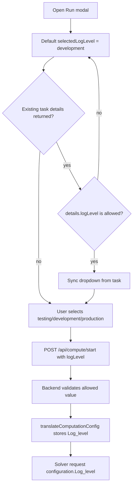

# Run Config and Computation Start Code Explanation

## Overview

Run config and computation start are adjacent but separate flows. The current backend reads run configuration definitions from the PostgreSQL `RunConfigs` table, groups them as `runConfigs`, and returns them with domain data. The frontend lets users select solver and algorithm groups from that object, choose a solver log level, and send the chosen names plus task metadata to `/api/compute/start`.

The frontend also contains a save path that attempts to post edited run config values to `/api/data/run-configs/import`. The current backend route file does not define that route, so this is an implementation gap, not a working backend persistence contract.

## Source Files

Current behavior was checked in these source files:

- `src/src/frontend/src/components/header-bar/index.tsx`
- `src/src/frontend/src/components/header-bar/run-buttons/run-config-modal.tsx`
- `src/src/frontend/src/components/header-bar/run-buttons/universal-runconfig-panel.tsx`
- `src/src/frontend/src/components/header-bar/header-buttons/computation-button.tsx`
- `src/src/backend/routes/computeRoutes.ts`
- `src/src/backend/utils/economicCosts.ts`
- `src/src/backend/utils/translation.ts`
- `src/tests/backend/utils/economicCosts.test.ts`
- `src/tests/backend/utils/translationCosts.test.ts`

For TP and Economic field ownership, see `time-period-and-economic-flow.md`.

## Purpose

Run config and computation start are separate responsibilities:

- Set Run edits stored solver and algorithm configuration attributes.
- Run selects the solver, algorithm, run name, maximum computation time, and solver log level for a new task.
- The backend compute start route rebuilds solver parameters from the current diagram state and queues the computation task.

Run config does not own TP ranges, durations, economic entities, economic mappings, or `parameters.costs`. The Run modal log-level dropdown also does not control browser console output or the Node/Winston logger; it is a solver-facing configuration value stored as `configuration.Log_level`.

## Field Ownership

| Field | Owner | Stored in | Used by compute start |
| --- | --- | --- | --- |
| `runConfigs` | Backend domain data route. | PostgreSQL `RunConfigs`, then Redux domain data. | Solver and algorithm names are selected from these keys. |
| Solver config attributes | `RunConfigModal` and `UniversalRunConfigPanel`. | Currently loaded from `RunConfigs`; frontend save attempts `/api/data/run-configs/import`, but the backend route is missing. | `ComputationTaskService.translateComputationConfig` uses the selected solver name. |
| Algorithm config attributes | `RunConfigModal` and `UniversalRunConfigPanel`. | Currently loaded from `RunConfigs`; frontend save attempts `/api/data/run-configs/import`, but the backend route is missing. | `ComputationTaskService.translateComputationConfig` uses the selected algorithm name. |
| `runName` | `ComputationButton`. | Computation task row. | Required in `/api/compute/start`. |
| `maxComputationTime` | `ComputationButton` UI, then backend route validation. | Computation configuration. | Passed to `translateComputationConfig`. |
| `logLevel` / `Log_level` | `ComputationButton` UI, then backend route validation. | `computationTask.configuration.Log_level`. | Passed to `translateComputationConfig` and then to the solver request `configuration.Log_level`. |
| `parameters.costs` | `computeRoutes.ts` and `translation.ts`. | `diagram.parameters.costs` after start. | Generated from `duration`, `durationUnit`, `tpNodeVers`, `costEntities`, and `costMappings`. |

## Data Flow

1. The domain data route reads PostgreSQL `RunConfigs` through `buildRunConfigs()` and returns the grouped `runConfigs` object with the rest of the domain payload.
2. The frontend stores `runConfigs` in Redux domain state and `HeaderBar` splits keys into solver and algorithm groups with `/algorithm/i`.
3. `Set Run` opens `RunConfigModal` for the selected group. Editable saves currently attempt `/api/data/run-configs/import`; because the backend route is not present, treat that call as frontend intent that still needs backend implementation.
4. `Run` opens `ComputationButton`, which chooses one solver key and one algorithm key from the same `runConfigs` object and defaults the log level to `development`.
5. The frontend posts `/api/compute/start` with `runName`, `solverName`, `algorithmName`, `maxComputationTime`, `logLevel`, and `diagramId`.
6. The backend start route validates `logLevel` when provided, defaults invalid/missing internal values to `development`, rebuilds diagram parameters, and uses `ComputationTaskService.translateComputationConfig(...)` to look up the selected solver and algorithm blocks from snapshot `runConfigs`.
7. A waiting computation task is created and queued for solver dispatch.

## Header Handoff

`HeaderBar` reads `state.domain.data.runConfigs || {}` and exposes two user-facing sections:

- `Set Run` for editing config attributes.
- `Run` through `ComputationButton` for starting a computation.

In `Set Run`, keys that do not match `/algorithm/i` are shown under the Solver dropdown. Keys that match `/algorithm/i` are shown under the Algorithm dropdown. Selecting either key opens `RunConfigModal` with the selected config group.

The same computing-disable rule is passed as `readOnly` to `RunConfigModal`. In read-only mode, the modal renders the config values but does not expose save/cancel actions.

## Run Config Modal

`RunConfigModal` receives:

```ts
{
  show,
  onHide,
  selectedType,
  runConfigs,
  readOnly
}
```

It determines whether the selected group is a solver or algorithm group by checking `/algorithm/i`. The modal then passes the selected group's `attributes` to `UniversalRunConfigPanel`.

`UniversalRunConfigPanel` renders attributes as:

- A 1D table when `attributeName` does not contain `_`.
- A 2D table when `attributeName` contains `_`.

On save, numeric-looking strings are converted to numbers. Empty numeric strings become `null`. The panel returns a map keyed by `attributeName`.

`RunConfigModal` then creates an updated run config group where each attribute receives the new `defaultValue`. It posts:

```http
POST /api/data/run-configs/import
```

Current frontend payload shape:

```json
{
  "exportType": "<solver-or-algorithm-from-selectedType>",
  "diagramId": "...",
  "runConfigs": {
    "<selectedType>": {
      "attributes": []
    }
  }
}
```

`exportType` is derived from `selectedType`: `/algorithm/i.test(selectedType)` produces `algorithm`; every other selected type produces `solver`.

Current caution: the frontend call exists, but the current backend only reads `RunConfigs` from PostgreSQL and returns them with domain data. `dataRoutes.ts` does not currently define `POST /api/data/run-configs/import`, so edited values do not have a confirmed backend persistence route until that gap is implemented.

If a matching backend route is added and returns success, the frontend dispatches `updateRunConfig`, refreshes domain data when `domainId` exists, alerts success, and closes the modal.

## Computation Button

`ComputationButton` reads the same `runConfigs` object. When configs load, it defaults:

- `selectedSolver` to the first key that does not match `/algorithm/i`.
- `selectedAlgorithm` to the first key that matches `/algorithm/i`.

The computation modal lets the user choose run name, maximum computation time, solver, algorithm, and log level. It can also open read-only `RunConfigModal` views for the selected solver or algorithm.

### Log Level Dropdown

`ComputationButton` defines the allowed log-level values as a frontend union:

```ts
type LogLevel = 'testing' | 'development' | 'production';
```

The dropdown defaults to `development` and renders:

- `testing`
- `development`
- `production`

When a computation is waiting, computing, or already has details available from `/api/compute/details/:diagramId`, the frontend syncs `selectedLogLevel` from `computationInfo.logLevel` only if the returned value is one of those three allowed values. This keeps the modal consistent after reloads, polling updates, and completed/failed task views.

The field is disabled while computation is processing, just like run name, max execution time, solver, and algorithm. It is intentionally task-local: changing the dropdown affects the next `/api/compute/start` request and does not mutate `RunConfigs`.



Before posting a start request, the frontend guards against:

- Unsaved diagrams.
- Incomplete stream edges.
- Duplicate stream-instance edges.
- Blank run name.
- Duplicate run name.
- Missing selected solver.
- Missing selected algorithm.
- Double-submit while a start request is already in progress.

The start body is:

```json
{
  "runName": "Run 1",
  "solverName": "Selected Solver",
  "algorithmName": "Selected Algorithm",
  "logLevel": "development",
  "maxComputationTime": 50,
  "diagramId": "..."
}
```

The frontend computes `maxComputationTime` from the UI value and selected unit before sending. The backend treats it as the numeric value used to build the computation configuration and enforces its minimum allowed value.

## Backend Start Route

`POST /api/compute/start` validates:

- `diagramId`
- `maxComputationTime`
- `runName`
- `solverName`
- `algorithmName`

The route rejects missing required fields, computation times below the backend minimum, and any provided `logLevel` outside `testing`, `development`, or `production`. If `logLevel` is omitted, the backend normalizes it to `development`.

After validation, the route:

1. Loads the diagram with snapshot data.
2. Checks that the user can access the diagram.
3. Loads node documents and cache data.
4. Expands subnetwork nodes into the assembled canvas.
5. Checks for missing model versions.
6. Checks duplicate stream instances.
7. Reads calculation type from `diagram.parameters.global_params.task_config.task_type`, falling back to `Simulation`.
8. Loads network `tpNodeVers` rows and persisted TP changes.
9. Merges request-body TP changes over persisted TP changes when supplied.
10. Builds `costsPayload`.
11. Calls `translation(...)`.
12. Writes the returned parameters back to the diagram.
13. Builds the computation configuration from the selected solver, algorithm, and normalized log level.
14. Creates a waiting computation task.

The compute route does not read solver parameters from the run config modal state directly. It receives only the selected solver and algorithm names plus task-level metadata, then delegates config construction to `ComputationTaskService.translateComputationConfig`.

`translateComputationConfig(...)` stores the log level in the exact solver-facing key `Log_level`:

```ts
{
  max_computation_time: maxComputationTime,
  solver,
  algorithm,
  Log_level: logLevel
}
```

`GET /api/compute/details/:diagramId` returns that stored value as `computationInfo.logLevel` for every task status branch. If the stored value is missing or invalid, the details route falls back to `development`.

## TP and Economic Handoff

The cost payload assembled by compute start is:

```ts
{
  entities: cloneCostEntityFields(diagram.costEntities),
  mappings: Array.isArray(diagram.costMappings) ? diagram.costMappings : [],
  duration: buildCostDurationPayload(diagram, diagramId, tpNodeVersRows)
}
```

`buildCostDurationPayload` uses valid `tpNodeVers` ranges for the current network. If there are no valid TP rows, it falls back to:

```ts
{
  fromTp: 1,
  toTp: 1,
  duration: diagram.duration || 1,
  durationUnit: diagram.durationUnit || "hours"
}
```

`translation.ts` then writes `parameters.costs`:

- `entities` are normalized and may be grouped into `timePeriodCosts`.
- `mappings` are normalized to network/node/port/var/entity.
- `duration` is normalized to solver keys `From TP`, `To TP`, `Duration`, and `DurationUnit`.

This is the key boundary: TP and Economic UI fields are persisted before start, and compute start converts those persisted fields into `parameters.costs`.

## Generated Parameters

`translation.ts` rebuilds the runtime parameter object. It also rebuilds `tps_specs` from:

- Clean model definitions.
- Connected stream values.
- Current calculation type.
- Explicit TP/spec overrides.

This means `diagram.parameters` after a run start is generated state. Do not use generated runtime files or stale parameter snapshots as the source of truth for TP or Economic editing behavior.

## Testing

Relevant backend tests are present at:

- `src/tests/backend/utils/economicCosts.test.ts`
- `src/tests/backend/utils/translationCosts.test.ts`

Focused validation command:

```powershell
cd C:\Users\19612\Desktop\Project\HYPRONET-GUI\src
npx.cmd jest tests/backend/utils/economicCosts.test.ts tests/backend/utils/translationCosts.test.ts --runInBand --coverage=false
```

For documentation-only edits, also run:

```powershell
git diff --check -- docs/CodeExplanation/time-period-and-economic-flow.md docs/CodeExplanation/run-config-and-computation-start.md
```

## Known Cautions

- Solver and algorithm grouping depends on the config key name matching `/algorithm/i`.
- `UniversalRunConfigPanel` converts numeric-looking strings on save, but deeper semantic validation belongs to the missing run config import/backend path.
- The current frontend attempts `POST /api/data/run-configs/import`; the current backend does not define that route and only reads `RunConfigs` into domain data.
- `parameters.costs` is produced at compute start from persisted diagram fields. It should not be treated as a manual editing surface.
- `logLevel` is a solver-facing task configuration value. It does not control frontend console logging, backend Winston logging, or diagnostic debug `fetch(...)` calls.
- Keep the frontend `LOG_LEVEL_OPTIONS`, backend `ComputationLogLevel`, backend `isComputationLogLevel(...)`, and documentation values synchronized if a new level is added.
- `src/src/backend/services/solve_request.json` is not the current source of truth for this flow.
