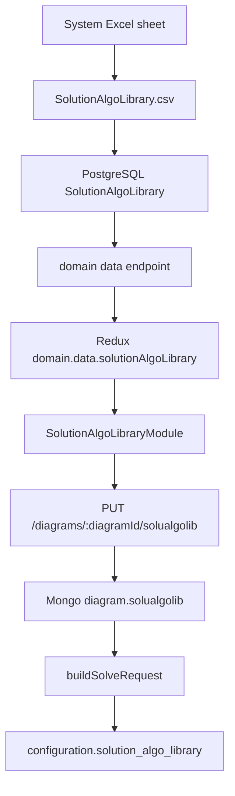

# Solution Algorithm Library Module Code Explanation

## Overview

The Solution Algorithm Library module lets users configure algorithm phases for a saved diagram. The base algorithm rows come from PostgreSQL table `SolutionAlgoLibrary`, which is imported from the system Excel workbook. The frontend module displays those rows, lets users edit runtime fields and choose related sets or collections, then saves the diagram-specific choices into MongoDB under `diagram.solualgolib`.

The module replaced the old frontend Composite_Algorithm workflow in the header. Users still open it from the Set Run `Algorithm` dropdown, but the dropdown item opens SoluAlgoLib instead of a legacy run-config form.

## Source Files

- `src/src/frontend/src/components/header-bar/header-buttons/solution-algo-library-module.tsx`: modal UI, PostgreSQL row display, editable fields, collection/set dropdowns, diagram hydration, and save behavior.
- `src/src/frontend/src/components/header-bar/header-buttons/solution-algo-library-module.css`: wide modal, table, select, input, and footer styling.
- `src/src/frontend/src/components/header-bar/index.tsx`: renders SoluAlgoLib as an item under the Set Run `Algorithm` dropdown.
- `src/src/frontend/src/models/domain.ts`: defines `SolutionAlgoLibraryEntry` and exposes `DomainData.solutionAlgoLibrary`.
- `src/src/backend/routes/dataRoutes.ts`: reads PostgreSQL `SolutionAlgoLibrary` rows for domain data and persists `diagram.solualgolib`.
- `src/src/backend/services/solverEngineApiService.ts`: emits SoluAlgoLib under `configuration.solution_algo_library`.
- `src/src/backend/workers/computationDispatchWorker.ts`: passes `diagram.solualgolib` into the solver request builder.
- `src/src/backend/prisma/postgres/schema.prisma`: declares the `SolutionAlgoLibrary` table.
- `src/src/backend/prisma/mongodb/schema.prisma`: declares `Diagram.solualgolib Json?`.
- `src/excel-migration/excel_to_csv.py`: maps the Excel sheet `Solution Algorithm Library` to `SolutionAlgoLibrary.csv`.
- `src/excel-migration/migrate.py`: imports `SolutionAlgoLibrary.csv` into PostgreSQL.

## Purpose and Responsibility

The module owns diagram-level SoluAlgoLib editing. It combines read-only base rows from PostgreSQL with user-editable per-diagram choices, such as convergence goto behavior, run type, solver, selected collection, and selected Objective Function set.

It does not create the base library rows. Those rows are owned by the Excel import pipeline and PostgreSQL migration scripts. It also does not create sets or collections; it reads options saved by the `+Constr` module.

## Inputs and Outputs

| Input | Source | Used For |
| --- | --- | --- |
| `state.domain.data.solutionAlgoLibrary` | Redux domain data from PostgreSQL | Provides the base algorithm rows displayed in the table. |
| `diagramId` | React Router params | Loads and saves diagram-specific SoluAlgoLib selections. |
| `GET /api/data/diagrams/:diagramId` | Backend route | Loads saved collections, sets, and existing `solualgolib` choices. |
| `diagram.collections` | MongoDB | Populates the Collection dropdown. |
| `diagram.sets` | MongoDB | Populates the Set dropdown after filtering to Objective Function sets. |
| `diagram.solualgolib` | MongoDB | Rehydrates saved row edits and selections. |

| Output | Destination | Notes |
| --- | --- | --- |
| `editableRows` | Component state | Combines PostgreSQL row defaults and user edits. |
| `PUT /api/data/diagrams/:diagramId/solualgolib` | Backend route | Persists diagram-specific row values and selected set/collection payloads. |
| `diagram.solualgolib` | MongoDB | Stores the selected row values for the diagram. |
| `configuration.solution_algo_library` | Solver request | Contains normalized rows with collection and set references reduced to ids. |
| `configuration.algorithm` | Solver request | Defaults to `SoluAlgoLib` when no explicit algorithm exists. |

## Core State and Data Structures

- `SolutionAlgoLibraryEntry`: domain row with `id`, `domain`, `algorithmName`, `phaseName`, numeric phase controls, goto fields, variables, `runType`, and `solver`.
- `EditableSolutionAlgoLibraryEntry`: extends the domain row with `collectionId` and `setId`.
- `ConstraintOption`: dropdown option with `id`, `name`, and full `payload`.
- `collectionOptions`: options loaded from `diagram.collections`.
- `setOptions`: options loaded from `diagram.sets` and filtered to `Objective Function`.
- `showPanel` and `isSaving`: local modal and save guards.

PostgreSQL stores the base rows:

```prisma
model SolutionAlgoLibrary {
  id                       String  @id @default(uuid()) @map("_id")
  domain                   String
  algorithm_name           String
  phase_name               String
  max_phase_iter           Float?
  tolerance_percent        Float?
  step_reduction           Float?
  if_convergence_fail_goto String?
  if_convergence_pass_goto String?
  update_var               String?
  convergence_var          String?
  run_type                 String?
  solver                   String?
}
```

Mongo stores the diagram-specific row list:

```ts
{
  id: string;
  algorithmName: string;
  phaseName: string;
  maxPhaseIter: number | null;
  tolerancePercent: number | null;
  stepReduction: number | null;
  ifConvergenceFailGoto: string | null;
  ifConvergencePassGoto: string | null;
  updateVar: string | null;
  convergenceVar: string | null;
  runType: string | null;
  solver: string | null;
  collection: StoredConstraintCollectionDefinition | null;
  set: StoredConstraintSetDefinition | null;
}
```

## Main Functions and Components

- `SolutionAlgoLibraryModule`: renders the optional trigger and the table modal.
- `normalizeGotoValue(...)`: normalizes variants such as `phase_1`, `1`, and `p1` into `P1`.
- `normalizeSolverValue(...)`: normalizes solver names such as `iport` and `ipopt` into `IPOPT`.
- `normalizeConstraintOptions(...)`: converts saved collections into dropdown options.
- `normalizeObjectiveSetOptions(...)`: converts saved sets into dropdown options and keeps only `Objective Function` sets.
- `normalizePersistedSolutionAlgoRows(...)`: reads saved Mongo rows and maps them by row id so current PostgreSQL rows can be overlaid with saved choices.
- `handleNumericValueChange(...)`: updates nullable numeric fields and ignores invalid non-numeric input.
- `handleGotoValueChange(...)`, `handleRunTypeChange(...)`, and `handleSolverChange(...)`: update row-level select values.
- `handleConstraintChoiceChange(...)`: updates the selected collection or set id for a row.
- `serializeRowsForPersistence()`: converts editable rows into the Mongo persistence payload with full selected set/collection payloads.
- `handleSave()`: validates that a diagram exists, then saves `solualgolib`.
- `buildSolutionAlgoLibrary(...)`: backend domain-data helper that reads PostgreSQL rows and filters them by current domain plus `Generic`.
- `normalizeSolveRequestSolutionAlgoLibrary(...)`: emits solver rows with `collection` and `set` as ids.

## Rendered UI and Interaction Map

| UI Area | Behavior |
| --- | --- |
| Set Run `Algorithm` dropdown | Contains a `SoluAlgoLib` item that opens the modal. |
| Algorithm Name column | Read-only value from PostgreSQL. |
| Phase Name column | Read-only value from PostgreSQL. |
| Max Iter, Tolerance %, Step Reduction | Editable nullable numeric inputs. |
| Fail Goto and Pass Goto | Select fields using `P1`, `P2`, `P3`, and `END`. |
| Update Var and Convergence Var | Read-only values from the library row. |
| Run Type | Select field using `OPT`, `SIM`, `SYNC_VALUES`, and `ALGEBRAIC`. |
| Solver | Select field using `IPOPT` and `GUROBI`. |
| Collection | Dropdown loaded from saved collections. |
| Set | Dropdown loaded from saved Objective Function sets. |
| Save | Persists all editable rows for the current diagram. |

## Component Contract

`SolutionAlgoLibraryModule` accepts:

| Prop | Required | Behavior |
| --- | --- | --- |
| `disabled?: boolean` | No | Disables the trigger. |
| `buttonLabel?: string` | No | Defaults to `SoluAlgoLib`. |
| `renderTrigger?: (...) => React.ReactNode` | No | Lets the parent render the trigger as a dropdown item instead of a button. |

The component expects `domain.data.solutionAlgoLibrary` to be present when the domain endpoint has loaded successfully. Empty data is rendered as a single table row that says no library rows were loaded.

## Data Flow

1. The Excel migration writes `SolutionAlgoLibrary.csv` rows into PostgreSQL table `SolutionAlgoLibrary`.
2. The backend domain route calls `buildSolutionAlgoLibrary(...)` and includes matching rows in `DomainData.solutionAlgoLibrary`.
3. The frontend domain slice stores those rows.
4. The Set Run `Algorithm` dropdown renders `SolutionAlgoLibraryModule` as a `Dropdown.Item`.
5. Opening the modal maps PostgreSQL rows into editable local rows.
6. If `diagramId` exists, the module fetches the diagram to load collections, Objective Function sets, and saved `solualgolib` choices.
7. User edits are saved with `PUT /api/data/diagrams/:diagramId/solualgolib`.
8. The backend sanitizes row values and stores them on `diagram.solualgolib`.
9. During computation, `computationDispatchWorker.ts` passes `diagram.solualgolib` to `buildSolveRequest(...)`.
10. The solver request places normalized rows under `configuration.solution_algo_library`.



## Backend/Data-Flow Contract

The save route accepts:

```ts
{ solualgolib: unknown[] }
```

Important route behavior:

- `diagramId` must be valid and owned by the authenticated user.
- `solualgolib` must be an array.
- Numeric fields are converted to numbers or null.
- Collection and set values can be supplied as full objects or ids; the sanitizer resolves ids from either form.
- Stored collection and set objects are sanitized through the same helpers used by the `+Constr` save routes.
- The route replaces the full `diagram.solualgolib` array.

Solver request rules:

- `configuration.algorithm` defaults to `SoluAlgoLib`.
- `configuration.solution_algo_library` is always included as an array.
- Row `collection` and `set` fields are reduced to ids before being sent to the solver.
- `solution_algo_library` is part of `configuration`, not `parameters`.

## Side Effects

- Opening the modal fetches the diagram to load currently saved collections, sets, and row selections.
- Saving writes `diagram.solualgolib` in MongoDB.
- Deleting sets or collections in the `+Constr` module can be blocked by rows saved here.
- Computation dispatch sends saved rows to the solver in the configuration object.

## Error Handling and Edge Cases

- Saving without a saved diagram shows `Please save the diagram before saving SoluAlgoLib.`
- If loading diagram constraints fails, collection and set dropdowns are cleared and an error is logged.
- Empty numeric inputs are stored as null.
- Invalid numeric edits are ignored and the previous value is retained.
- Only Objective Function sets are available in the Set dropdown.
- Duplicate names are safe because saved choices are tracked by id.
- Missing PostgreSQL `SolutionAlgoLibrary` table returns an empty library from the backend domain helper.

## Extension Points

- Add a new base column by updating the PostgreSQL schema, Excel migration import, backend domain mapping, `SolutionAlgoLibraryEntry`, modal table, save sanitizer, and solver normalization.
- Add a new run type or solver by updating the frontend option arrays and solver-side accepted values.
- Change set filtering by updating `normalizeObjectiveSetOptions(...)` and any solver expectations.
- If SoluAlgoLib should save only ids instead of full payloads in Mongo, update frontend serialization, backend sanitizer, delete guards, and solver normalization together.

## Testing and Verification

Terminal: **PowerShell**

Working directory:

```text
HYPRONET-GUI/src/
```

Useful checks:

```powershell
npm.cmd exec tsc -- -p tsconfig.build.json --noEmit
npm.cmd exec eslint src/frontend/src/components/header-bar/header-buttons/solution-algo-library-module.tsx
```

Manual verification matrix:

| Scenario | Expected Result |
| --- | --- |
| Open Set Run `Algorithm` dropdown | `SoluAlgoLib` appears as the available item. |
| Open modal with PostgreSQL rows loaded | Table displays algorithm and phase rows. |
| Edit numeric values and save | Mongo `diagram.solualgolib` stores numeric values or nulls. |
| Select collection and Objective Function set | Saved rows reload with the same selections. |
| Try duplicate display names | Correct choices persist because ids are used. |
| Run computation | `configuration.solution_algo_library` is present and row set/collection values are ids. |
| Remove PostgreSQL table in dev | Domain endpoint returns an empty library instead of crashing. |

## Known Cautions

- PostgreSQL owns the base library rows; Mongo owns only diagram-specific selections.
- `solution_algo_library` belongs under solver `configuration`, not `parameters`.
- The old Composite_Algorithm frontend flow should not be reintroduced through RunConfigs.
- The Set dropdown intentionally excludes Constraint sets.
- Delete protections for sets and collections depend on saved SoluAlgoLib rows, so unsaved modal changes cannot protect related objects.

## Related Pages

- [Constraint Module Code Explanation](./constraint-module.md)
- [Equation Writing Module Code Explanation](./equation-writing-module.md)
- [Excel Import Pipeline Code Explanation](./excel-import-pipeline.md)
- [Run Config and Computation Start Code Explanation](./run-config-and-computation-start.md)
- [Compute, Solver Callback, and Results Code Explanation](./compute-solver-callback-and-results.md)
