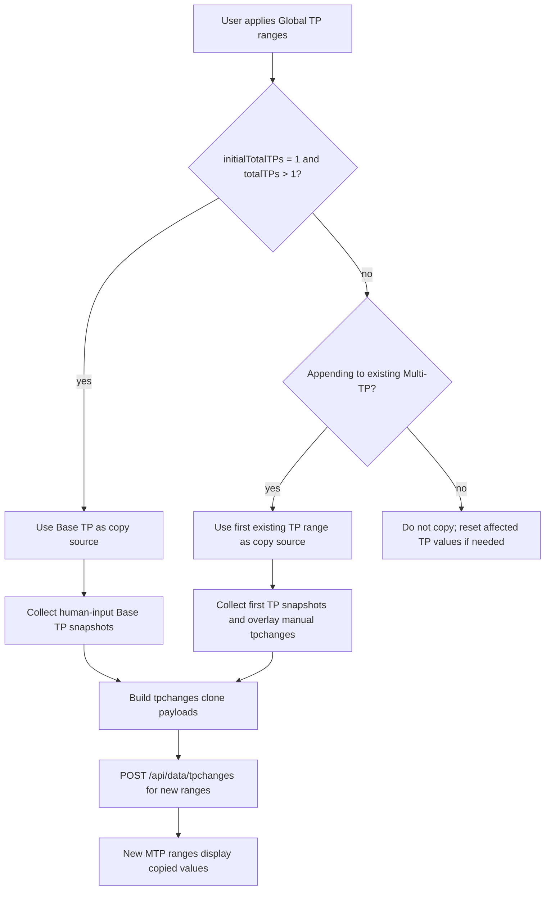

# Time Period and Economic Flow Code Explanation

## Overview

The TP and Economic flow owns diagram-level duration, Multi-TP ranges, node model-version ranges, cost entities, and cost mappings. User edits are saved to diagram fields or TP rows first; compute start later converts those persisted fields into solver-facing `parameters.costs`.

The important boundary is that `parameters.costs` is generated runtime state. It is not the editing source of truth for Base TP, Global TP, Base Economic, or Multi-TP Economic behavior.

## Source Files

Current behavior was checked in these source files:

- `src/src/frontend/src/components/header-bar/header-buttons/base-tp-button.tsx`
- `src/src/frontend/src/components/header-bar/header-buttons/time-period-viewer.tsx`
- `src/src/frontend/src/components/header-bar/header-buttons/global-tp-button.tsx`
- `src/src/frontend/src/components/header-bar/header-buttons/tp-specs-button.tsx`
- `src/src/frontend/src/components/header-bar/header-buttons/cost-button.tsx`
- `src/src/frontend/src/components/header-bar/header-buttons/cost-button-utils.ts`
- `src/src/frontend/src/components/header-bar/index.tsx`
- `src/src/backend/routes/dataRoutes.ts`
- `src/src/backend/routes/computeRoutes.ts`
- `src/src/backend/utils/economicCosts.ts`
- `src/src/backend/utils/translation.ts`
- `src/tests/backend/utils/economicCosts.test.ts`
- `src/tests/backend/utils/translationCosts.test.ts`

Legacy docs were used only as historical density references:

- `docs-archive/PreviousDoc/CodeExplanation/global-tp.md`
- `docs-archive/PreviousDoc/CodeExplanation/tp-duration-base-and-solve-request.md`
- `docs-archive/PreviousDoc/CodeExplanation/tp-specs-panel.md`
- `docs-archive/PreviousDoc/CodeExplanation/timePeriodViewer.md`

## Purpose

The TP and Economic flow owns two related data surfaces:

- Time structure and duration, stored on the diagram for the base period and on `tpNodeVers` rows for multi-time-period ranges.
- Economic cost definitions and mappings, stored on the diagram and converted into solver-facing `parameters.costs` only when computation starts.

The UI does not edit `parameters.costs` directly. `parameters.costs` is generated by the backend start route from the current diagram, TP rows, and economic rows.

## Field Ownership

| Field | Owner | Stored in | Computation handoff |
| --- | --- | --- | --- |
| `duration` | Base TP owns diagram-level base duration. Global TP owns TP-row duration. | `diagram.duration`; `tpNodeVers.duration` | `computeRoutes.ts` builds `parameters.costs.duration`. |
| `durationUnit` | Base TP owns diagram-level base unit. Global TP owns TP-row unit. | `diagram.durationUnit`; `tpNodeVers.durationUnit` | `computeRoutes.ts` normalizes to `DurationUnit`. |
| `costEntities` | Base Economic and Multi-TP Economic panels. Backend MTP initialization may seed or stretch rows. | `diagram.costEntities` | `translation.ts` sanitizes into `parameters.costs.entities`. |
| `costMappings` | Base Economic and Multi-TP Economic panels. Backend MTP initialization may stretch rows. | `diagram.costMappings` | `translation.ts` sanitizes into `parameters.costs.mappings`. |
| `parameters.costs` | Backend compute start route and translation layer. | `diagram.parameters.costs` after `/api/compute/start` | Solver-facing payload. Not the source of truth for editing. |

## Data Flow

1. Base TP edits save `duration` and `durationUnit` to the diagram through `/api/data/diagrams/:diagramId/base-duration`.
2. Global TP edits read and write `tpNodeVers` rows for the current network, including TP ranges, durations, units, and model versions.
3. Base Economic and Multi-TP Economic edits save `costEntities` and `costMappings` to the diagram through `/api/data/diagrams/:diagramId/costs`.
4. Multi-TP initialization or range changes may call `/api/data/diagrams/:diagramId/costs/initialize-mtp` so economic rows match the current TP structure.
5. When `/api/compute/start` runs, `computeRoutes.ts` loads the diagram, TP rows, cost entities, and cost mappings.
6. `computeRoutes.ts` builds `costsPayload` from persisted diagram fields plus `buildCostDurationPayload(...)`.
7. `translation.ts` sanitizes that payload and writes solver-facing `parameters.costs`.
8. The backend saves the generated `parameters` back to the diagram before queueing the computation task.

Saved economic entity rows use this storage shape:

```ts
{
  generatedBy,
  scope,
  fromTp,
  toTp,
  name,
  cost,
  uncertainty,
  unit,
  type
}
```

Saved economic mapping rows use this storage shape:

```ts
{
  scope,
  fromTp,
  toTp,
  network,
  node,
  port,
  var,
  entity
}
```

`scope` is intentionally backward-compatible:

- A row with `scope: "base"` is a base-period row.
- A legacy unscoped `1-1` row is also treated as base.
- A row with `scope: "mtp"` is a Multi-TP row, even when its range is `1-1`.
- A legacy unscoped row outside `1-1` is treated as Multi-TP.

## Base TP

`BaseTpButton` edits the base duration for a saved diagram.

The modal reads `diagram.duration` and `diagram.durationUnit` from `GET /api/data/diagrams/:diagramId`. Missing or invalid values fall back to `1 hours`.

On save it calls:

```http
PUT /api/data/diagrams/:diagramId/base-duration
```

with:

```json
{
  "duration": 1,
  "durationUnit": "hours"
}
```

The backend validates that duration is positive and the unit is one of `minutes`, `hours`, `days`, or `weeks`. It then updates the current diagram and related network diagrams so subnetworks use the same base duration.

Base TP is guarded against accidental use after Multi-TP ranges exist. The button is disabled when there is no `diagramId`, or when `/api/data/tpnodevers?diagramId=...` contains any range other than `1-1`. If the guard fetch fails, the component logs the error and leaves the button available instead of blocking the user.

## Global TP

`GlobalTpButton` owns the editable Multi-TP structure. It reads the current diagram, subnetwork diagrams, nodes, and all `tpNodeVers` rows for the network.

Each saved row can include:

```ts
{
  diagramId,
  nodeId,
  timePeriodId,
  fromTp,
  toTp,
  duration,
  durationUnit,
  modelVersion
}
```

The range validator enforces these rules:

- Ranges must start at `1`.
- Ranges must be continuous.
- Ranges must not overlap.
- The last `toTp` must match the total TP count.
- Every range must have a positive duration.
- `durationUnit` must be `minutes`, `hours`, `days`, or `weeks`.

On apply, the component builds add, update, and delete sets for `/api/data/tpnodevers`. Structural changes can clear TP-specific values, computation results, and cache state. When new ranges are added, the component can clone existing Base TP or first-period values into the new ranges by writing sparse `/api/data/tpchanges` rows.

### Base TP Value Copy to Multi-TP

Global TP owns the automatic copy path for node variable values when the time structure expands. This is separate from Base Economic copy behavior.

The copy decision is implemented in `src/src/frontend/src/components/header-bar/header-buttons/global-tp-utils.ts`:

- `shouldCopyBaseTpValuesToNewRanges(initialTotalTPs, totalTPs)` returns `true` only when the network is converted from base-only TP (`initialTotalTPs === 1`) to Multi-TP (`totalTPs > 1`).
- `shouldCopyTpValuesToNewRanges(initialTotalTPs, totalTPs)` returns `true` for Base-to-MTP conversion and for appending new ranges to an already Multi-TP network.
- Existing Multi-TP range reshaping or reduction does not use Base TP as a source; those paths may clear affected TP values after confirmation.

When converting from Base TP to Multi-TP, `GlobalTpButton` collects source snapshots from the node's Base TP model version and current Base TP Redux parameter overrides. It copies only effective human-input values:

- The preferred `is_human_input` flag comes from the current Redux parameter override when present.
- If there is no override flag, the model variable object's `is_human_input` flag is used.
- Values whose effective source is not human input are skipped.
- Non-numeric values are skipped.

Each copied snapshot can include:

```ts
{
  portName,
  portVarName,
  portLocation,
  portVarValue,
  lowerBound,
  upperBound,
  unit,
  spec
}
```

For every new non-base TP range, Global TP creates a `/api/data/tpchanges` payload using that snapshot. The result is a sparse Multi-TP override row, not a mutation of the Base TP model version.



When appending to an existing Multi-TP network, the source is not Base TP. The component reads the first existing TP range model version, overlays manual non-computed `tpchanges` for that first range, then copies those snapshots into appended ranges. This protects existing MTP semantics where TP-specific edits already supersede Base TP.

Global TP also prepares economic data for the new TP ranges. It calls:

```http
POST /api/data/diagrams/:diagramId/costs/initialize-mtp
```

when the network is converted to Multi-TP, ranges are appended, ranges are reduced, or existing ranges change. If base cost data is missing during base-to-MTP expansion, the UI warns that base-period cost data does not exist and the user should upload Multi-TP cost data.

## Time Period Viewer

`TimePeriodViewer` is currently a model-version viewer/editor, not the owner of range structure or duration. The source has:

```ts
const TP_STRUCTURE_EDITING_ENABLED = false;
```

With that flag disabled, the modal tells the user that TP range editing is temporarily disabled. It still reads `tpNodeVers`, diagrams, and nodes, and it can save model-version updates, but it does not expose active duration or range-structure editing controls.

The button renders only after verification state allows it. The header keeps the button available and relies on this component to control the detailed editing surface.

## TP Specs

`TPSpecsButton` edits node model variable specs and values, not TP range duration. It has separate Base and Multi-TP modes.

Base mode is opened from `Model -> Specs`. It reads the diagram and node definitions, builds rows from model-version `ports_var` and `model_var_object`, and displays `From TP` and `To TP` as `1-1`.

On save it sends:

```http
PUT /api/data/tp-specs/bulk-update
```

with row-level value, spec, bounds, and selected unit updates for the node model version.

Multi mode is opened from `Multi-TP -> TP Specs`. It additionally reads `/api/data/tpnodevers` and `/api/data/tpchanges/all`, expands rows per TP range, overlays existing `tp_changes`, and saves non-base edits back through:

```http
POST /api/data/tpchanges
DELETE /api/data/tpchanges
```

Only rows whose `timePeriodId` is exactly `BASE_TP` use the base bulk-update route while the panel is in Multi mode. A `1-1` TP range in Multi mode is still treated as a Multi-TP row unless its `timePeriodId` is `BASE_TP`.

If calculation type is included, it also updates:

```http
PUT /api/data/diagrams/:diagramId
```

so `parameters.global_params.task_config.task_type` and existing `tps_specs.task` values stay aligned.

At compute start, `translation.ts` rebuilds `parameters.tps_specs` from clean model definitions, connected streams, selected calculation type, and explicit user overrides.

See `tp-specs-panel.md` for the full Base vs Multi-TP Specs behavior.

## Economic Panels

`CostButtons` is used in two modes:

- Base Economic uses `showTpRanges={false}` from the `Economic` header section.
- Multi-TP Economic uses `showTpRanges` from the `Multi-TP` header section.

The Multi-TP version is read-only when the header cannot detect a Multi-TP network, or when the computing-disable rule for cost buttons is active.

The component loads `diagram.costEntities` and `diagram.costMappings`. In Multi-TP mode it also loads `tpNodeVers` to discover the available ranges and maximum TP. If existing saved economic rows do not match the current TP ranges, the component can initialize Multi-TP data through `/api/data/diagrams/:diagramId/costs/initialize-mtp`.

Save validates that all entity and mapping ranges are finite, start at TP `1` or later, and have `toTp >= fromTp`. It then merges rows with normalized ranges, inferred scope, trimmed names, and deduplication keys before calling:

```http
PUT /api/data/diagrams/:diagramId/costs
```

The `Apply Base Economic` action copies base economic rows into all available Multi-TP ranges with `scope: "mtp"`. Base rows remain base rows, and generated MTP rows are saved separately.

## Backend Economic Normalization

`economicCosts.ts` is the storage-normalization boundary for economic rows.

It accepts TP aliases such as `fromTp`, `fromTP`, `from_tp`, and `From TP`, and the matching `toTp` aliases. It rejects invalid ranges. It defaults missing row ranges to `1-1`.

`buildMtpEconomicDataFromBase` preserves base rows and stretches Multi-TP rows to the requested ranges. It is careful not to treat explicit `scope: "mtp"` rows as base rows just because they happen to be `1-1`.

## Compute Start Handoff

When `/api/compute/start` runs, `computeRoutes.ts` builds:

```ts
const costsPayload = {
  entities: cloneCostEntityFields(diagram.costEntities),
  mappings: Array.isArray(diagram.costMappings) ? diagram.costMappings : [],
  duration: buildCostDurationPayload(diagram, diagramId, tpNodeVersRows)
};
```

`buildCostDurationPayload` uses TP rows for the current network when valid rows exist. It falls back to `diagram.duration` and `diagram.durationUnit` as `1-1` when no valid TP rows exist.

`translation.ts` then writes solver-facing costs into `parameters.costs`:

- `entities` stay in the legacy single-period shape when there are no Multi-TP entities and no Multi-TP duration.
- Multi-TP entities are grouped with `timePeriodCosts`.
- `mappings` drop `scope`, `fromTp`, and `toTp`; the solver receives network/node/port/var/entity only.
- `duration` is emitted as an array with `From TP`, `To TP`, `Duration`, and `DurationUnit`.

## Testing

Relevant backend tests are present at:

- `src/tests/backend/utils/economicCosts.test.ts`
- `src/tests/backend/utils/translationCosts.test.ts`

Focused validation command:

```powershell
cd C:\Users\19612\Desktop\Project\HYPRONET-GUI\src
npx.cmd jest tests/backend/utils/economicCosts.test.ts tests/backend/utils/translationCosts.test.ts --runInBand --coverage=false
```

## Known Cautions

- Do not use generated runtime artifacts as the source of truth for TP or cost behavior.
- `parameters.costs` is regenerated by compute start; edit diagram-level fields or TP rows instead.
- Base TP is intentionally blocked once real Multi-TP ranges exist.
- `TimePeriodViewer` contains save code for TP rows, but the current UI disables TP structure editing with `TP_STRUCTURE_EDITING_ENABLED = false`.
- Legacy unscoped `1-1` cost rows are base rows for compatibility. New Multi-TP rows should use explicit `scope: "mtp"`.
