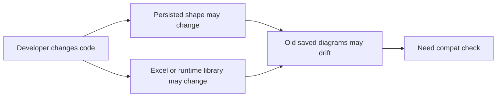
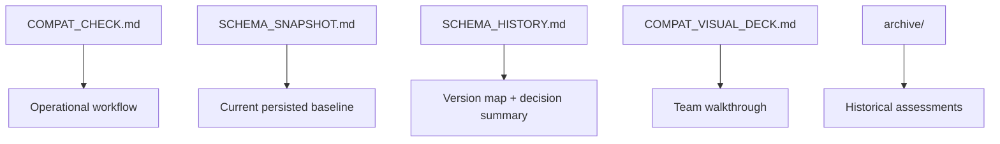
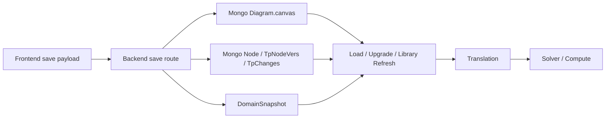
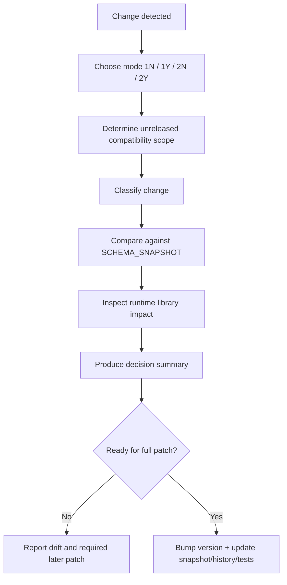
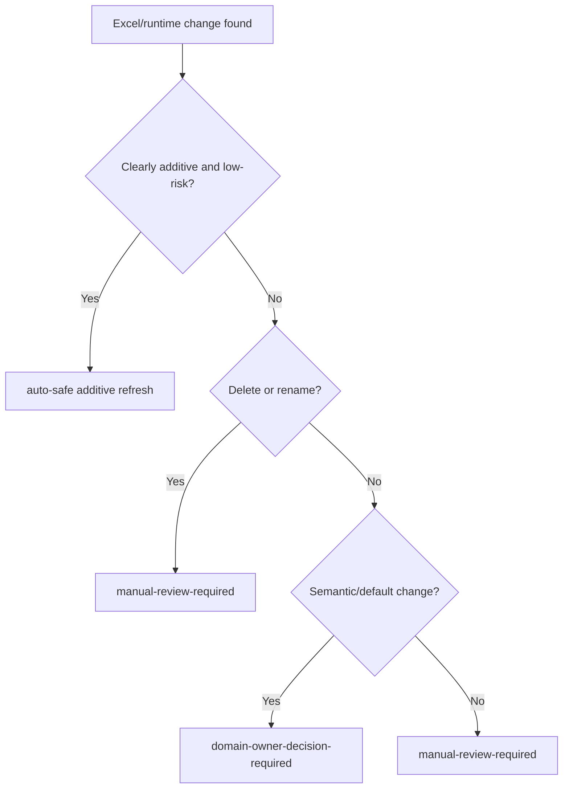
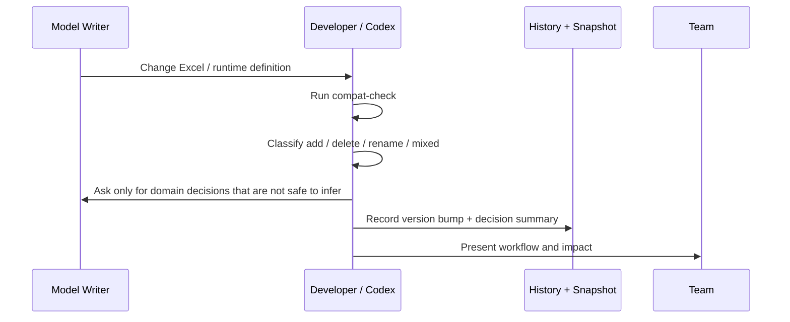

# Plant-GUI Compatibility Walkthrough

### Purpose

- explain what compatibility work is responsible for
- separate persisted-structure drift from Excel/runtime-library drift
- show where human decisions are required
- give the team a 5-minute overview before diving into code

---

# 1. Why This Exists

Compatibility is not only about JSON shape.

We have two independent sources of risk:

1. persisted structure changed
2. Excel/runtime-library contract changed

Both can break saved diagrams.



---

# 2. Document Roles



Rules:

- `SCHEMA_SNAPSHOT.md` answers: "What is the baseline now?"
- `SCHEMA_HISTORY.md` answers: "What changed between versions, and what did we decide?"
- `COMPAT_CHECK.md` answers: "How do we run the review?"

---

# 3. Data Flow View



Questions to ask:

- did the persisted shape change?
- did the runtime model contract change?
- can old data be refreshed automatically?

---

# 4. Execution Flow View



---

# 5. Classification Matrix

| Classification | What changed | Typical handling |
|----------------|--------------|------------------|
| `schema-only` | persisted shape only | migration-driven |
| `library-additive` | new runtime items | additive refresh if clearly safe |
| `library-rename` | same concept, new identifier/name | explicit mapping required |
| `library-delete` | runtime item removed | warn + unverify + manual reselection by default |
| `mixed` | both shape and runtime changed | combine schema patch with strictest library rule |

Important:

- this repo uses **one compatibility version axis**
- but review still distinguishes schema vs library semantics internally

---

# 6. Decision Boundary



Team rule:

- tooling may detect
- tooling may refresh low-risk additive data
- tooling must not invent chemical-engineering meaning

---

# 7. Why History Must Include Decisions

Only recording "which Excel file was used" is **not enough**.

We also need to know:

- was the change `add`, `delete`, `rename`, or `mixed`?
- did we auto-refresh, warn, unverify, or require manual remap?
- who decided that this behavior was acceptable?

Example history row content:

```text
Version: 6.0.0
Runtime baseline: src/excel-sheets/mar-18-2026.xlsx
Classification: library-additive
Decision summary:
- additive refresh allowed
- rename/delete not auto-resolved
```

---

# 8. Recommended Team Workflow



What the team should expect from each release:

- one compatibility version bump
- one snapshot update
- one history row with the decision summary

---

# 9. What To Present In A Team Meeting

Minimum walkthrough:

1. what changed
2. what class of compatibility change it is
3. what was handled automatically
4. what required human judgment
5. what was recorded in history

That is enough for a short PPT or slide-driven Markdown walkthrough.
