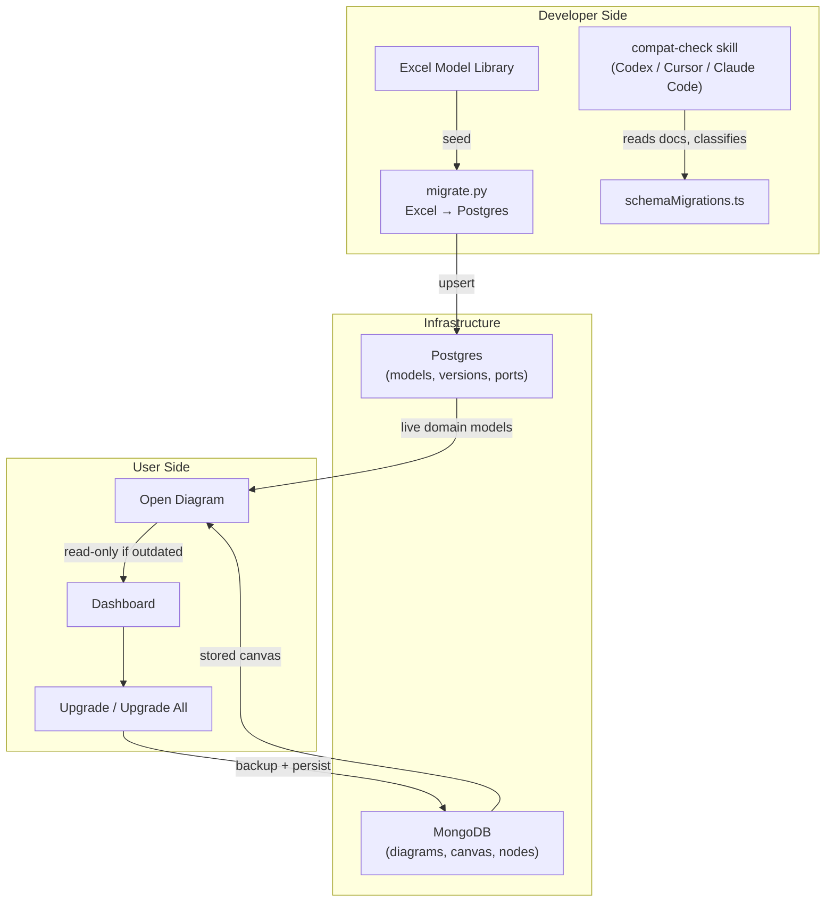
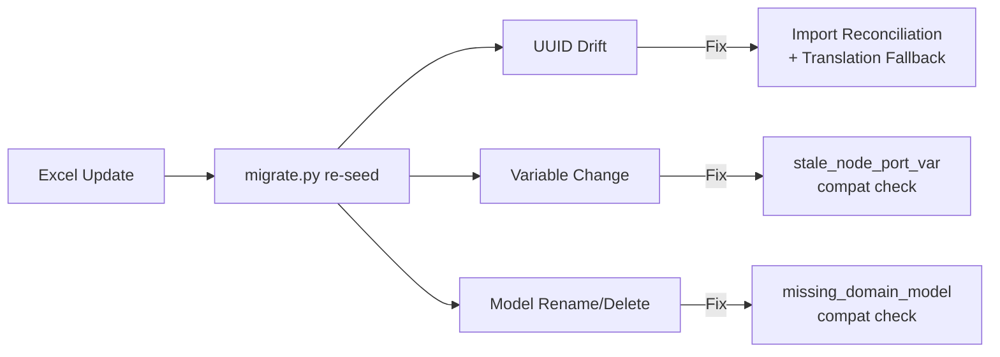
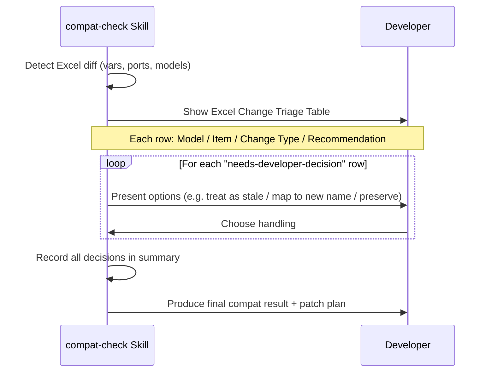
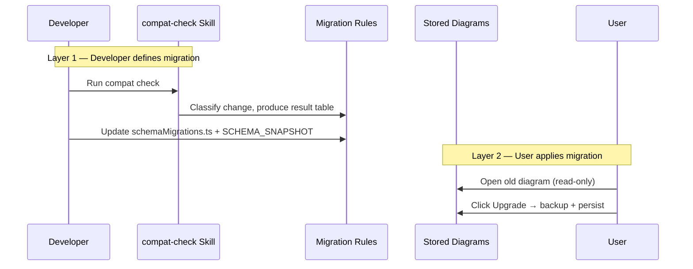

# Compatibility System

A **skill** (reusable AI prompt workflow) that runs inside Codex, Cursor, or Claude Code.

Skill name: `plant-gui-compat-check`

---

## How To Run It

### Developer

```
"Run a compat check"     # full review
"Compat check 1Y"        # schema-only, ready
"Compat check 2N"        # library change, iterating
```

Reads `COMPAT_CHECK.md` + `SCHEMA_SNAPSHOT.md` + `SCHEMA_HISTORY.md`, classifies the change, outputs result table + decision.

### User

Users never touch the skill. They use the **Dashboard UI**:

| Action | What Happens |
|--------|-------------|
| Open old diagram | Temporarily migrated, shown read-only |
| Click **Upgrade** | Backup created, diagram upgraded |
| Click **Upgrade All** | Bulk upgrade all outdated diagrams |

---

## Architecture Overview



---

## The Excel Pollution Problem

When the model library Excel is updated and re-seeded into Postgres, three kinds of data pollution affect saved diagrams:



---

## Excel Change Triage Flow

When the skill detects Excel/library changes, it does **not silently apply fixes**. Instead:



Example triage output:

| # | Model | Item | Change | Recommendation |
|---|-------|------|--------|---------------|
| 1 | HX | ENTHALPY_CHANGE removed | var-removed | auto-unverify |
| 2 | MIXER | MCP_OUT1 added | var-added | auto-refresh (silent-ok) |
| 3 | REACTOR | YIELD renamed → CONVERSION | var-renamed | **needs-developer-decision** |

For row 3, the skill asks:
> `REACTOR / YIELD → CONVERSION: (a) treat as stale, (b) add rename mapping, (c) preserve as-is?`

---

## UUID Drift (Most Common)

| Stage | What Happens |
|-------|-------------|
| Before re-seed | `MIXER` → Postgres ID `aaa-bbb-ccc` |
| After re-seed | `MIXER` → new ID `xxx-yyy-zzz` |
| Saved diagram | Still stores `model.id = aaa-bbb-ccc` |
| Consequence | `domainModelMap.get(id)` → `undefined` |

**Proactive fix**: Import reconciliation — remap `model.id` by `model_name` on import

**Safety net**: Translation fallback — resolve by name if ID lookup fails at compute time

---

## Variable Change (stale_node_port_var)

Port variable added / removed / renamed in Excel.

Saved diagrams still hold old variable name/value.

Compat check detects this and **blocks computation** until user acknowledges.

---

## Model Rename / Delete (missing_domain_model)

Model renamed or removed from Excel entirely.

Saved diagram references a `model_name` that no longer exists.

Compat check flags as **blocking issue**.

---

## Two-Layer Design



> **Developer defines the migration path; user decides when to apply it.**

---

## Key Files

| File | Audience |
|------|----------|
| `COMPAT_CHECK.md` | Developer |
| `SCHEMA_SNAPSHOT.md` | Developer |
| `schemaMigrations.ts` | Developer |
| `diagramCompatibility.ts` | System |
| `dataRoutes.ts` (import reconciliation) | System |
| `translation.ts` (name fallback) | System |
| Dashboard UI (Upgrade) | User |

---

## Q&A

**Q: Why not auto-upgrade on open?**
Opening is for readability. Upgrading needs backup + user consent.

**Q: What does the skill do?**
Classifies changes and produces a report. Does not modify user data.

**Q: What if Postgres is re-seeded?**
Import reconciliation remaps stale IDs by `model_name`. Translation fallback catches the rest.
