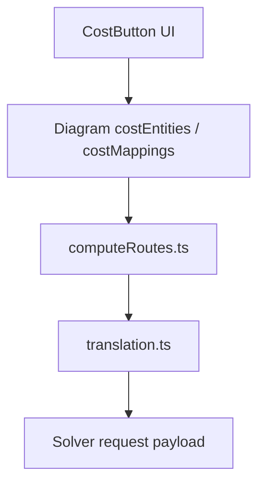

## Purpose

This page defines how contributors should write `CodeExplanation` documentation for HyProNet.

A `CodeExplanation` page is not a changelog, meeting note, or generic tutorial. It is a stable explanation of how one code area works so future contributors can understand, debug, and extend it without rereading every source file from scratch.

A good `CodeExplanation` page should answer:

1. What code area does this page explain?
2. Where is the source code?
3. What problem does this code solve?
4. What inputs, state, outputs, and side effects does it use?
5. What are the main functions, components, or data structures?
6. How does data flow through this code?
7. What should future contributors be careful not to break?
8. Where should someone look next if they need to modify it?

If the page cannot answer those questions, it is not ready for review.

## What Belongs in CodeExplanation

Write a `CodeExplanation` page when a code area is important enough that future contributors need a stable map of it.

Good topics include:

- A frontend component or component group.
- A backend route or service.
- A Redux slice or shared state module.
- A save, import, compute, translation, or verification workflow.
- A cross-file data flow that is hard to understand from one file.
- A module with many callers or side effects.
- A feature where future changes are likely.

Do not use `CodeExplanation` pages for:

- Temporary debugging notes.
- Raw terminal output.
- A list of every commit that touched the file.
- A copy-paste of the source code.
- API documentation that repeats function names without explaining behavior.
- Speculation about code that was not checked.

## Placement

The current active user-facing documentation parent is:

```text
docs/SetupInstructions/
```

Current setup and installation guides live under:

```text
docs/SetupInstructions/Installation/
```

Current `CodeExplanation` pages live under:

```text
docs/SetupInstructions/CodeExplanation/
```

The legacy `CodeExplanation` reference surface is:

```text
docs-archive/PreviousDoc/CodeExplanation/
```

Rules:

- Treat `docs/SetupInstructions/` as the active current docs parent.
- Put setup and installation pages under `docs/SetupInstructions/Installation/`.
- Put current `CodeExplanation` pages under `docs/SetupInstructions/CodeExplanation/`.
- Treat `docs-archive/PreviousDoc/CodeExplanation/` as historical reference only.
- Use legacy pages only for information density, useful topic coverage, and historical background.
- Re-read the current source code before documenting behavior, APIs, data fields, component contracts, or verification commands.
- Do not copy the legacy page structure just because it exists in the archive.
- Ignore misplaced or generated `CodeExplanation` copies under `version6.1/`, including `version6.1/doc/docs/capstone/CodeExplanation/`, when deciding current placement or writing standards.
- Do not add new current pages to the archive unless the task explicitly asks for historical preservation.
- Do not add or modify `version6.1/` content when writing current `CodeExplanation` docs.
- Keep this standards page under `docs/SetupInstructions/CodeExplanation/` so contributors can find the writing rules before creating new explanations.

## File Naming

Use a filename that matches the code area being explained.

Examples:

```text
header-bar.md
save-diagram.md
translation.md
compute-routes.md
node-cache-slice.md
```

Rules:

- Use `.md`.
- Prefer lowercase words separated by hyphens for new explanation pages.
- Source-symbol pages may preserve source-style names when changing them would break existing links or make the source mapping less clear.
- Name the page after the feature or module, not the author or issue number.
- Avoid vague names such as `notes.md`, `misc.md`, `logic.md`, or `new-flow.md`.
- If the page explains a source file, use a close but readable name. For example, `translation.ts` can become `translation.md`.

## Required Page Structure

Choose the structure that fits the code area.

Full workflow pages should use this structure when the explanation crosses multiple files, layers, user actions, persistence boundaries, or solver boundaries:

1. Title.
2. Overview.
3. Source files.
4. Purpose and responsibility.
5. Inputs and outputs.
6. Core state or data structures.
7. Main functions or components.
8. Data flow.
9. Important side effects.
10. Error handling and edge cases.
11. Extension points.
12. Testing and verification.
13. Known cautions.
14. Related pages or source areas.

Compact pages are acceptable for a small component, utility, hook, Redux slice, selector group, or narrowly scoped helper. A compact page may merge sections such as `Inputs and Outputs`, `Core State`, and `Main Functions`, but it must still document:

- `Source files`.
- Ownership and responsibility boundaries.
- Inputs, outputs, props, selectors, state, or data structures that affect behavior.
- Main functions, components, reducers, or effects.
- `Data flow`.
- Side effects, guards, and error or fallback behavior.
- Testing and manual verification.
- `Known cautions`.

Do not skip `Source files`, `Data flow`, or `Known cautions`. In compact pages, they may be explicit subsections inside a merged section, but the information must still be easy to find.

## Frontmatter

Current pages under `docs/SetupInstructions/` use frontmatter. New Docusaurus-rendered current docs should use frontmatter where the target docs surface expects it:

```markdown
---
title: Header Bar Code Explanation
sidebar_position: 5
description: Explains how the HyProNet header bar coordinates primary actions, secondary controls, and related modals.
---
```

Rules:

- `title` should be readable in the sidebar.
- `description` should say what code area is explained and why it matters.
- `sidebar_position` should place related explanations in a logical order.
- Do not leave unfinished placeholder text in published docs.
- Do not infer current frontmatter, sidebar, or route rules from misplaced `version6.1/` content.

## Overview Section

The overview should be short and practical.

Include:

- The user-facing or developer-facing feature this code supports.
- The main source file or entry point.
- The role this code plays in the larger application.

Example:

```markdown
## Overview

The Header Bar coordinates the primary canvas actions in the frontend. It renders top-level navigation, contextual secondary controls, and action buttons for model editing, run configuration, computation, and result history.
```

Avoid starting with implementation history. Save history for commit messages or issue notes.

## Source Files Section

List the source files readers should inspect first.

Use this format:

```markdown
## Source Files

- `src/src/frontend/src/components/header-bar/index.tsx`: main header layout and active section control.
- `src/src/frontend/src/components/header-bar/header-buttons/cost-button.tsx`: Economic editor modal and cost data editing.
- `src/src/backend/routes/computeRoutes.ts`: backend compute route that receives cost payloads.
```

Rules:

- List the main entry point first.
- Include helper files only when they are important for understanding behavior.
- Explain each file's role in one sentence.
- Do not list every imported file if it does not help the reader navigate the code.

## Purpose and Responsibility

State what the code owns and what it does not own.

Good pattern:

```markdown
## Purpose and Responsibility

This module owns the UI state for choosing the active header section and opening related modals. It does not own backend persistence, solver execution, or domain data normalization; those responsibilities are delegated to route handlers, services, and utility modules.
```

Rules:

- Be explicit about boundaries.
- Mention delegated responsibilities.
- If a file is large, explain the main responsibility instead of describing every minor helper.

## Inputs and Outputs

Document what enters and leaves the code area.

Include:

- Props.
- Route parameters.
- Request bodies.
- Redux state.
- Local state.
- Returned values.
- API responses.
- Persisted database fields.
- Files read or written.

Use tables when it helps comparison:

```markdown
## Inputs and Outputs

| Input | Source | Used For |
| --- | --- | --- |
| `diagramId` | route parameter | Loads and updates the selected diagram. |
| `costEntities` | diagram record | Builds the Economic solver payload. |

| Output | Destination | Notes |
| --- | --- | --- |
| `parameters.costs` | solver request payload | Contains sanitized cost entities, mappings, and duration data. |
```

Rules:

- Do not only say "takes data and returns data."
- Use exact field names when they matter.
- Explain data ownership when multiple layers touch the same value.

## Core State or Data Structures

Explain state that controls behavior.

Examples:

```markdown
## Core State

- `activeSection`: controls which secondary header row is visible.
- `showRunConfigModal`: controls whether the run configuration modal is open.
- `calcType`: Redux value that selects the current calculation mode.
```

Rules:

- Explain what each state value controls.
- Mention default values when they matter.
- Mention whether the state is local, Redux, database-backed, or derived.
- Do not list obvious temporary variables unless they affect behavior.

## Main Functions or Components

List the functions, components, or methods that future contributors are most likely to modify.

Use this format:

```markdown
## Main Functions

- `handleOpenRunConfig(type)`: opens the shared run configuration modal for the selected solver or algorithm.
- `buildCostDurationPayload(...)`: converts diagram TP duration data into the backend cost payload shape.
- `translation(...)`: builds the solver-facing request from graph, domain, TP, and cost data.
```

Rules:

- Include parameters only when they clarify behavior.
- Say what the function changes or returns.
- Mention important side effects.
- Do not document every small helper unless it has tricky behavior.

## Frontend CodeExplanation Rules

Frontend pages must explain what the user sees, how interaction changes state, and which contracts child components receive. Include these items when they apply:

- Rendered UI / Interaction Map: list the visible controls, panels, modals, canvas elements, and user actions this code owns.
- Component contract: document required props, optional props, callback props, emitted events, and assumptions about parent-owned state.
- Props passed to children: name important child components and explain the behavior-relevant props they receive.
- Route params, selectors, and local state: identify route parameters, Redux selectors, derived state, and local `useState` values that affect rendering or actions.
- Conditional rendering: explain which branches render, hide, swap, or remount UI.
- Disabled/readOnly guards: document conditions that disable controls, make inputs read-only, block actions, or prevent persistence.
- Hooks/effects dependencies and cleanup: explain important `useEffect`, `useMemo`, `useCallback`, subscription, timer, and listener dependencies, including cleanup behavior.
- Frontend manual verification matrix: include a small matrix for the important UI states, actions, expected visual result, expected API or state change, and regression risk.

Rules:

- Do not describe a component only by listing JSX children.
- Explain the contract between parent and child components when behavior depends on props.
- If a UI action updates Redux, route state, persisted data, or a backend request body, follow that handoff in the data flow.
- If a guard is duplicated between UI and backend code, name both sides.

## Data Flow

Every `CodeExplanation` page should include a data flow section.

Use numbered steps for linear flows:

```markdown
## Data Flow

1. The user edits Economic data in `CostButton`.
2. The frontend stores cost entities and mappings on the diagram.
3. `computeRoutes.ts` loads the diagram during `/api/compute/start`.
4. The route builds `costsPayload`.
5. `translation.ts` sanitizes the payload into `parameters.costs`.
6. The solver receives the final request body.
```

Use a diagram only when the flow crosses many modules:



Rules:

- Start from the real trigger.
- End at the real output or side effect.
- Include file names at important boundaries.
- Do not hide important transformations behind vague wording.

## Backend and Data-Flow Rules

Backend, compute, import, translation, persistence, and cross-layer pages must explain the real contract at every boundary. Include these items when they apply:

- Solver-facing payload contract: document the final request shape sent to the solver.
- Exact fields: use exact names such as `parameters`, `parameters.tps_specs`, and `parameters.costs` when those fields are relevant.
- Field ownership and source: explain whether each important value comes from UI state, Redux, route params, database records, imported workbook data, defaults, or derived calculations.
- Fallback and sanitization rules: document defaulting, coercion, filtering, null handling, legacy compatibility, and validation behavior.
- DB read/write boundary: name the collections, tables, models, or repositories that are read or written.
- Queue boundary: explain where a request is enqueued, where task state changes, and which worker or service consumes it.
- External solver/callback boundary: describe the outbound solver request, callback endpoint, callback payload, and status update path.
- Generated artifact usage: generated files are allowed only for read-only verification, not as the source of truth for authoring behavior.

Rules:

- Trace backend data from its owner to the final side effect.
- Separate request-building behavior from runtime artifacts created by a local run.
- Do not infer current API behavior from legacy docs or generated output without checking the source.
- If a value can be written by more than one layer, name the winning source and the merge or override rule.

## Side Effects

Document side effects clearly.

Examples:

- Calls a backend API.
- Updates Redux state.
- Writes to MongoDB or PostgreSQL.
- Stores values in `localStorage`.
- Starts a computation task.
- Writes a solver request payload.
- Reloads the page.
- Deletes saved results.

Rules:

- Say when the side effect happens.
- Say what data is changed.
- Say whether the action is reversible.
- Warn if the side effect can affect saved diagrams, imported data, or solver runs.

## Error Handling and Edge Cases

Explain known failure paths and guard logic.

Use this format:

```markdown
## Error Handling and Edge Cases

- If `diagramId` is missing, the route returns an error before building the solver payload.
- If a stream edge is incomplete, save aborts and highlights the incomplete edge.
- If TP ranges are not verified, Multi-TP actions stay disabled in the UI.
```

Rules:

- Include user-visible errors when they exist.
- Include validation guards.
- Include fallback behavior.
- Do not invent errors that the code does not actually handle.

## Extension Points

Explain how future contributors should safely extend the code.

Good examples:

```markdown
## Extension Points

- Add a new header action by wiring it into the primary or secondary row in `header-bar/index.tsx`.
- Add a new cost field by updating the UI row type, persistence shape, backend payload builder, and translation sanitizer together.
- Add a new solver parameter by updating the translation utility and adding a targeted regression test.
```

Rules:

- Point to exact files.
- Mention all layers that must change together.
- Include tests that should be updated.
- Warn about compatibility or saved-data concerns.

## Testing and Verification

Code explanations must tell readers how to verify changes.

Include:

- Existing tests related to the code.
- Manual UI checks.
- Build or type-check commands.
- Runtime payloads or logs that can confirm behavior.
- For frontend pages, a manual verification matrix that covers key rendered states, interactions, disabled/readOnly guards, and expected state or API effects.

Example:

```markdown
## Testing and Verification

- Backend translation changes: run `npx.cmd jest tests/backend/utils/translationCosts.test.ts --runInBand --coverage=false` from `src/`.
- TypeScript build: run `npm.cmd run build` from `src/`.
- Manual check: start the app, edit Economic cost data, run compute, and inspect that the generated solver payload contains the expected `parameters.costs` shape.
```

Rules:

- Use exact commands.
- Include the working directory.
- Separate automated tests from manual checks.
- Do not claim a test exists unless it exists in the repository.
- For backend payload checks, prefer source-level tests first and use generated runtime artifacts only as read-only confirmation.

## Known Cautions

Every page should warn future contributors about risky assumptions.

Examples:

- This code is performance-sensitive.
- This code affects save behavior.
- This code affects solver request shape.
- This code reads legacy saved diagrams.
- This code handles both base TP and Multi-TP data.
- This code has generated runtime artifacts that should not be committed.

Rules:

- Keep cautions concrete.
- Tie each caution to a file, data shape, or workflow.
- Do not write generic warnings such as "be careful."

## Generated Artifacts

Do not use generated artifacts as the main source of truth for a `CodeExplanation` page.

Generated artifacts are useful only for read-only verification of current runtime behavior after the source path has been identified.

Generated or diagnostic files include:

```text
src/src/backend/services/solve_request.json
src/src/backend/routes/external/callback_response.json
src/logs/
src/generated/
src/node_modules/
src/dist/
src/coverage/
version6.1/doc/build/
```

Rules:

- Mention generated files only when they help debugging or verification.
- Summarize relevant output instead of pasting the whole file.
- Do not commit large generated diffs as documentation.
- Do not hand-edit generated code or build output.
- Do not base behavior, API, or field-ownership claims on generated artifacts alone.

## Language and Style

Write in clear technical English unless a task explicitly asks for another language.

Rules:

- Use present tense for current behavior.
- Use active voice.
- Keep paragraphs short.
- Prefer exact names over vague phrases.
- Keep code identifiers, paths, commands, and error messages exactly as written in the codebase.
- Do not over-explain basic TypeScript, React, Express, or Redux concepts.
- Explain project-specific behavior and non-obvious interactions.

## Review Checklist

Before asking for review, check:

- The page is placed under the current docs surface, not the legacy archive or misplaced `version6.1/` content.
- Any legacy material was used only as reference density or historical background, with current behavior rechecked in source.
- The page explains a specific code area.
- The page uses either the full workflow structure or a compact structure appropriate for a small component, utility, hook, or Redux slice.
- The source files are listed with roles.
- The purpose and boundaries are clear.
- Inputs, outputs, and state are documented.
- Main functions or components are described by behavior, not just listed.
- Data flow is included.
- Frontend pages include rendered UI / interaction mapping, component contracts, child props, route params or selectors, conditional rendering, disabled/readOnly guards, hooks/effects dependencies, cleanup, and manual UI verification.
- Backend and cross-layer pages include payload contracts, exact important fields, ownership/source, fallback/sanitization rules, DB boundaries, queue boundaries, and external solver/callback boundaries.
- Side effects are called out.
- Edge cases and guards are included.
- Extension points tell future contributors where to modify code.
- Verification commands or manual checks are included.
- Known cautions are specific.
- Generated artifacts are not treated as source documentation.
- Generated artifacts are used only for read-only verification.
- Links point to real files or current docs.
- `git diff --check` reports no whitespace errors.

If the target current docs surface expects Docusaurus frontmatter, also check that frontmatter is valid and sidebar order is intentional.

## CodeExplanation Template

Use this template when creating a new `CodeExplanation` page:

````markdown
---
title: Feature or Module Code Explanation
sidebar_position: 5
description: Explains how the HyProNet feature or module works and how future contributors can extend it safely.
---

## Overview

Explain the feature or module, the main entry point, and its role in the application.

Use the full workflow structure for multi-layer behavior. For a small component, hook, utility, or Redux slice, keep the compact form but preserve the required information: source files, data flow, verification, and known cautions.

## Source Files

- `path/to/main-file.ts`: explain the file's role.
- `path/to/helper-file.ts`: explain why this helper matters.

## Purpose and Responsibility

Explain what this code owns and what it delegates to other modules.

## Inputs and Outputs

| Input | Source | Used For |
| --- | --- | --- |
| `exampleInput` | caller or state source | Explain usage. |

| Output | Destination | Notes |
| --- | --- | --- |
| `exampleOutput` | caller or persisted target | Explain result. |

## Core State or Data Structures

- `stateOrFieldName`: explain what it controls and where it lives.

## Main Functions or Components

- `functionName(...)`: explain behavior, side effects, and return value.

## Rendered UI / Interaction Map

For frontend pages, list the visible controls, user actions, conditional rendering branches, disabled/readOnly guards, and the expected UI result.

| UI State or Action | Source State or Props | Expected Result | Verification |
| --- | --- | --- | --- |
| Example action | Route params, selectors, local state, or props | Expected visible change and data handoff | Manual check or test command |

## Component Contract

For frontend pages, document required props, optional props, callback props, props passed to child components, route params, selectors, local state, and hook/effect dependencies or cleanup.

## Data Flow

1. Start from the trigger.
2. Follow the data through files and functions.
3. End at the output or side effect.

## Backend/Data-Flow Contract

For backend or cross-layer pages, document solver-facing payload contracts, exact fields such as `parameters`, `parameters.tps_specs`, and `parameters.costs` when relevant, field ownership/source, fallback and sanitization rules, DB read/write boundaries, queue boundaries, and external solver/callback boundaries.

## Side Effects

- Explain API calls, persistence writes, Redux updates, local storage changes, solver requests, or deletes.

## Error Handling and Edge Cases

- Explain validation guards and failure behavior.

## Extension Points

- Explain where future contributors should modify code and which tests should change with it.

## Testing and Verification

Terminal: **PowerShell**

Working directory:

```text
HYPRONET-GUI/src/
```

Run:

```powershell
npm.cmd run build
```

Expected result:

The TypeScript build completes without errors.

## Known Cautions

- Explain risks such as save behavior, solver payload shape, legacy compatibility, generated artifacts, or data deletion.

## Related Pages

- Link to related current docs or source explanation pages.
````

## Maintenance Rule

When code behavior changes, update its `CodeExplanation` page in the same pull request. A stale explanation is worse than no explanation because it sends future contributors toward the wrong implementation path.
