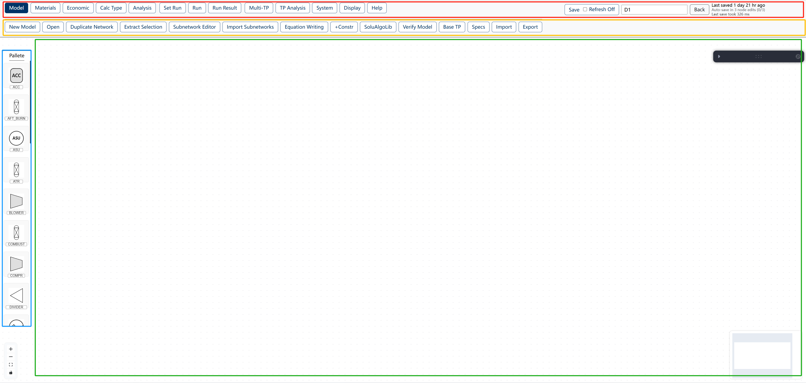

# Interface Overview

Use this page when you first open the HyProNet modeling workspace and need to understand the color-boxed regions and the top-level menu buttons.

## Color-Boxed Areas

| Color Box | Area Category | What It Contains | What It Is For |
| --- | --- | --- | --- |
| Red | Primary menu and status header | **Model**, **Materials**, **Economic**, **Calc Type**, **Analysis**, **Set Run**, **Run**, **Run Result**, **Multi-TP**, **TP Analysis**, **System**, **Display**, **Help**, plus **Save**, **Refresh Off**, diagram name, **Back**, and save status | Switch the major working mode or use always-visible status controls. |
| Orange | Secondary menu | In this screenshot, the active **Model** menu shows **New Model**, **Open**, **Duplicate Network**, **Extract Selection**, **Subnetwork Editor**, **Import Subnetworks**, **Equation Writing**, **+Constr**, **SoluAlgoLib**, **Verify Model**, **Base TP**, **Specs**, **Import**, and **Export** | Use actions that belong to the selected primary menu. The buttons change when another primary menu is selected. |
| Blue | Component palette | The left **Palette** panel with plant unit types such as **ACC**, **AFT_BURN**, **ASU**, **ATR**, **BLOWER**, **COMBUST**, **COMPR**, and **DIVIDER** | Pick the plant unit type you want to add to the model. |
| Green | Modeling canvas | The dotted workspace, floating canvas control, and minimap | Build, inspect, pan, zoom, and navigate the process network. |

## Primary Menu Buttons

Click a primary menu name below to open its specific introduction page.

| Primary Menu | Short Description | Detail Page |
| --- | --- | --- |
| **Model** | Create, open, duplicate, verify, import, export, and prepare the model. | [Model menu](./primary-menus/model) |
| **Materials** | Open material editing tools for material data used by the model. | [Materials menu](./primary-menus/materials) |
| **Economic** | Configure economic entities and mappings for costs, expenses, revenues, and objectives. | [Economic menu](./primary-menus/economic) |
| **Calc Type** | Select the calculation mode used by node variables and specifications. | [Calc Type menu](./primary-menus/calc-type) |
| **Analysis** | Open analysis tools such as Plant Measurements. | [Analysis menu](./primary-menus/analysis) |
| **Set Run** | Choose solver and algorithm configuration before computation. | [Set Run menu](./primary-menus/set-run) |
| **Run** | Start, stop, or inspect the computation action. | [Run button](./primary-menus/run) |
| **Run Result** | Open saved computation history and result records. | [Run Result button](./primary-menus/run-result) |
| **Multi-TP** | Configure multi-time-period workflows, TP node versions, TP specs, and Multi-TP economics. | [Multi-TP menu](./primary-menus/multi-tp) |
| **TP Analysis** | Open visualization and dashboard tools for time-period analysis. | [TP Analysis menu](./primary-menus/tp-analysis) |
| **System** | Import system-level material and node definition data. | [System menu](./primary-menus/system) |
| **Display** | Filter which node types remain visible on the canvas. | [Display button](./primary-menus/display) |
| **Help** | Access documentation and tutorial placeholders. | [Help menu](./primary-menus/help) |

## How To Use The Layout

1. Start in the red box and choose the primary menu for the task.
2. Move to the orange box and choose the secondary action for the active primary menu.
3. Use the blue **Palette** when you need to add plant units.
4. Work in the green canvas when creating or reviewing the network.
5. Watch the red-box save status after using **Save** or after auto-save runs.

## Result

You can identify the main workspace regions, understand what the colored boxes represent, and open the detailed introduction page for each primary menu button.

## Related Pages

- [Model primary menu](./primary-menus/model)
- [Materials primary menu](./primary-menus/materials)
- [Economic primary menu](./primary-menus/economic)
- [Calc Type primary menu](./primary-menus/calc-type)
- [Run primary button](./primary-menus/run)
- [Display primary button](./primary-menus/display)
