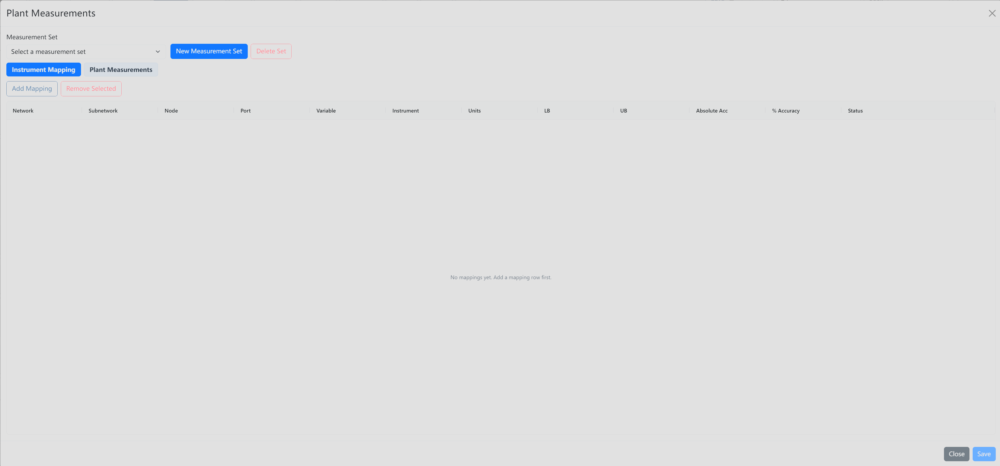

# Plant Measurements

Use **Plant Measurements** when you need to manage measurement sets, connect variables to instruments, and import or enter plant measurement values.

## Where To Find It

1. Select the **Analysis** primary menu.
2. Click **Plant Measurements** in the secondary button row.

## What It Opens/Does

The **Plant Measurements** modal contains a **Measurement Set** selector, **New Measurement Set**, and **Delete Set** controls. It has two tabs: **Instrument Mapping** and **Plant Measurements**.

Use **Add Mapping** to add variable-to-instrument rows on the **Instrument Mapping** tab. Use **Add Measurement**, **Import**, and **Remove Selected** on the **Plant Measurements** tab. Use **Save** to store the current changes.

## Basic Steps

1. Open **Plant Measurements** from the **Analysis** menu.
2. Choose an existing **Measurement Set**, or click **New Measurement Set**.
3. On **Instrument Mapping**, click **Add Mapping** and fill in the mapping rows.
4. On **Plant Measurements**, click **Add Measurement** to enter rows manually, or click **Import** to load measurement data.
5. Select unwanted rows and click **Remove Selected** if you need to clean up the table.
6. Click **Save**.

## Result

The selected measurement set keeps its instrument mappings and plant measurement rows for later analysis workflows.

## Related Pages

- [Analysis Menu overview](../analysis)
- [Set Run menu](../set-run)
- [Run button](../run)
