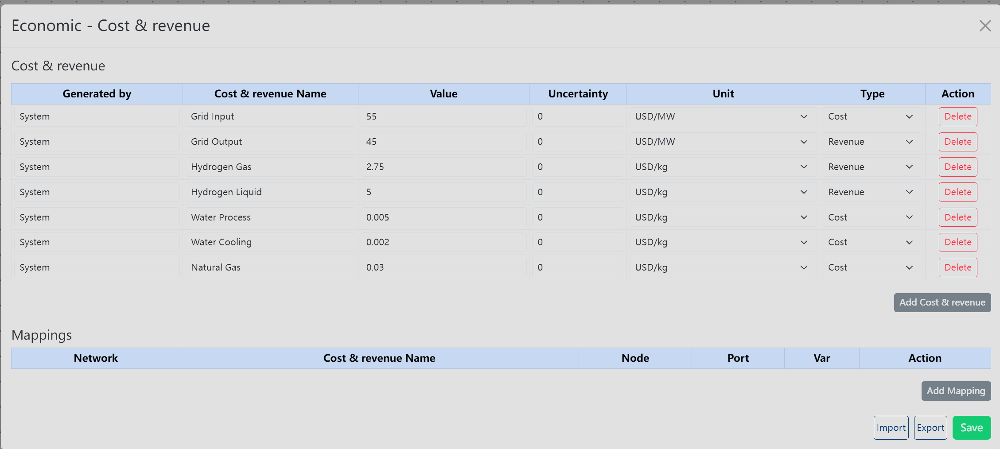

# Cost & revenue

Use **Cost & revenue** when you need to enter or maintain cost and revenue data for the current diagram.

## Where To Find It

1. Select the **Economic** primary menu.
2. Click **Cost & revenue** in the secondary button row.

## What It Opens/Does

**Cost & revenue** opens the **Economic - Cost & revenue** modal. The modal is used for economic rows, including entity and mapping work, plus import, export, and save actions.

## Basic Steps

1. Open **Cost & revenue**.
2. Review the existing cost and revenue rows.
3. Add or edit the required entities.
4. Update mappings so rows point to the correct model context.
5. Use import or export when you need to exchange rows with a workbook.
6. Click **Save** when the rows are ready.

## Result

The diagram's cost and revenue rows are saved for later analysis or computation. If the modal is read-only, review or export the rows and return after editing is available.

## Related Pages

- [Economic Menu overview](../economic)
- [Demand & Supply](./demand-supply)
- [Analysis Menu](../analysis)
- [Set Run Menu](../set-run)
