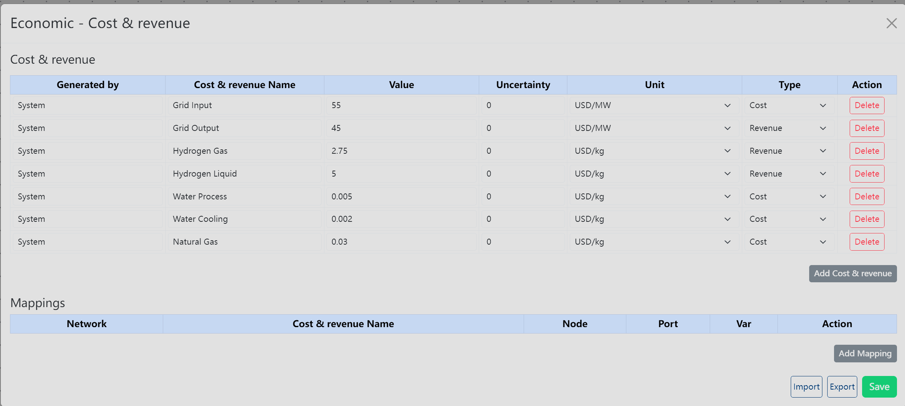

# Cost & revenue

Use **Cost & revenue** when you need to enter or maintain cost and revenue data for the current diagram.

## Where To Find It

1. Save a newly created diagram with the main **Save** action. Economic data
   needs a persisted diagram before it can be edited.
2. Open **User Tables**.
3. Click **Cost and Revenue Data**.

Before the first main save, the Economic entries are disabled and **User
Tables** shows: “Save the diagram with the main Save action before editing
Economic data.”

## What It Opens/Does

**Cost & revenue** opens the **Economic - Cost & revenue** modal. The modal is used for economic rows, including entity and mapping work, plus import, export, and save actions.

Fresh diagrams start with no System Cost or Revenue rows. Use **Add Price** or
**Import** to create diagram-owned rows; the unit and type selectors remain
available even when the System configuration contains no entities.

## Basic Steps

1. Open **Cost & revenue**.
2. Review the existing cost and revenue rows.
3. Add, edit, or delete the required entities. Deleting the final row is
   supported. When the last Base row for a name is deleted, its Base mappings
   are removed with it.
4. Update mappings so rows point to the correct model context.
5. Use import or export when you need to exchange rows with a workbook.
6. Click **Save** when the rows are ready.
7. Confirm the visible success message. If saving fails, keep the modal open
   and use the visible error message before retrying.
8. Reopen or reload the diagram when you need to verify persistence. Deleted
   rows, including an intentionally empty list, must remain deleted.

## Result

The diagram's user-created or imported cost and revenue rows are saved for later analysis or
computation. A saved empty list is intentional persisted state; reopening the
diagram does not restore SQL or workbook defaults. Existing saved diagrams keep
their own Economic arrays. If the modal is read-only, review
or export the rows and return after editing is available.

## Related Pages

- [Economic Menu overview](../economic)
- [Demand & Supply](./demand-supply)
- [Analysis Menu](../analysis)
- [Set Run Menu](../set-run)
