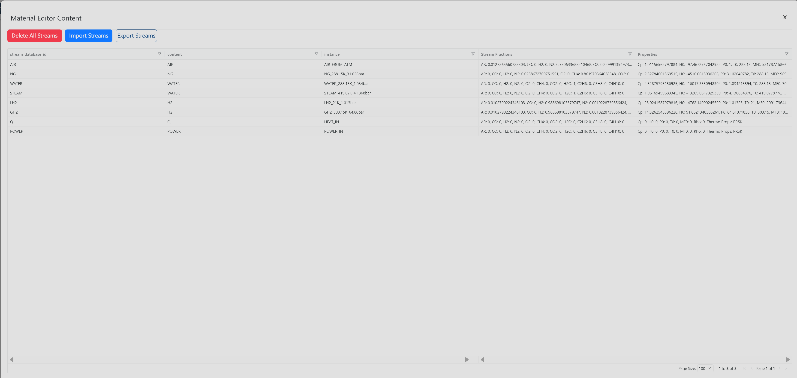

# Material Editor

Use **Material Editor** when you need to review, import, export, or clear material stream rows for the current diagram.

## Where To Find It

1. Select the **Materials** primary menu.
2. Click **Material Editor** in the secondary button row.

## What It Opens/Does

**Material Editor** opens a material editor overlay. The overlay contains **Delete All Streams**, **Import Streams**, **Export Streams**, and a stream table.

The import action opens a hidden file picker that accepts `.xlsx` and `.xls` workbook files. The table shows the current stream rows in an AgGrid view.

## Basic Steps

1. Open **Material Editor**.
2. Review the stream rows in the table.
3. Click **Import Streams** to load stream data from an Excel workbook.
4. Click **Export Streams** to download the current stream rows.
5. Click **Delete All Streams** only when you need to clear the diagram's streams.
6. Close the overlay when finished.

## Result

The current diagram's material streams are reviewed, imported, exported, or cleared. In read-only mode, stream editing, deleting, and importing are restricted.

## Related Pages

- [Materials Menu overview](../materials)
- [Model Menu overview](../model)
- [System Menu](../system)
