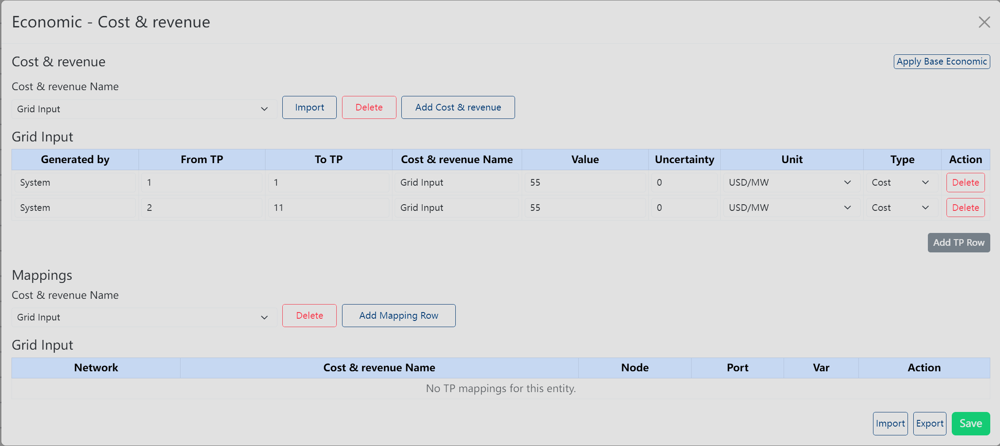
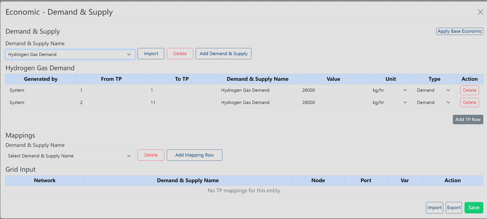

# Multi-TP Economic

Use **Economic** from the **Multi-TP** menu when you need economic panels that depend on Multi-TP ranges.

## Where To Find It

1. Open an existing diagram with Multi-TP ranges.
2. Select the **Multi-TP** primary menu.
3. Open the **Economic** dropdown in the secondary button row.
4. Choose **Cost & revenue** or **Demand & Supply**.

## What It Opens

The dropdown opens an **Economic - Cost & revenue** or **Economic - Demand & Supply** panel, depending on the selected item.

The panels are read-only or unavailable when cost buttons are disabled or when the current diagram has no Multi-TP ranges.

If you have just added or changed TP ranges, click **Apply Base Economic** first. This copies the base economic rows into the current TP ranges and refreshes the Multi-TP economic data before you review, edit, or save the panel.

## Basic Steps

1. Confirm Multi-TP ranges exist for the diagram.
2. Open the **Economic** dropdown.
3. Select **Cost & revenue** to work with cost and revenue data.
4. Select **Demand & Supply** to work with demand and supply data.
5. If TP ranges were just added or updated, click **Apply Base Economic** to generate or refresh the TP-based economic rows.
6. Review or update only the fields that are enabled in the selected panel.
7. Click **Save** if you changed the panel data.
8. Close the panel when finished.

## Result

The selected Multi-TP economic panel opens for the current diagram. After **Apply Base Economic** runs, the panel shows economic rows for the current TP ranges. If cost controls are disabled or no Multi-TP ranges exist, the panel is read-only or unavailable.

## Related Pages

- [Multi-TP Menu overview](../multi-tp)
- [Global TP](./global-tp)
- [TP Specs](./tp-specs)
- [Economic primary menu](../economic)
