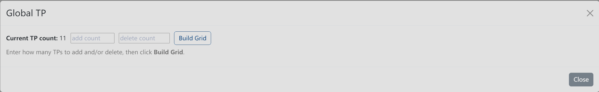

# Global TP

Use **Global TP** when you need to define the same time-period range structure for all nodes in the diagram.

## Where To Find It

1. Open an existing diagram.
2. Select the **Multi-TP** primary menu.
3. Click **Global TP** in the secondary button row.

## What It Opens

The **Global TP** modal opens. It includes the current TP count, fields for adding or deleting TP counts, a **Build Grid** button, range rows, **duration**, **duration unit**, and **Apply to All Nodes**.

## Basic Steps

1. Open **Global TP**.
2. Enter how many TPs to add or delete.
3. Click **Build Grid**.
4. Review each range row, including **from tp**, **to tp**, **duration**, and **duration unit**.
5. Adjust the range values where needed.
6. Click **Apply to All Nodes**.
7. Click **Close** when the modal finishes applying the changes.

## Result

The global TP range grid is applied to the nodes in the current diagram. The diagram uses the updated TP count, ranges, durations, and duration units for later Multi-TP work.

## Related Pages

- [Multi-TP Menu overview](../multi-tp)
- [TP Node - Model Version Control](./tp-node-model-version-control)
- [TP Specs](./tp-specs)
- [TP Analysis Menu](../tp-analysis)
