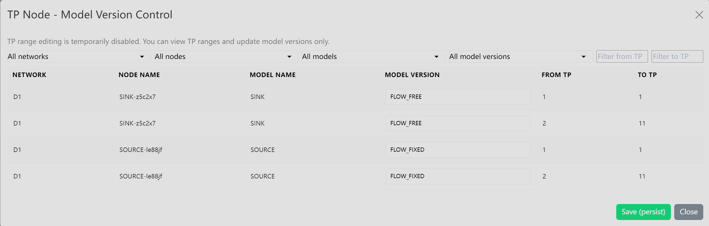

# TP Node - Model Version Control

Use **TP Node - Model Version Control** when you need to review time-period ranges for nodes and assign model versions for those ranges.

## Where To Find It

1. Open an existing diagram.
2. Verify the model from the **Model** menu.
3. Select the **Multi-TP** primary menu.
4. Click **TP Node - Model Version Control** in the secondary button row.

## What It Opens

The **TP Node - Model Version Control** modal opens after the model is verified. The modal shows TP ranges for nodes and the model version assigned to each range.

TP structure editing may be disabled in the current UI. When it is disabled, use the modal to view TP ranges and update model versions only.

## Basic Steps

1. Confirm the model has been verified.
2. Open **TP Node - Model Version Control**.
3. Review each node row and TP range.
4. Change model version selections where the fields are enabled.
5. Click **Save (persist)**.
6. Click **Close** when finished.

## Result

The TP node model-version selections are saved for the current diagram. If the model is not verified, this button is not shown.

## Related Pages

- [Multi-TP Menu overview](../multi-tp)
- [Verify Model](../model/verify-model)
- [Global TP](./global-tp)
- [TP Specs](./tp-specs)
