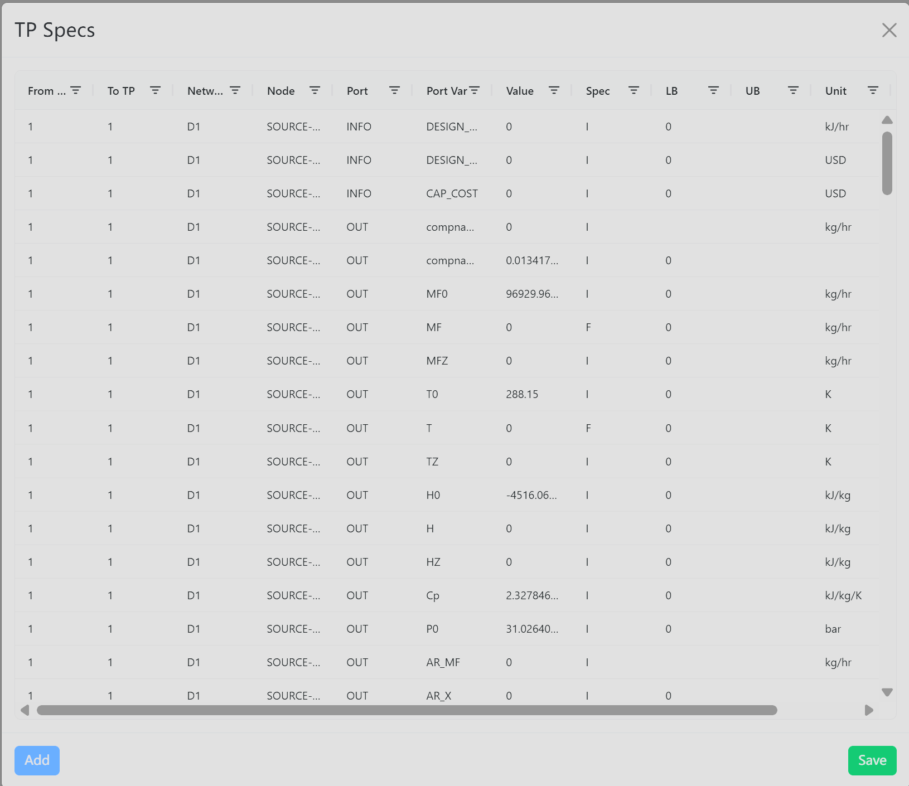

# TP Specs

Use **TP Specs** when you need to review, version, apply, or edit specification values for time-period-specific node variables.

## Where To Find It

1. Open an existing diagram with Multi-TP ranges.
2. Select the **Multi-TP** primary menu.
3. Click **TP Specs** in the secondary button row.

## What It Opens

The **TP Specs** modal opens in Multi-TP mode. It shows TP-specific specification data in a grid. The panel is separate from the Base TP Specs panel: Base TP versions and Multi-TP versions are displayed and applied independently.

The modal is read-only when the **MTP.TPSpecs** computing rule is read-only. In that state, use the grid for review and do not expect editable fields or saving.

## Basic Steps

1. Open **TP Specs**.
2. Select the calculation type tab: **Simulation**, **Optimization**, **DataRec**, or **ParamUpdt**.
3. Select the version to inspect from the version menu.
4. Review rows by network, node, port, port variable, TP range, value, spec, bounds, and unit.
5. If the grid is editable, update the enabled values.
6. Click **Save** to persist changes to the selected version.
7. Click **Apply** when you want that version to become the version used by the Multi-TP network and the next solve request.

## Version Management

Multi-TP specs are versioned separately from Base TP specs and separately for each calculation type. Creating **V2** under **Simulation** creates only the Simulation Multi-TP version table.

Default Multi-TP tables use the Base TP naming pattern with an `M` prefix:

| Calculation type | Default table |
| --- | --- |
| Simulation | `MTPSPECV1` |
| Optimization | `MTPSPECOPTV1` |
| DataRec | `MTPSPECDRV1` |
| ParamUpdt | `MTPSPECPEV1` |

Version behavior:

- **V1 Default** is created automatically and cannot be deleted.
- When a network is moved into Multi-TP, the default Multi-TP spec table is initialized from the Base TP defaults.
- **New** copies the currently selected version for the current calculation type only.
- **Rename** changes the display name shown in the version menu.
- **Delete** removes the selected non-default version. If the deleted version was active, the panel falls back to V1 for that calculation type.
- **Save** stores edits in the selected version. If that version is not active, the network is not updated until **Apply** is clicked.
- **Apply** makes the selected version active for the current calculation type, refreshes the panel, and updates the Multi-TP values used by the network.

## Result

Editable TP specification changes are saved for the current diagram and version. If the modal is read-only, no TP Spec data is changed. The active Multi-TP spec version is included in the solve request metadata as `tp_spec_scope`, `tp_spec_version`, and `active_tp_spec_table`.

## Related Pages

- [Multi-TP Menu overview](../multi-tp)
- [Global TP](./global-tp)
- [TP Node - Model Version Control](./tp-node-model-version-control)
- [Specs](../model/specs)
