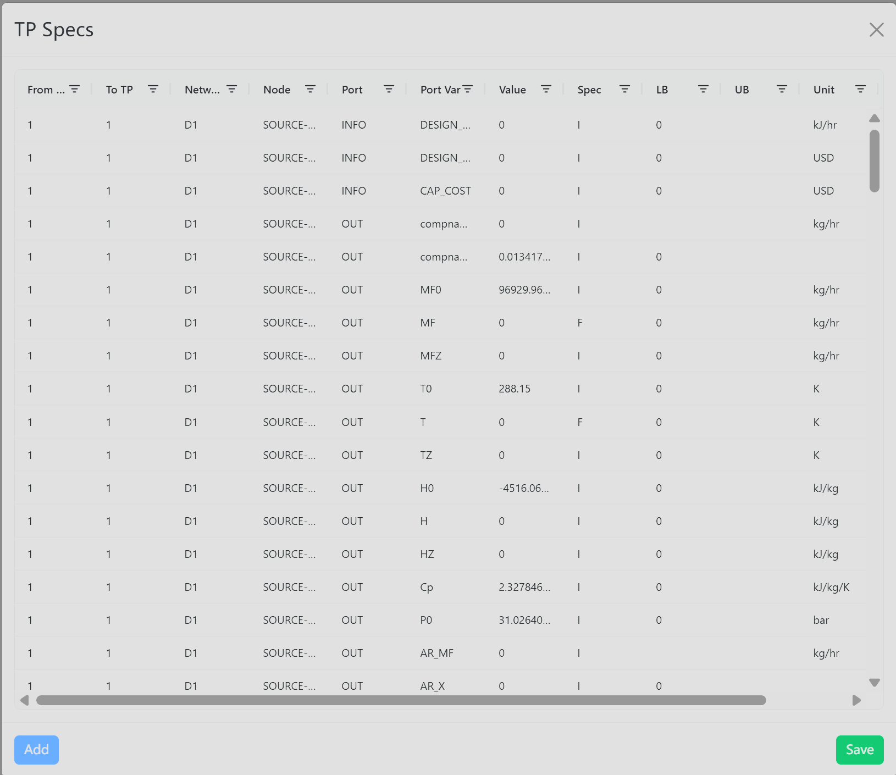

# TP Specs

Use **TP Specs** when you need to review, version, apply, or edit specification values for time-period-specific node variables.

## Where To Find It

1. Open an existing diagram with Multi-TP ranges.
2. Select the **Multi-TP** primary menu.
3. Click **TP Specs** in the secondary button row.

## What It Opens

The **TP Specs** modal opens in Multi-TP mode. It shows TP-specific specification data in a grid. The panel is separate from the Base TP Specs panel: Base TP versions and Multi-TP versions are displayed and applied independently.

The grid begins with eligible node model variables and expands them across the saved TP ranges for each node. A row must have an effective specification of `F`, `V`, `P`, `I`, or `CALC` for the selected calculation type. Wrapper nodes show exposed mapped ports rather than every internal subnetwork port.

The modal is read-only when the **MTP.TPSpecs** computing rule is read-only. In that state, use the grid for review and do not expect editable fields or saving.

## Basic Steps

1. Open **TP Specs**.
2. Select the calculation type tab: **Simulation**, **Optimization**, **DataRec**, or **ParamUpdt**.
3. Select the version to inspect from the version menu.
4. Review rows by network, node, port, port variable, TP range, value, spec, bounds, and unit.
5. If the grid is editable, update the enabled values.
6. Click **Save** to persist changes to the selected version.
7. Click **Apply** when you want that version to become the version used by the Multi-TP network and the next solve request.

The dropdown shows the **selected** version; the `(active)` marker identifies the version currently used by MTP editing flows and computation. Selecting another version only changes the table being viewed. It does not activate it.

The **State** column distinguishes saved or computed data:

- **Changed** indicates that the selected version has a saved override for the row.
- **Computed** indicates a solver-produced value associated with that version context.
- A blank state means the row currently inherits its materialized baseline.

## Version Management

Multi-TP specs are versioned separately from Base TP specs and separately for each calculation type. Creating **V2** under **Simulation** creates only the Simulation Multi-TP version table.

Default Multi-TP tables use the Base TP naming pattern with an `M` prefix:

| Calculation type | Default table |
| --- | --- |
| Simulation | `MTPSPECV1` |
| Optimization | `MTPSPECOPTV1` |
| DataRec | `MTPSPECDRV1` |
| ParamUpdt | `MTPSPECPEV1` |

Version behavior:

- **V1 Default** is created automatically when the version family is first loaded and cannot be deleted.
- The MTP table is materialized from node model defaults expanded across `TpNodeVers`, then overlaid with the selected version's saved changes. Legacy unversioned manual changes are adopted by V1 for compatibility.
- **New** copies the currently selected version for the current calculation type only. Manual changes are copied; computed solver rows are not. The new version starts inactive.
- **Rename** changes the display name shown in the version menu.
- **Delete** removes the selected non-default version. If the deleted version was active, the panel falls back to V1 for that calculation type.
- **Save** stores edits in the selected version. If that version is not active, the network is not updated until **Apply** is clicked.
- **Apply** makes the selected version active for the current calculation type, refreshes the panel, and updates the Multi-TP values used by the network.

The version code, display name, and logical table name are separate:

| Identity | Example | Behavior |
| --- | --- | --- |
| Version code | `V2` | Stable generated code for that version number. |
| Display name | `Peak Demand Case` | User-editable label in the dropdown. |
| Logical table | `MTPSPECV2` | Internal readable identity for MTP Simulation V2. Renaming does not change it. |

## Save Versus Apply

| Current state | Save result | Apply result |
| --- | --- | --- |
| Selected version is active | Saves manual changes into the active MTP version. | Disabled because it is already active. |
| Selected version is inactive | Saves only inside the selected version. | Activates it for MTP and the current calculation type. |
| Active non-default version is deleted | Deletes its manual and computed version rows. | V1 becomes active automatically. |

Versions are sparse overlays, not frozen copies of every displayed row. Unchanged rows inherit the current node model defaults and TP structure. If TP ranges or model defaults change, review each version again before applying it.

## Result

Editable TP specification changes are saved for the current diagram and version. Node-modal TP-change reads and writes use the current calculation type and active MTP version context. If the modal is read-only, no TP Spec data is changed.

The solve task configuration records:

- `tp_spec_scope`
- `tp_spec_version`
- `tp_spec_version_name`
- `active_tp_spec_table`
- `active_tp_spec_version_set_id`
- `active_tp_spec_version_table_id`

Computed callback rows are tagged with the active version set/table, calculation type, and computed change source. PostgreSQL computation results also retain calculation type, scope, version code, and logical table for traceability.

## Troubleshooting

| Message or symptom | Meaning | What to do |
| --- | --- | --- |
| `Save the diagram first to load TP Specs.` | Versions require a persisted diagram id. | Save the diagram, then reopen TP Specs. |
| `No Multi-TP spec rows found. Create time periods first.` | The diagram has no materializable TP ranges. | Create and apply Global TP ranges, then reopen TP Specs. |
| Saved values do not affect node dialogs or computation | The edited version is inactive. | Select it and click **Apply**. |
| A version disappears after changing calculation type | Each calculation type has its own version list. | Return to the tab where the version was created. |
| Base versions are absent | Base and MTP version families are separate. | Open **Model -> Specs** for Base versions. |
| Computed rows are absent in a newly copied version | New versions intentionally copy manual changes only. | Run computation for the new version if computed values are required. |

## Related Pages

- [Multi-TP Menu overview](../multi-tp)
- [Global TP](./global-tp)
- [TP Node - Model Version Control](./tp-node-model-version-control)
- [Specs](../model/specs)
- [TP Spec Version Management Code Explanation](../../../CodeExplanation/tp-spec-version-management.md)
