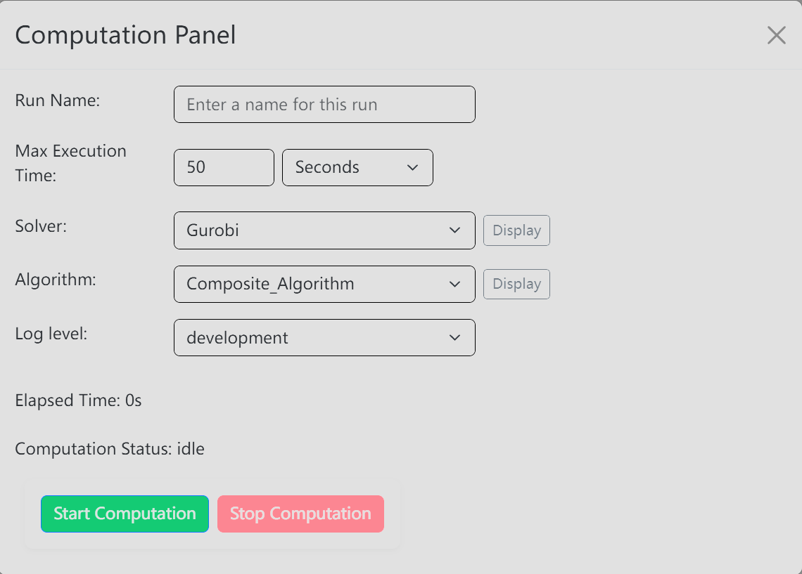

# Computation Panel

Use the **Computation Panel** when you are ready to run the current diagram with a selected solver and algorithm.

## Where To Find It

1. Use **Set Run** to review solver and algorithm settings if needed.
2. Click the **Run** primary header button.
3. If a save prompt appears, choose whether to save before continuing.

## What It Opens/Does

**Run** opens the **Computation Panel**. The panel contains **Run Name**, **Max Execution Time**, **Solver**, **Algorithm**, **Log level**, **Display** buttons for solver and algorithm configs, **Start Computation**, **Stop Computation**, elapsed time, computation status, and stage progress.

Controls are disabled while computation is processing. A duplicate **Run Name** blocks **Start Computation** until you choose a different name.

:::note
The screenshot shows the run-setup controls. In the current interface, the stage-progress area appears after a computation starts.
:::

## Basic Steps

1. Enter a unique **Run Name**.
2. Set **Max Execution Time** and choose the time unit.
3. Select a **Solver**.
4. Select an **Algorithm**.
5. Choose the **Log level**.
6. Click **Display** beside the solver or algorithm if you need to review its configuration.
7. Click **Start Computation**.
8. Watch **Current Stage**, **Current Stage Time**, and the stage table.
9. Click **Stop Computation** if you need to abort a running computation.

## Monitor the Three Stages

After a run starts, the panel tracks three stages:

| Stage | What It Means |
| --- | --- |
| **Preparing / waiting in queue** | The request is being prepared or is waiting for the solver to accept it. |
| **Solver computation** | The external solver has accepted the task and is processing it. |
| **Processing returned results** | HYPRONET has received the callback and is applying and saving the returned results. |

The stage table shows each stage as **Pending**, **In progress**, **Completed**, or **Unavailable**. An active stage continues counting from the latest status update. Completed stages keep their final duration.

**Unavailable** or a dash in the **Time** column means the timestamps needed for that stage do not exist. This is expected for some older runs and does not by itself mean the computation failed. When an older callback contains solver start and end times, the panel can still show **Solver computation** time while the local preparation or result-processing time remains unavailable.

## Result

The computation starts with the selected run settings. The panel shows the current stage, stage durations when available, and the terminal status when the task completes, fails, times out, or is aborted.

## Related Pages

- [Run Button overview](../run)
- [Solver Configuration](../set-run/solver-configuration)
- [Algorithm Configuration](../set-run/algorithm-configuration)
- [Run History](../run-result/run-history)
