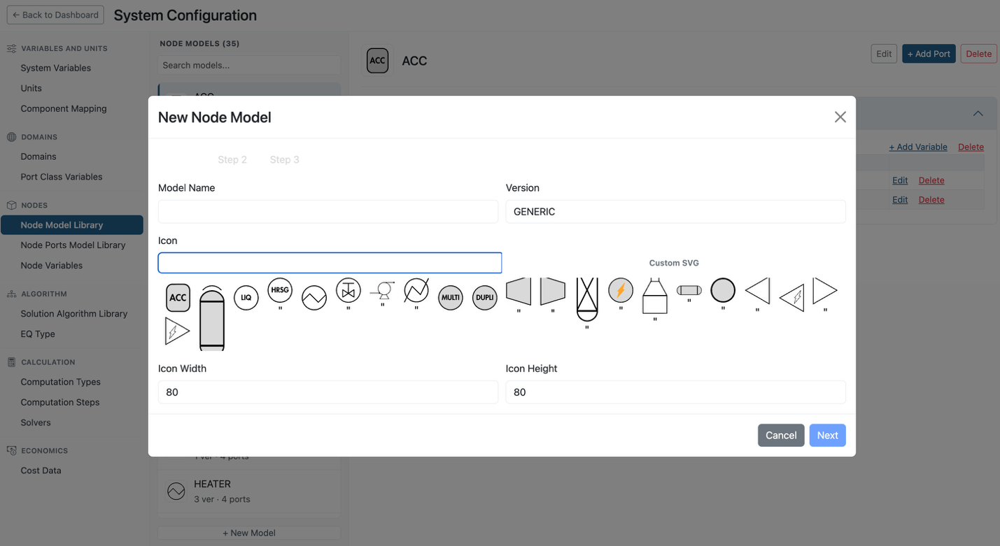
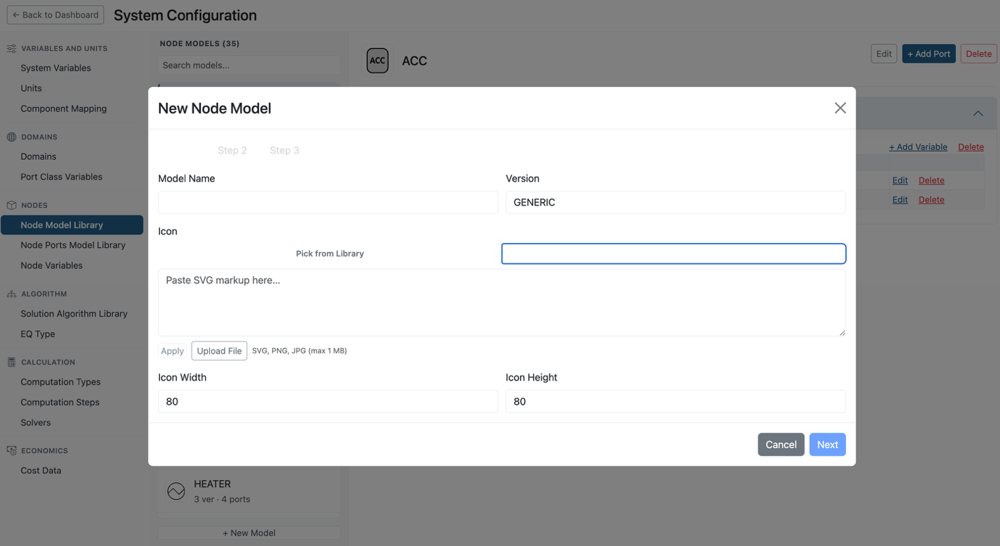

# System Configuration GUI Navigation Guide

Use this page to find your way around the admin-only **System Configuration** page — where the node icon library comes from, how to log in as an admin, and how each of its six table groups works.

## The Node Icon Library

The master copy of every node icon lives in one plain-text file, checked into the repo: [`src/excel-sheets/icons.csv`](https://github.com/bluehydrogenplant123/HYPRONET-GUI/blob/main/src/excel-sheets/icons.csv).

It has two columns:

- **Shape** — a numeric ID (`1`, `2`, `3`, … `44`)
- **SVG** — the full inline SVG markup for that icon

There are currently 44 icons defined (Shape IDs 1–44). Each is a monochrome inline SVG — a process-engineering symbol (reactor, splitter, source, valve shape, etc.). There are no separate image files anywhere: icons are plain SVG text stored in this CSV, and later injected straight into the page.


1. In the `Node Model Library` Excel sheet, each model row has a **Shape** column holding a numeric ID (e.g. `42`) — not the SVG itself.
2. `excel_to_csv.py` reads `icons.csv` and replaces every numeric Shape ID with its full SVG markup before writing the model CSV out.
3. `migrate.py` imports that CSV into PostgreSQL — the resolved SVG string lands in the `Models` table's `shape` column (the model's permanent Icon ID is the row's `_id`).
4. When a user opens a diagram, the backend sends model data — including that SVG string — to the frontend.
5. The Sidebar Palette (and the admin GUI) render each model's icon by injecting that SVG directly into the page.

## Creating a New Node Icon

The left sidebar in the diagram canvas is called the **Palette**. It lists every icon a user can drag onto their flowsheet — the built-in icons above, plus any custom icons a user has created.


The day-to-day way to add or change one node's icon — no Excel, no re-import — is done entirely from the config page: see [Create a node in the admin config page (GUI)](#create-a-node-in-the-admin-config-page-gui) below.

### Where those icons ultimately come from — the Excel pipeline

A model created from the config page can only pick from icons already sitting in the `Models` table, or a hand-pasted one-off SVG. The actual master list of 44 icon designs above lives in Excel/CSV, and bulk changes to that master list still go through the import pipeline, not the config page:

1. Add a row to `src/excel-sheets/icons.csv` with the next free Shape ID (currently `45`) and SVG markup (square `viewBox`, e.g. `0 0 866 866`).
2. Reference that Shape ID in the `Node Model Library` Excel sheet for the model row(s) that should use it.
3. Run, from `src/excel-migration/`:

```bash
python excel_to_csv.py ../excel-sheets/<workbook>.xlsx csv_outputs
python migrate.py
```

:::note
A model created via the config page is live immediately, but will be silently overwritten on the next full Excel re-import unless it's also added to the Excel sheets — Excel is still the system of record for a full reset/re-import.
:::

## Create a New Node Model

Use this section when you want to add a brand-new node to HyProNet — for example a new reactor, splitter, or source — so it shows up in the **node library on the left-hand side (LHS) of the canvas** and can be dragged onto a diagram.

### How it works (the big picture)

Node models are **defined in Excel**, then **imported into the database**. After the import, the new node appears in the LHS node library, ready to use.

```
Excel sheets  ──►  import  ──►  database  ──►  node appears in the LHS node library
```

A node model is made of four parts:

1. **The model** — name, version, icon, equation settings
2. **An icon** — the SVG picture shown on the canvas
3. **Ports** — the connection points, each with a class and a position on the icon
4. **Variables** — the quantities carried on each port

There are **two ways** to create a node:

- **In the admin config page (GUI)** — interactive and fast, best for a single node. See [Create a node in the admin config page](#create-a-node-in-the-admin-config-page-gui) below.
- **In Excel, then import** — best for adding many nodes at once, and the source of truth for the whole system. Steps 1–6 below cover this.

:::note
The Excel file is the **single source of truth** for a full re-import. Nodes you create in the GUI show up immediately, but to make them permanent across a re-import, also add them to the Excel sheets (Steps 1–4).
:::

---

### Step 1 — Define the model

**Sheet: `Node Model Library`** — add one row per model version.

| Column | What to put | Example |
|---|---|---|
| **Domain** | Which domain it belongs to | `Generic`, `Hydrogen Plant` |
| **Model Name** | Unique short name | `ACC` |
| **Model Version** | Version label | `BASE` |
| **Shape** | The icon id (see Step 2) | `42` |
| **Default** | `Y` if this is the default version | `Y` |
| **Icon width** / **Icon Height** | Icon size in pixels | `120` / `120` |
| **P1.EQ** / **P1.Calc** / **P1.CalcPost** | Equation type + calc settings, Phase 1 | `MH0`, … |
| **P2.EQ** / **P2.Calc** / **P2.CalcPost** | Same, Phase 2 | … |
| Author / Comment / Version Date | Optional metadata | |

:::tip
**Model Name** is the key that ties every other sheet together. Spell it exactly the same everywhere (`Node Model Library`, `Node Ports Model Library`, `Node Variables`).
:::

---

### Step 2 — Add the icon

**File: `excel-sheets/icons.csv`** — this holds the SVG images.

| Column | Meaning |
|---|---|
| **Shape** | A number id (e.g. `1`, `2`, … `42`) |
| **SVG** | The full SVG markup of the icon |

- **Reuse an existing icon:** find its `Shape` number in `icons.csv` and put that number in the **Shape** column of `Node Model Library`.
- **Add a new icon:** add a new row to `icons.csv` with the next free `Shape` number and your SVG markup, then reference that number.

:::tip
Keep the SVG's `viewBox` square (the existing icons use `0 0 866 866`) so it scales cleanly. **Icon width / Icon Height** in the model sheet control how large it renders on the canvas.
:::

---

### Step 3 — Define the ports

**Sheet: `Node Ports Model Library`** — add one row per port.

| Column | What to put | Example |
|---|---|---|
| **Domain** | Same domain as the model | `Generic` |
| **Model Name** | Same model name | `ACC` |
| **Port Name** | Short port name | `IN`, `OUT`, `INFO` |
| **Port Class** | Which port class it uses | `MES`, `Q`, `INFO` |
| **Type** | `IN`, `OUT`, or `INFO` | `IN` |
| **Port Location** | A **number** — which connection point on the icon this port attaches to | `0`, `1`, `2`, … |
| **Description** | For `INFO` ports, a JSON list of variable names | `["DESIGN_DUTY","RATE"]` |

#### About Port Location

Port Location is the id of a **connection handle** on the icon. Give each port a **different** location number so edges attach at the right spot (for example, inputs on the left, outputs on the right). On the canvas, a connection finds its port by this number.

#### About Port Class and Type

- **`IN` / `OUT`** ports must use a **defined Port Class** (like `MES`, `M`, `Q`). That is where the port's variables come from.
- **`INFO`** ports are not tied to a shared class. Their variables are their own, listed directly (see the `Description` JSON above and Step 4).

---

### Step 4 — Define the variables

**Sheet: `Node Variables`** — add one row per (port, variable).

| Column | What to put | Example |
|---|---|---|
| **Model Name** / **Model Version** | Same as above | `ACC` / `BASE` |
| **Variable Name** | The node-internal name | `ACCUMULATED` |
| **Port** | Which port it belongs to | `INFO`, `IN`, `OUT` |
| **Port Var Name** | The system / port-class variable it maps to | `ACCUMULATED`, `MF`, `T0` |
| **Default Value** | Optional starting value | |
| **Simulation** / **Optimization** / **ParamUpdt** / **DataRec** | Role in each computation task (`I`, `P`, `F`, `CALC`, …) | `I` |

:::note
For **IN/OUT** ports, `Port Var Name` should be one of the variables defined on that port's **Port Class**. For **INFO** ports, these are the port's own ad-hoc variables.
:::

---

### Step 5 — Run the import (the "system update")

Regenerate the database from the updated Excel file:

```bash
docker compose build python-runner
docker compose run --rm python-runner /app/run_python_import.sh /app/excel-sheets/<your-file>.xlsx
```

This reads all the sheets plus `icons.csv` and populates the `Models`, `ModelVersion`, `Ports`, and variable tables. Existing models are updated in place, so re-running the import is safe.

---

### Step 6 — Verify

Open the app. The new node now appears in the **node library menu on the left of the canvas**. Drag it onto a diagram — its icon shows, with the ports at the connection locations you set.

You can also confirm it in the admin config page under **Nodes → Node Model Library**.

---

### Create a node in the admin config page (GUI)

Instead of editing Excel, you can create and manage node models **directly in the admin config page**. This is the quickest way for a single node — no import step needed, and it shows up on the canvas right away.

Open the app → **admin config page** → in the left menu, choose **Nodes → Node Model Library**.

#### 1. Create the model

1. Click **+ New Model**.
2. Enter the **Model name** and **Version name**.
3. In the **Icon** field, either pick an existing icon from the **Pick from Library** grid, or switch to the **Custom SVG** tab to paste SVG markup or upload an SVG/PNG/JPG file (max 1MB) — a live preview is shown either way. Set the **Icon width** and **Icon height**.





4. Click **Save** — the new model appears in the list on the left.

#### 2. Add ports

Select the model, then on its detail page:

1. Click **+ Add Port**.
2. Enter the **Port name**, choose the **Type** (**Input**, **Output**, or **INFO**), and set the **Port location** (the number of the connection point on the icon — give each port a different one).
3. **Input / Output** ports: choose a **Port class**. Its variables appear, and you give each one an **internal name**.
4. **INFO** ports: leave the class empty — you add the variables directly in the next step.
5. Click **Save**.

#### 3. Add variables to an INFO port

For an INFO port, click **+ Add Variable** and fill in:

- **Variable name** (external) and **Internal name**
- **Variable / Parameter**, **Type**, **Unit**, **Bounds**, **Description**

Click **Save**. Repeat for each variable.

#### 4. Edit or delete

- **Edit** (button on the model header) — change the name, icon, or size.
- **Delete** — remove a single port (the **Delete** on the port), or the whole model (the **Delete** on the header).

:::tip
For an **Input/Output** port to work, its **Port class** must already be defined (see the Port Class Variables page). For a brand-new port class, define it first, then come back and add the port.
:::

## Accessing the System Configuration Page (Admin)

### What is an "Admin" user?

An **Admin** user is a user account with the `admin` role in the database. Admin users have access to the System Configuration page, which lets them view and edit all system reference tables (units, domains, models, variables, etc.). Regular users do not see this page.

### Default admin credentials

| Email | Password |
|---|---|
| `admin@admin.com` | `admin123` |

This account is created automatically when running `init.sh` during project setup.

### How to log in

1. Open the app at `http://localhost:5173/`.
2. Enter the admin email and password on the login page.
3. After login, you arrive at the Dashboard. Click **System Configuration** in the top-right area to open the admin config page.


On success you land on the Dashboard. If your account's role is `admin` or `owner`, a **System Configuration** button appears next to **Logout** in the top-right corner.


Click **System Configuration** to open the admin / system tables GUI described below.

## System GUI Overview and Navigation

The application has three main areas: the Dashboard, the diagram Canvas, and (admin-only) System Configuration.

### Dashboard

The landing page after login. From here a user can:

- **Create New Network** — name a new diagram, pick a Domain and a Calculation Type (Simulation, etc.), and create it.
- **Import Diagram** — load a diagram from a file.
- **Open Verified / Unverified Networks** — previously saved diagrams, split by whether they've passed verification.
- **Open Subnetwork Blueprints** — custom reusable nodes packaged from the canvas (outside System Configuration; not covered on this page).

### Canvas (diagram editor)

Opening or creating a diagram brings up the flowsheet editor:

- **Header bar** (top) — Subnetwork Editor, Save, Verify, Run, and other diagram-level actions.
- **Palette** (left sidebar) — the searchable node icon library described above, draggable onto the canvas.
- **Canvas** (center) — drop nodes here, connect their ports to build the process flowsheet, then Save/Verify/Run.

### System Configuration — Navigation and Usage

The System Configuration page has a left-hand navigation menu and a main content area on the right. Switching tables is instant — click a table name in the left menu and the main content area swaps, no page reload.


The navigation menu is organized into 6 groups:

| Group | Table | Editable? | What it controls |
|---|---|---|---|
| Variables and units | System Variables | Yes | Master list of every reusable variable (name, dimension, unit, bounds, Pyomo type) that port classes attach to. |
| | Units | Yes | Conversion factors between each dimension's base unit and its other display units. |
| | Component Mapping | Yes | Maps internal component/system names to the names shown to end users. |
| Domains | Domains | Yes | Process domains (e.g. Hydrogen Plant) and which port classes + property/composition databases belong to each one. |
| | Port Class Variables | Yes | Port classes (e.g. `MES`, `GSLN`) and which system variables each exposes, with per-variable Hidden / Send-to-calc / Parameter flags. |
| Nodes | Node Model Library | Yes | The node icon library (above) — models, their icon, ports, and port-to-variable mappings. |
| | Node Ports Model Library | No | Read-only reference list of every port defined across all node models. |
| | Node Variables | No | Read-only reference list of every port-variable mapping across all node models/versions. |
| Algorithm | Solution Algorithm Library | Yes | Per-domain solver algorithm phases (iteration count, tolerance, convergence routing) used by Set Run → Algorithm. |
| | EQ Type | Yes | Equation-type options offered per domain for a model version's calculation phases. |
| Calculation | Computation Types | Yes | Task-type options available for a computation run. |
| | Computation Steps | Yes | Step-type options within a computation run. |
| | Solvers | Yes | Per-solver (e.g. `GurobiSolver`, `IPOPTSolver`) configurable attributes and their defaults. |
| Economics | Cost Data | No | Read-only reference list of cost entities — default values, units, and dimensions used by cost calculations. |

#### How to use each table

Most tables support full CRUD (Create, Read, Update, Delete); a few are read-only reference views (see above).

- **View data** — click a table name in the left menu. The data loads in the main area as a list, or a list-and-detail pair (click a row on the left to load its full detail on the right).
- **Add a row** — click the **+ Add** / **+ New** button (top-right of the table). Fill in the form fields and click **Save**.
- **Edit a row** — click **Edit** on any row. A form dialog opens; make your changes and click **Save**.
- **Delete a row** — click **Delete** on a row and confirm.

Changes are immediate — the config page writes directly to PostgreSQL. Anything you add or edit here (a unit, a model, a variable) is reflected in the diagram GUI as soon as the page is refreshed, no re-import needed.


#### Special views

- **Node Model Library** — a list-and-detail view (not an accordion): the model list is on the left, and selecting one loads its icon, versions, ports, and variables into the detail panel on the right. New models, ports, and variables are all managed from there — see [The Node Icon Library](#the-node-icon-library) above and [Create a New Node Model](#create-a-new-node-model) below for the icon side of this.
- **Domains** — shows the domain list with each domain's port-class ↔ database mappings. Click a port class to view its actual stream property/composition data, sourced from that domain's `#Prop_*` / `#Comp_*` reference database.
- **System Variables** — a single searchable table (no domain column shown in the list itself, though a domain is chosen when creating a variable).


#### Data source

All system tables are stored in PostgreSQL. The initial data for a fresh environment is imported from the system Excel workbook via the migration pipeline (see above). After that, changes can be made either by re-importing from Excel (bulk, authoritative) or by editing directly in this GUI (immediate, but local until also reflected back in Excel for any table that gets re-imported).
