# HYPRONET (HPN) System Overview

HYPRONET uses a data-driven configuration so the GUI does not need hard-coded knowledge of every domain, stream, component, or node model. The configuration data is maintained in the **System Excel Workbook (SBOOK)**.

## Data-Driven Configuration

System workbooks are stored in [`src/excel-sheets`](https://github.com/bluehydrogenplant123/HYPRONET-GUI/tree/ce574f8a293180a3a9b148c61a3c76ef6e82b852/src/excel-sheets). By convention, the workbook with the latest date in its filename is used to configure the system.

The workbook is migrated into PostgreSQL before the application uses it. See the [Excel migration procedure](https://github.com/bluehydrogenplant123/HYPRONET-GUI/blob/ce574f8a293180a3a9b148c61a3c76ef6e82b852/src/excel-migration/README.md) for the current migration commands and validation steps.

## Domains

HYPRONET can be configured for different modeling domains, such as chemical plants, petroleum refineries, or electrical distribution networks. A domain defines:

- the entities that move along network arcs, such as chemical mixtures or electricity;
- the attributes used to describe those entities; and
- the domain-specific equations used by node models.

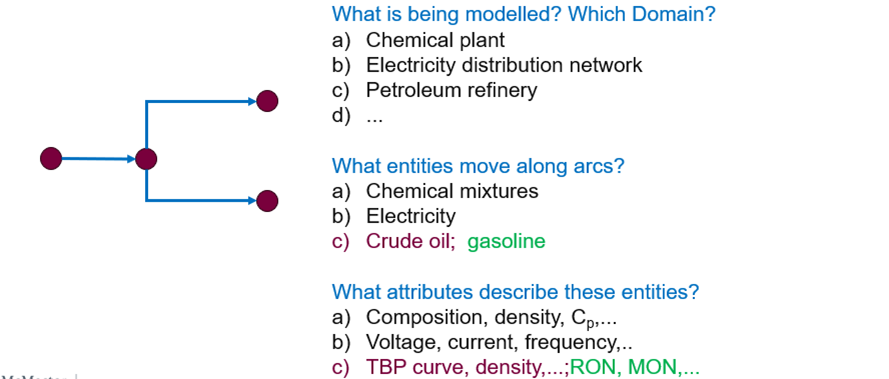

The model organizes this information as a hierarchy from **Domain**, to **Arc content**, to an **Instance set**.

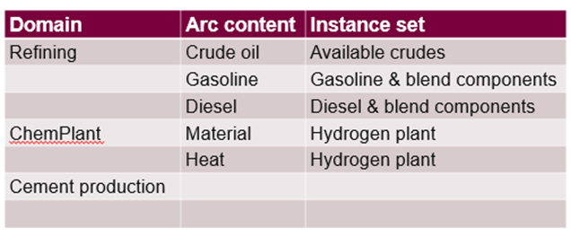

Each arc-content name can represent several possible instances. The instance attributes depend on the domain.

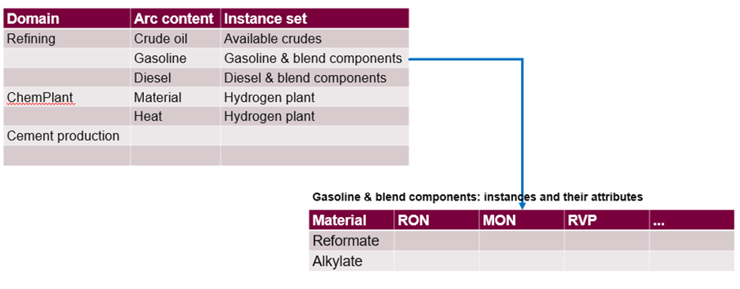

To reduce direct dependence on a physical-property package, HYPRONET stores local thermodynamic properties as a linear approximation around specific operating conditions.

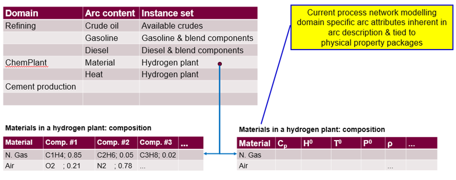

The SBOOK **Domains** worksheet lists the configured domain names:

| Domain |
| --- |
| Hydrogen Plant |
| Petroleum Refinery |
| Pharmaceuticals |
| Generic |

Hydrogen Plant and Petroleum Refinery currently have the required domain-specific data. Pharmaceuticals illustrates how another domain name can be added. Generic entries provide shared configuration used across domains.

## Network Arc Content: System Data

The SBOOK **Port Classes Database Mapping** worksheet connects each domain and port class to the worksheets that contain bulk properties and, where applicable, composition fractions.

| Domain | Port Class | Properties Database | Composition Database |
| --- | --- | --- | --- |
| Hydrogen Plant | MES | `#Prop_MES_HP` | `#Comp_MES_HP` |
| Generic | Q | `#Prop_MES_HP` |  |
| Generic | ELF | `#Prop_MES_HP` |  |
| Hydrogen Plant | CM | `#Prop_MES_HP` | `#Comp_MES_HP` |
| Hydrogen Plant | M | `#Prop_MES_HP` | `#Comp_MES_HP` |
| Hydrogen Plant | MS | `#Prop_MES_HP` | `#Comp_MES_HP` |
| Hydrogen Plant | ME | `#Prop_MES_HP` | `#Comp_MES_HP` |
| Generic | E | `#Prop_MES_HP` |  |
| Generic | EF | `#Prop_MES_HP` |  |
| Generic | EL | `#Prop_MES_HP` |  |
| Generic | QF | `#Prop_MES_HP` |  |
| Petroleum Refinery | GSLN | `#Prop_GSL_R` |  |
| Petroleum Refinery | diesel | `#Prop_diesel_R` |  |
| Petroleum Refinery | crude | `#Prop_crude_R` | `#Comp_crude_R` |
| Petroleum Refinery | MES | `#Prop_MES_R` | `#Comp_MES_R` |
| Petroleum Refinery | M | `#Prop_MES_R` | `#Comp_MES_R` |
| Petroleum Refinery | MS | `#Prop_MES_R` | `#Comp_MES_R` |
| Petroleum Refinery | ME | `#Prop_MES_R` | `#Comp_MES_R` |

### Bulk Property Worksheets

The **Properties_Database** column names the SBOOK worksheet that contains bulk material properties. For example, `#Prop_MES_HP` identifies streams by domain, port class, stream database ID, stream content, and instance.

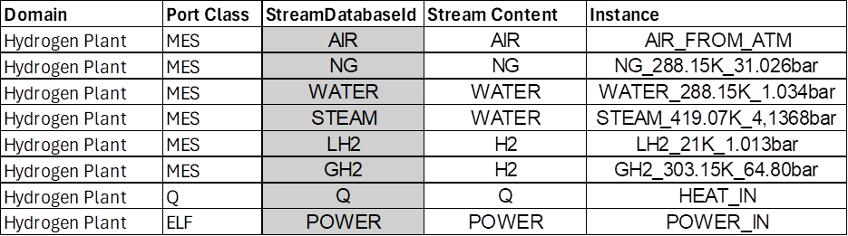

The worksheet columns to the right hold the bulk property values for each stream instance.

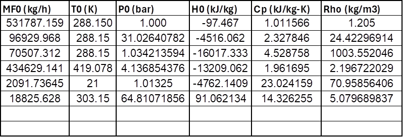

**Stream Content** names a set that may contain several instances. For example, `WATER` can refer to liquid water at one condition or steam at another condition. The content and instance fields help the GUI identify the specific arc material.

### Composition Worksheets

When a domain describes streams by composition fractions, the **Composition_Database** column names the corresponding worksheet. For the Hydrogen Plant domain, the example worksheet is `#Comp_MES_HP`.

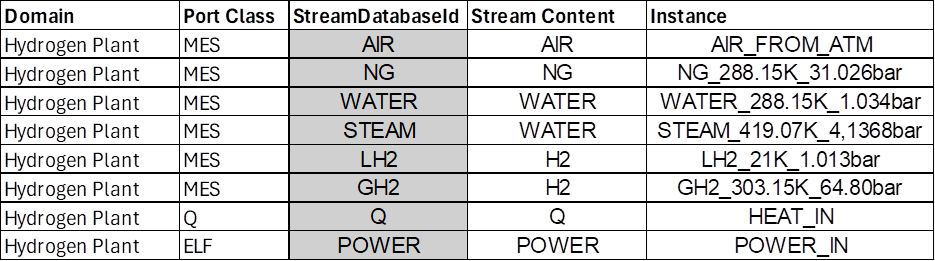

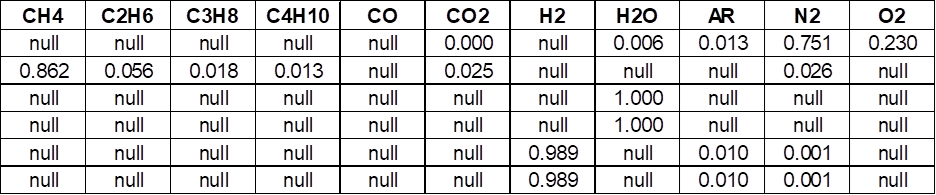

:::note Component presence values
Every chemical component that exists in a domain must be listed in the composition table. Text `null` means the component does not exist for that stream. Numeric `0.0` means the component is valid for the stream but currently has a zero fraction and may appear as operating conditions change.
:::

## Network Arc Content: User Data

Users provide the attributes for streams in their plant network. For a chemical-plant workflow, a process simulator such as Aspen Plus, Pro/II, or HYSYS can export two Excel workbooks:

1. A bulk-properties workbook in the format referenced by **Properties_Database**, such as `#Prop_MES_HP`.
2. A stream-composition workbook in the format referenced by **Composition_Database**, such as `#Comp_MES_HP`.

In the current GUI, open **User Tables -> Material Properties** to launch the Material Editor, then use **Import Streams** to select the workbook. See [Material Editor](./primary-menus/materials/material-editor) for the complete import workflow.

Component names exported by a simulator may differ from HYPRONET system names. For example, HYPRONET may use `CH4` while a simulator uses another methane alias. Use **Component Mapping** in the Material Editor to map user workbook headers to the canonical system names. See [Component Mapping](./primary-menus/model/comp-map).

## Node Definition

A node model has three parts:

- a node frame;
- a domain-specific node model equation; and
- a node icon.

The node frame contains the node model and the ports attached to it. Network arcs connect to those ports.

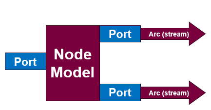

### Port Class Association

Every port has an associated port class. The port class defines the variables available on that port, while the SBOOK **System Variables** worksheet defines reserved system variable names.

For every port on a node model, the SBOOK **Node Ports Model Library** worksheet specifies the port name and port class. The following example shows the ASU model.

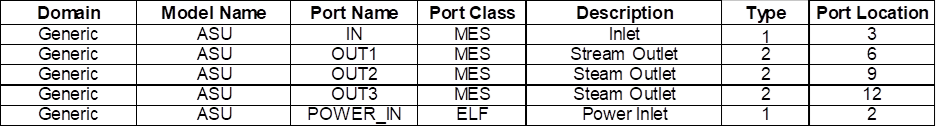

- **Type** `1` is an inlet, `2` is an outlet, and `0` is an information port. The GUI uses the type to assign the port color.
- **Port Location** identifies a predefined position on the perimeter of the node icon.

### Variables in Each Port Class

The SBOOK **Port Classes and Vars** worksheet lists each port class and its variables.

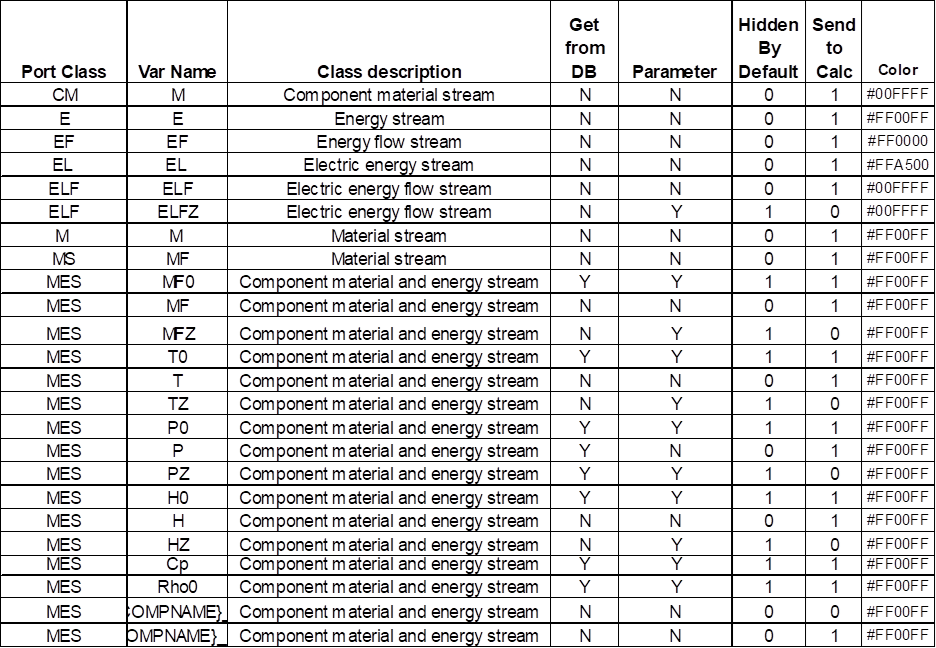

- **Get from DB** = `Y` means the value is read from the stream-properties table.
- **Hidden by Default** = `1` means the variable is not initially shown when a user inspects a node. The user must enable hidden variables to see it.
- **Send to Calc** = `1` means the value is sent to the calculation server.
- **Color** is not currently used.

### Mapping Port Variables to Node Variables

Port variables use reserved system names. For example, `MF.IN1.ASU` can represent the oxygen-feed mass flow for an ASU. A reusable model equation should not depend on a specific port name, so it may instead use a model variable such as `O2_FEED`.

The SBOOK **Node Variables** worksheet maps port-variable names to the variable names used by each model equation.

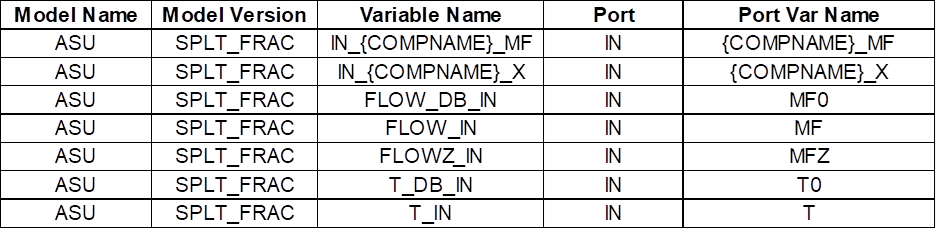

Every node also has an **INFO** port. It carries the internal node variables that must persist from one network-calculation iteration to the next.

## Node Model Library

The SBOOK **Node Model Library** worksheet lists every available node model. A node can have multiple versions with different equation sets. Users select the required version when placing or configuring a node on the canvas.

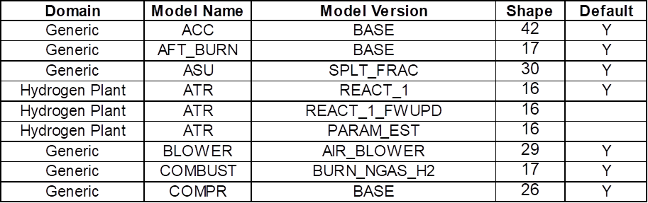

- **Shape** is the identifier of the icon in the shape library.
- **Default** = `Y` identifies the version used by default.

The remaining columns define phase-specific equation and post-calculation behavior and the node icon proportions.

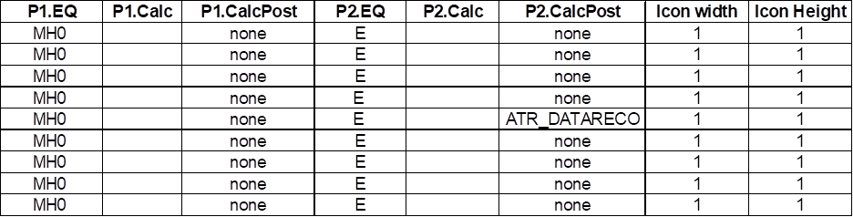

- **P1.EQ** and **P2.EQ** identify the equation set generated in Phase 1 and Phase 2 of the Composite Algorithm.
- **P1.CalcPost** and **P2.CalcPost** identify the function executed for the block after the corresponding phase.
- **Icon width** and **Icon height** define the relative icon-size ratio.

Node model equations are written in Pyomo.

## Related Pages

- [Interface Overview](./interface-overview)
- [Material Properties](./primary-menus/materials)
- [Material Editor](./primary-menus/materials/material-editor)
- [Component Mapping](./primary-menus/model/comp-map)
- [Create a Node Model](./create-a-node-model)
