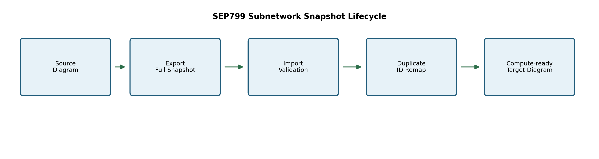
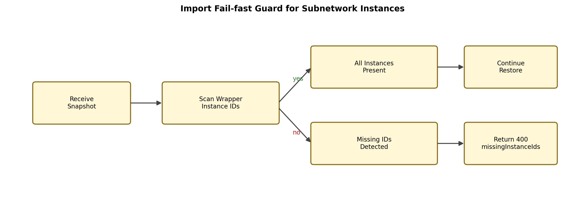
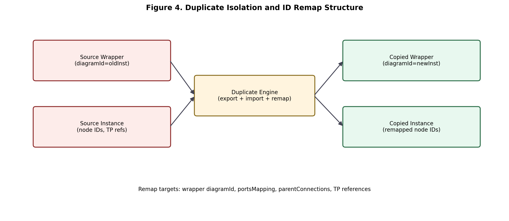
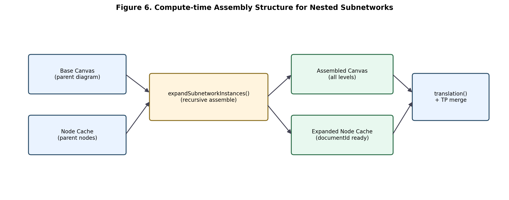
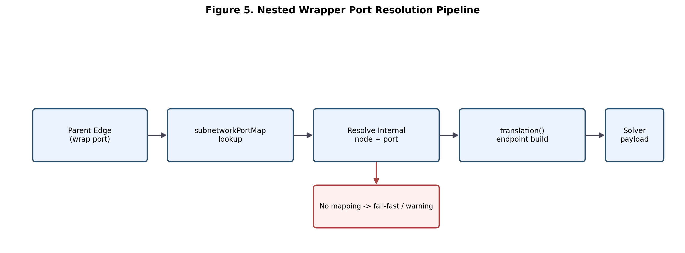
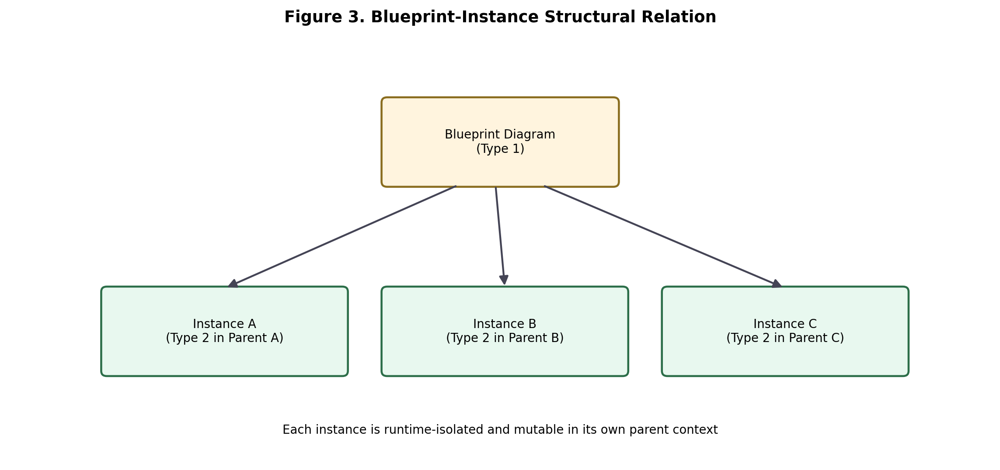
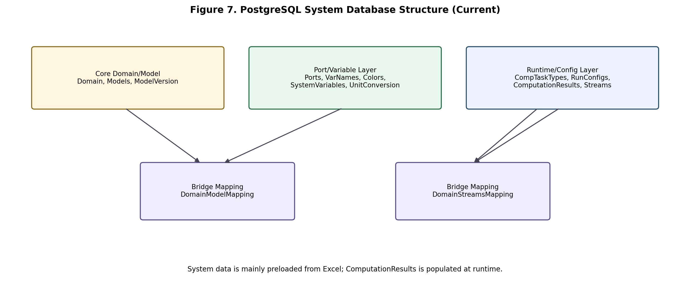
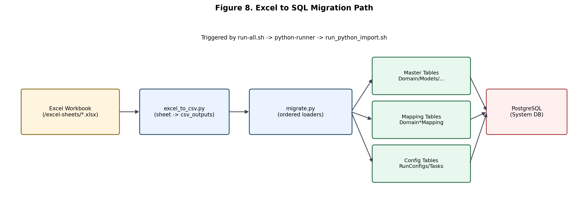

# SEP799 Winter Midterm Report
## Software for Optimization of a New Blue Hydrogen Plant (Production Starting in 2027)
### Backend Team - Personal Contribution Section

**Team Member:** Hongyu Jiang (400649873)  
**Scope:** Personal backend contribution only (Issue 28 subnetwork reliability)

## Abstract (Personal Contribution Scope)
This section documents my personal backend contribution to improve subnetwork reliability in the SEP799 Winter term. The work focuses on three linked backend paths: robust `duplicate/export/import` behavior for subnetworks, stable multi-layer nested subnetwork computation, and strict runtime isolation between subnetwork blueprints and subnetwork instances. The goal is to make copied/imported diagrams structurally complete, compute-ready, and independent from the original source state.

## Introduction (Contribution Context)

### Previous Baseline (project baseline)
The baseline design already separated reusable subnetwork definitions from runtime instance diagrams. This gave the project a usable hierarchical modeling structure, but reliability in cross-diagram transfer scenarios was still sensitive when wrappers were nested or when instance data was partially missing.

### Problem Gap Addressed in Winter
In practical workflows, users depend on `export -> import -> duplicate` to move and clone complex diagrams. Three backend gaps were most visible: incomplete transfer payloads for subnetwork instances, unstable endpoint resolution in deep nesting paths, and accidental coupling between copied diagrams when instance IDs were not fully remapped. My Winter contribution addressed these reliability issues without changing the external API style.

## Functional Outcomes (My Part)

### 3.5 Duplicate/Export/Import for Subnetwork Reliability
On the transfer side, the backend now treats export data as a **complete reconstruction package** rather than a lightweight diagram dump. In addition to parent-level canvas information, the package carries the subnetwork context required to rebuild wrapper behavior after transfer, including reusable blueprint metadata and runtime instance state. This design choice is important because wrapper nodes are not standalone objects: they depend on internal instance diagrams, mapped ports, and parent-connection metadata to stay computable.

From a workflow perspective, this makes transfer deterministic. When a user exports a model with nested wrappers and later imports it into another environment, the backend can rebuild the same structural graph instead of approximating missing parts. That directly reduces "looks valid in UI but fails at compute time" cases caused by hidden reference gaps.

**Figure 1. Subnetwork Snapshot Lifecycle**  

Import now includes a missing-instance guard. If a wrapper references an instance that is not present in the transferred payload, the backend rejects the request with a clear `400` response and a list of missing instance IDs. This fail-fast behavior is deliberate: it prevents partial success states where a diagram appears imported but contains latent structural defects that only surface later during translation or solver execution.

**Figure 2. Import Fail-fast Validation Path**  

Duplicate follows the same consistency target. The duplicate route creates new runtime instance diagrams and remaps identity links so copied wrappers do not keep stale source references. In other words, the copied graph is not a shallow reference copy; it is a deep runtime copy with refreshed identities. This prevents cross-diagram coupling where edits in one copied model could accidentally affect another model that reused old instance references.

**Figure 3. Duplicate Isolation and ID Remap Structure**  

| Remap target | Why it matters |
|---|---|
| Wrapper `diagramId` | Ensures each copied wrapper points to a new copied instance. |
| Wrapper `portsMapping` node references | Prevents copied wrappers from resolving to source instance nodes. |
| Instance `parentConnections` | Keeps backpropagation links valid in the target copied context. |

### 3.6 Multi-layer Subnetwork Computation Support
For nested subnetworks, compute correctness depends on resolving wrapper ports to internal endpoints across layers. The backend compute path handles this as a staged process: it first assembles all reachable instance canvases recursively, then builds a wrapper-to-internal port mapping, and finally performs translation using those resolved endpoints.

This staged approach matters because parent edges attached to wrapper handles do not directly identify solver-ready nodes. Without explicit endpoint resolution, deep nesting can produce ambiguous connectivity or misplaced streams. By resolving wrapper handles to concrete internal node-port targets before payload generation, the backend keeps network connectivity consistent across parent and child levels.

**Figure 4. Compute-time Assembly for Nested Subnetworks**  

The endpoint resolution logic converts parent-edge wrapper handles into internal node/port targets before solver payload generation. If required mapping is missing, translation takes a fail-fast/warning path instead of producing a silently incorrect connectivity payload. This preserves reliability under non-ideal data conditions: errors become visible and diagnosable, instead of silently contaminating downstream computation results.

**Figure 5. Nested Wrapper Port Resolution Pipeline**  

| Core function | Reliability role |
|---|---|
| `expandSubnetworkInstances(...)` | Assembles parent + nested canvases into one compute context. |
| `buildSubnetworkPortMap(...)` | Creates wrapper-port to internal-endpoint mappings. |
| `translation(...)` | Uses mapped endpoints to generate compute-ready connectivity. |

### 3.7 Blueprint vs Instance Isolation
The implementation keeps blueprint and instance responsibilities operationally separate. A blueprint (`type = 1`) is reusable definition metadata, while an instance (`type = 2`) is mutable runtime state embedded in a specific parent context. This separation is the core isolation rule that protects copied/imported diagrams from write-through side effects.

**Figure 6. Blueprint-Instance Structural Relation**  

In practice, this isolation means that edits, TP updates, and computation results remain local to each instance diagram after import/duplicate, while the blueprint continues to act as a reusable template reference. The result is predictable behavior when teams clone and evolve similar network structures in parallel.

### 3.8 System Database (PostgreSQL) Overview
In the current architecture, PostgreSQL is the **system database** for curated configuration, model metadata, and persisted computation result records, while MongoDB stores user-specific diagram runtime state. The system layer currently contains 14 core relational tables: `Domain`, `Models`, `ModelVersion`, `Ports`, `VarNames`, `Streams`, `DomainModelMapping`, `DomainStreamsMapping`, `Colors`, `CompTaskTypes`, `UnitConversion`, `SystemVariables`, `RunConfigs`, and `ComputationResults`.

**Figure 7. PostgreSQL System Database Structure (Current)**  

The table design is layered: domain/model master data, bridge mappings, and runtime/config data. This layered design helps keep ownership boundaries clear. For example, model and variable dictionaries are seeded as controlled system data, while result rows are generated at runtime as computations complete. `ComputationResults` therefore acts as an operational history table rather than a preload table.

| Logical layer | Main tables | Purpose |
|---|---|---|
| Domain/model master data | `Domain`, `Models`, `ModelVersion`, `Ports`, `VarNames`, `Streams` | Defines process models, ports/variables, and domain stream dictionaries used by translation and UI. |
| Mapping/bridge layer | `DomainModelMapping`, `DomainStreamsMapping` | Maintains domain-to-model and domain-to-stream associations. |
| Runtime/config layer | `CompTaskTypes`, `UnitConversion`, `SystemVariables`, `RunConfigs`, `ComputationResults`, `Colors` | Stores task settings, unit conversion metadata, system variable bounds, run config presets, result rows, and UI port class color mappings. |

### 3.9 Migration Path from Excel to SQL (Detailed)
The migration path from Excel to SQL is a staged pipeline rather than a one-shot import. Operationally, the process first prepares the database services and schema, then runs a dedicated Python-based import flow against a selected workbook. Inside that flow, two stages are executed sequentially: workbook-to-CSV conversion (`excel_to_csv.py`) and dependency-aware SQL loading (`migrate.py`).

In the conversion stage, each sheet is exported into normalized CSV artifacts, with targeted cleanup logic applied where needed (for example, shape/icon normalization for model definitions). In the loading stage, the importer applies an order that respects relational dependencies (`CompTaskTypes -> Domain -> Streams -> Models -> DomainModelMapping -> Colors -> Ports -> VarNames -> SystemVariables -> UnitConversion -> RunConfigs`), so child tables are loaded only after required parent records exist.

**Figure 8. Excel to SQL Migration Path**  

| Migration stage | Typical input sheets/files | Main target tables |
|---|---|---|
| Base taxonomy/config seed | `CompTaskTypes`, `SYSDomains`, `SYS Units`, `SYS Run Configs`, `SYS System Variables` | `CompTaskTypes`, `Domain`, `UnitConversion`, `RunConfigs`, `SystemVariables` |
| Model definition seed | `SYSNodeModelLibrary`, `SYSNodePortsModelLibrary`, `SYSNodeVariables`, `SYSPortClassesandVars`, `icons.csv` | `Models`, `ModelVersion`, `Ports`, `VarNames`, `Colors`, `DomainModelMapping` |
| Stream dictionary seed | `SYS Stream Properties`, `SYS Stream Fractions*` | `Streams`, `DomainStreamsMapping` |

The SQL writes are designed to be mostly idempotent through conflict-handling upserts (`DO UPDATE` / `DO NOTHING`). As a result, repeated runs can refresh changed records without uncontrolled duplication. In practice, this makes migration safer for iterative data refinement cycles during development: users can fix spreadsheet content and rerun the pipeline with predictable update behavior.

## Validation / Evidence

| Claim | Evidence Source | Result |
|---|---|---|
| Export/import uses complete subnetwork-aware snapshot sections | Transfer contract and import reconstruction behavior | Payload carries both reusable blueprint context and runtime instance context. |
| Import blocks wrapper references to missing instance payloads | Import validation and error response behavior | Missing dependencies are surfaced early with explicit error reporting. |
| Nested subnet computation resolves through mapping pipeline | Compute-time assembly + wrapper endpoint resolution flow | Recursive expansion and endpoint mapping are applied before solver payload generation. |
| Blueprint and instance semantics stay isolated across copy/import | Runtime copy behavior and isolation semantics | Copied diagrams maintain independent mutable instance state. |
| PostgreSQL system database scope and table set are explicit | System schema definition and relational layering | 14-table structure separates master, mapping, and runtime/config responsibilities. |
| Excel-to-SQL migration uses ordered loader pipeline | Migration orchestration and staged import process | Workbook is normalized then loaded in dependency-aware order with idempotent upserts. |

## Conclusion (Personal Scope)
This backend contribution improves reliability for subnetwork-heavy workflows by hardening transfer completeness, nested compute mapping, and instance isolation. The result is fewer silent structural failures and better predictability when users copy/import nested wrapper diagrams.

Follow-on work should focus on deeper automated regression coverage for edge-case historical snapshots and high-depth nested scenarios.

## References (APA)
Bass, L., Clements, P., & Kazman, R. (2021). *Software architecture in practice* (4th ed.). Addison-Wesley.

Bray, T. (2017). *The JavaScript Object Notation (JSON) data interchange format* (RFC 8259). Internet Engineering Task Force. https://doi.org/10.17487/RFC8259

Fielding, R. T. (2000). *Architectural styles and the design of network-based software architectures* (Doctoral dissertation, University of California, Irvine).

Hart, W. E., Laird, C. D., Watson, J.-P., & Woodruff, D. L. (2017). *Pyomo: Optimization modeling in Python* (2nd ed.). Springer.

Haydary, J. (2019). *Chemical process design and simulation: Aspen Plus and Aspen HYSYS applications*. Wiley.

Kleppmann, M. (2017). *Designing data-intensive applications*. O'Reilly Media.

MongoDB, Inc. (n.d.). *Data modeling introduction*. MongoDB Manual. Retrieved February 25, 2026, from https://www.mongodb.com/docs/manual/core/data-modeling-introduction/

Newman, S. (2021). *Building microservices* (2nd ed.). O'Reilly Media.

Nygard, M. T. (2018). *Release it!: Design and deploy production-ready software* (2nd ed.). Pragmatic Bookshelf.
